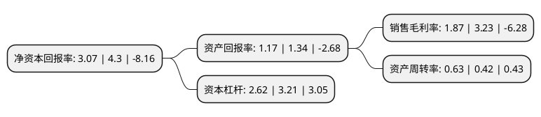

> 本页面由自动化程序生成于 2022年5月20日 01:34
> 内容可能存在错误，如有bug请提交issue至：https://github.com/Eroleice/doc-pi/issues
{.is-warning}

# 上市公司基本情况

## 基本资料

北京韩建河山管业股份有限公司（以下简称“韩建河山”）成立于2004年07月07日，北京市。于2015年06月11日在上交所主板上市。

韩建河山注册资本38,136.8万元，主要从事预应力钢筒混凝土管(PCCP)，钢筋混凝土排水管(RCP)和商品混凝土的研发，生产与销售。发行人的主导产品为预应力钢筒混凝土管。以下是详细信息：

- 公司名称: 北京韩建河山管业股份有限公司
- 股票代码: 603616.SH
- 所在地: 北京 - 北京市
- 成立日期: 2004年07月07日
- 注册资本: 38,136.8万元
- 法定代表人: 田玉波
- 主营业务: 主要从事预应力钢筒混凝土管(PCCP)，钢筋混凝土排水管(RCP)和商品混凝土的研发，生产与销售发行人的主导产品为预应力钢筒混凝土管
- 公司官网: www.bjhs.cn
- 公司介绍: 公司作为国内专业生产混凝土管道，品种、规格最全的企业之一，多年来稳居我国PCCP行业前列。现为中国混凝土与水泥制品协会副会长单位、中国水利学会、中国水利工程协会常务理事单位。公司主营业务为生产制造预应力钢筒混凝土管(PCCP)、压力钢管及压力钢岔管、排水管、商品混凝土。公司主营产品为规格DN600～DN4000的PCCP、DN300～DN3000的全系列混凝土排水管(RCP)、各种强度等级的混凝土和特种混凝土。公司取得了ISO9001质量管理、ISO14001环境管理和GB/T28001职业健康安全管理三标认证，实现了现代化、标准化、科学化的企业管理。

## 股东及高管情况

上市公司第一大股东为北京韩建集团有限公司，持股133,697,200股，占比35.06%，为上市公司实际控制人。

截至2022年03月31日，上市公司的前十大股东中，共有5名自然人股东，1名机构股东，3个产品账户，1个海外主体，其中5%以上大股东共有1名。上市公司前十大股东明细如下：

> 截至2022年03月31日，上市公司前十大股东信息如下：

| 股东名称 | 持股数量（股） | 持股比例 |
| --- | --- | --- |
| 北京韩建集团有限公司 | 133,697,200 | 35.06% |
| 国泰君安证券股份有限公司-湘财长顺混合型发起式证券投资基金 | 3,352,800 | 0.88% |
| 田玉波 | 3,000,000 | 0.79% |
| 交通银行股份有限公司-湘财周期轮动一年持有期混合型证券投资基金 | 1,961,900 | 0.51% |
| 李德奎 | 1,600,000 | 0.42% |
| 裴红伟 | 1,565,000 | 0.41% |
| 海通证券股份有限公司-湘财长源股票型证券投资基金 | 1,271,500 | 0.33% |
| 黄江畔 | 1,160,600 | 0.3% |
| UBS   AG | 1,149,927 | 0.3% |
| 隗合双 | 1,145,100 | 0.3% |

## 利润表分析

上市公司2021年总收入为15.17亿元，净利润为0.28亿元，实现盈利。

## 杜邦分析

> 数据列示周期：2021年 | 2020年 | 2019年
{.is-info}

上市公司的净资产收益率在近一年有所下降，下降幅度为-28.6%，其变化情况分解如下：
- 上市公司的销售毛利率在近一年下降了-42.11%，可能是生产效率的下降、商品原材料价格上涨或商品价格的下跌所致。
- 上市公司的资产周转率在近一年上升了50%，可能是源自于更快的销售回款或库存管理效果提升。
- 上市公司的财务杠杆比率在近一年下降了-18.38%，可能是减少负债降低财务费用。

