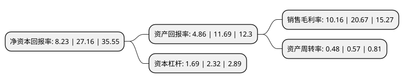

> 本页面由自动化程序生成于 2022年5月20日 01:36
> 内容可能存在错误，如有bug请提交issue至：https://github.com/Eroleice/doc-pi/issues
{.is-warning}

# 上市公司基本情况

## 基本资料

重庆四方新材股份有限公司（以下简称“四方新材”）成立于2003年08月18日，重庆市。于2021年03月10日在上交所主板上市。

四方新材注册资本17,235.4万元，公司目前主营业务是商品混凝土研发，生产和销售，同时生产建筑用砂石骨料。公司主要产品为商品混凝土。以下是详细信息：

- 公司名称: 重庆四方新材股份有限公司
- 股票代码: 605122.SH
- 所在地: 重庆 - 重庆市
- 成立日期: 2003年08月18日
- 注册资本: 17,235.4万元
- 法定代表人: 李德志
- 主营业务: 公司目前主营业务是商品混凝土研发，生产和销售，同时生产建筑用砂石骨料公司主要产品为商品混凝土
- 公司官网: www.cqsifang.com
- 公司介绍: 公司是以商品混凝土研发、生产和销售为主业，同时生产建筑用砂石骨料的建筑材料制造商。公司基于重庆市巴南区丰富的石灰岩矿产资源优势，形成了从建筑石料用石灰岩开采、精加工到商品混凝土研发、生产和销售的一体化生产经营模式。公司产品广泛应用于道路、桥梁、隧道、水利等基础设施建设，以及房地产开发等领域。公司拥有“环保型、规模化、自动化”的商品混凝土生产基地，设计生产能力约480万立方米/年，是重庆市城乡建设委员会、重庆市经济和信息化委员会首批授予“预拌混凝土绿色建材评级标识”的商品混凝土企业，有效提升了生产过程节能环保水平，实现了产品性能和质量的标准化。公司是重庆市最早成立的商品混凝土企业之一，产品销量和市场占有率自成立以来一直保持在行业前列。公司是重庆市城乡建设委员会、重庆市经济和信息化委员会首批授予“预拌混凝土绿色建材评级标识”的商品混凝土企业。公司自成立以来一直专注于商品混凝土的研发、生产和销售，凭借区别于传统产业的矿产资源优势、原材料供应优势、原材料品质优势、绿色环保优势和规模化优势等各项差异化优势，成为销售集中区域内的龙头企业。

## 股东及高管情况

上市公司第一大股东为张理兰，持股11,200,000股，占比6.5%，**疑似为**上市公司实际控制人。

截至2022年03月31日，上市公司的前十大股东中，共有8名自然人股东，2名机构股东，其中5%以上大股东共有1名。上市公司前十大股东明细如下：

> 未能通过持股比例判定出上市公司实际控制人（持股30%以上）
> 可能存在通过间接持股、联合持股、协议控制等方式拥有实际控制权的主体，具体请参考上市公司定期公告！
{.is-warning}

> 上市公司第一大股东持股不超过10%，请检查是否存在公司控制权风险！
{.is-danger}

> 截至2022年03月31日，上市公司前十大股东信息如下：

| 股东名称 | 持股数量（股） | 持股比例 |
| --- | --- | --- |
| 张理兰 | 11,200,000 | 6.5% |
| 福建晋江十月华隆股权投资合伙企业(有限合伙) | 5,052,500 | 2.93% |
| 赵清顺 | 1,400,000 | 0.81% |
| 重庆富坤新智能交通投资合伙企业(有限合伙) | 1,076,480 | 0.62% |
| 李石 | 961,220 | 0.56% |
| 李军 | 497,300 | 0.29% |
| 杨勇 | 462,000 | 0.27% |
| 杜德坤 | 454,276 | 0.26% |
| 谢涛 | 420,000 | 0.24% |
| 彭志勇 | 420,000 | 0.24% |

## 利润表分析

上市公司2021年总收入为13.5亿元，净利润为1.37亿元，实现盈利。

## 杜邦分析

> 数据列示周期：2021年 | 2020年 | 2019年
{.is-info}

上市公司的净资产收益率在近一年有所下降，下降幅度为-69.7%，其变化情况分解如下：
- 上市公司的销售毛利率在近一年下降了-50.85%，可能是生产效率的下降、商品原材料价格上涨或商品价格的下跌所致。
- 上市公司的资产周转率在近一年下降了-15.79%，可能是源自于更慢的销售回款或库存管理效果下降。
- 上市公司的财务杠杆比率在近一年下降了-27.16%，可能是减少负债降低财务费用。

