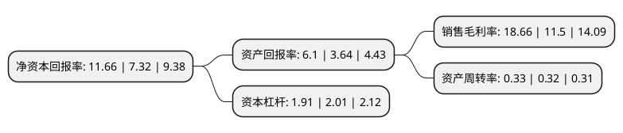

> 本页面由自动化程序生成于 2022年5月20日 01:29
> 内容可能存在错误，如有bug请提交issue至：https://github.com/Eroleice/doc-pi/issues
{.is-warning}

# 上市公司基本情况

## 基本资料

宁波海运股份有限公司（以下简称“宁波海运”）成立于1997年04月18日，宁波市。于1997年04月23日在上交所主板上市。

宁波海运注册资本120,653.42万元，主要业务:国内沿海，长江中下游，国际船舶普通货物运输以及控股子公司明州高速投资的宁波绕城高速公路西段项目。以下是详细信息：

- 公司名称: 宁波海运股份有限公司
- 股票代码: 600798.SH
- 所在地: 浙江 - 宁波市
- 成立日期: 1997年04月18日
- 注册资本: 120,653.42万元
- 法定代表人: 董军
- 主营业务: 国内沿海，长江中下游，国际船舶普通货物运输以及控股子公司明州高速投资的宁波绕城高速公路西段项目
- 公司官网: www.nbmc.com.cn
- 公司介绍: 公司主要经营国内沿海、长江中下游、国际船舶普通货物运输以及控股子公司明州高速投资的宁波绕城高速公路西段项目。多年来，公司凭藉宁波舟山港深水良港的地域优势，立足海运主业，审时度势，抓住机遇，积极奉行“诚信服务、稳健经营、规范运作、持续发展”的经营宗旨，稳步实施“立足海运，多元发展”的企业发展目标，致力于运力规模发展和经营结构调整，形成以煤炭运输为主的专业化散货运输经营格局，经营面辐射全国沿海港口和长江流域，航迹遍布30余个国家60多个港口。公司重视人才的引进和培养，多年来造就了一支素质过硬、技术精良、专业配套、与公司发展相适应的船员和专业管理队伍。公司已形成以沿海和国际煤炭运输为主的专业化散货运输经营格局，与国内大型能源集团等主要客户结成了长期战略合作关系，构筑运输企业、货源单位的优势互补和经济效益的互利双赢。

## 股东及高管情况

上市公司第一大股东为宁波海运集团有限公司，持股375,346,368股，占比31.11%，为上市公司实际控制人。

截至2022年03月31日，上市公司的前十大股东中，共有2名自然人股东，7名机构股东，1个产品账户，其中5%以上大股东共有2名。上市公司前十大股东明细如下：

> 截至2022年03月31日，上市公司前十大股东信息如下：

| 股东名称 | 持股数量（股） | 持股比例 |
| --- | --- | --- |
| 宁波海运集团有限公司 | 375,346,368 | 31.11% |
| 浙江省能源集团有限公司 | 154,736,242 | 12.82% |
| 浙江华云清洁能源有限公司 | 44,346,072 | 3.68% |
| 宁波保税区路远投资有限公司 | 26,950,000 | 2.23% |
| 天津港(集团)有限公司 | 15,000,000 | 1.24% |
| 浙江浙能煤运投资有限责任公司 | 10,662,857 | 0.88% |
| 杨三宝 | 9,400,000 | 0.78% |
| 宁波江北富搏企业管理咨询公司 | 7,268,288 | 0.6% |
| 傅湘涛 | 5,100,000 | 0.42% |
| 河南伊洛投资管理有限公司-乐天6号伊洛私募证券投资基金 | 3,467,818 | 0.29% |

## 利润表分析

上市公司2021年总收入为23.43亿元，净利润为4.37亿元，实现盈利。

## 杜邦分析

> 数据列示周期：2021年 | 2020年 | 2019年
{.is-info}

上市公司的净资产收益率在近一年有所上升，上升幅度为59.29%，其变化情况分解如下：
- 上市公司的销售毛利率在近一年上升了62.26%，可能是生产效率的提升、商品原材料价格下跌或商品价格的上涨所致。
- 上市公司的资产周转率在近一年上升了3.13%，可能是源自于更快的销售回款或库存管理效果提升。
- 上市公司的财务杠杆比率在近一年下降了-4.98%，可能是减少负债降低财务费用。

