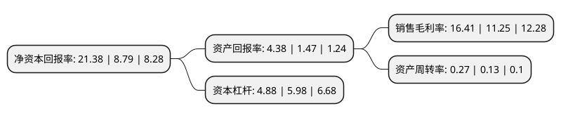

> 本页面由自动化程序生成于 2022年5月20日 01:31
> 内容可能存在错误，如有bug请提交issue至：https://github.com/Eroleice/doc-pi/issues
{.is-warning}

# 上市公司基本情况

## 基本资料

中远海运发展股份有限公司（以下简称“中远海发”）成立于2004年03月03日，上海市。于2007年12月12日在上交所主板上市。

中远海发注册资本1,358,647.73万元，主要业务:以船舶租赁，集装箱租赁和其他产业租赁等租赁业务为核心，以航运金融为特色的综合性金融服务平台。以下是详细信息：

- 公司名称: 中远海运发展股份有限公司
- 股票代码: 601866.SH
- 所在地: 上海 - 上海市
- 成立日期: 2004年03月03日
- 注册资本: 1,358,647.73万元
- 法定代表人: 王大雄
- 主营业务: 以船舶租赁，集装箱租赁和其他产业租赁等租赁业务为核心，以航运金融为特色的综合性金融服务平台
- 公司官网: development.coscoshipping.com
- 公司介绍: 公司是中国远洋海运集团有限公司所属专门从事供应链综合金融服务的公司。2016年2月1日，公司股东大会审议批准公司实施重大资产重组。通过重组交易，中海集运实现战略转型，由集装箱班轮运营商转型成为以船舶租赁、集装箱租赁和非航运租赁等租赁业务为核心，以航运金融为特色的综合性金融服务平台。公司致力于以航运金融为依托，发挥航运物流产业优势，整合产业链资源；打造以租赁、投资、保险、银行为核心的产业集群；以市场化机制、差异化优势、国际化视野，建立产融结合、融融结合、多种业务协同发展的“一站式”金融服务集团。非航融资租赁方面，公司致力于发展医疗、教育、新能源、建设和工业装备等多个领域的融资租赁业务。除多元化租赁业务以外，公司还致力于发展其他综合金融服务业务，充分利用航运业的产业经验、金融服务业的既有资源促进新产业发展，实现商业模式优化和金融业务多元化发展。公司作为航运金融平台将整合优质资源，充分发挥航运产业优势，多种金融业务协同发展，努力打造成为中国领先、国际一流、具有航运物流特色的供应链综合金融服务商。

## 股东及高管情况

上市公司第一大股东为中国海运集团有限公司，持股4,628,015,690股，占比34.06%，为上市公司实际控制人。

截至2022年03月31日，上市公司的前十大股东中，共有3名机构股东，4个产品账户，3个海外主体，其中5%以上大股东共有3名。上市公司前十大股东明细如下：

> 截至2022年03月31日，上市公司前十大股东信息如下：

| 股东名称 | 持股数量（股） | 持股比例 |
| --- | --- | --- |
| 中国海运集团有限公司 | 4,628,015,690 | 34.06% |
| 香港中央结算(代理人)有限公司 | 3,657,531,598 | 26.92% |
| 中远海运投资控股有限公司 | 1,447,917,519 | 10.66% |
| 中国国有企业混合所有制改革基金有限公司 | 163,043,478 | 1.2% |
| 香港中央结算有限公司(陆股通) | 136,954,251 | 1.01% |
| 中远海运发展股份有限公司回购专用证券账户 | 79,627,003 | 0.59% |
| UBS   AG | 55,184,373 | 0.41% |
| 河南伊洛投资管理有限公司-乐天1号伊洛私募证券投资基金 | 49,301,464 | 0.36% |
| 中国远洋海运集团有限公司 | 47,570,789 | 0.35% |
| 河南伊洛投资管理有限公司-君安12号伊洛私募证券投资基金 | 38,451,223 | 0.28% |

## 利润表分析

上市公司2021年总收入为371.68亿元，净利润为60.9亿元，实现盈利。

## 杜邦分析

> 数据列示周期：2021年 | 2020年 | 2019年
{.is-info}

上市公司的净资产收益率在近一年有所上升，上升幅度为143.23%，其变化情况分解如下：
- 上市公司的销售毛利率在近一年上升了45.87%，可能是生产效率的提升、商品原材料价格下跌或商品价格的上涨所致。
- 上市公司的资产周转率在近一年上升了107.69%，可能是源自于更快的销售回款或库存管理效果提升。
- 上市公司的财务杠杆比率在近一年下降了-18.39%，可能是减少负债降低财务费用。

