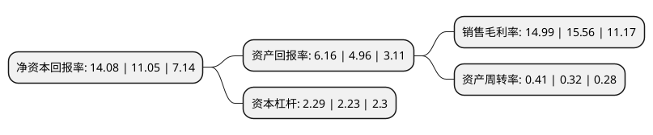

> 本页面由自动化程序生成于 2022年5月20日 01:31
> 内容可能存在错误，如有bug请提交issue至：https://github.com/Eroleice/doc-pi/issues
{.is-warning}

# 上市公司基本情况

## 基本资料

招商局能源运输股份有限公司（以下简称“招商轮船”）成立于2004年12月31日，上海市。于2006年12月01日在上交所主板上市。

招商轮船注册资本810,784.18万元，主要业务:国际原油运输，国际干散货运输业务，并通过持股50%的CLNG公司投资经营国际LNG运输业务。以下是详细信息：

- 公司名称: 招商局能源运输股份有限公司
- 股票代码: 601872.SH
- 所在地: 上海 - 上海市
- 成立日期: 2004年12月31日
- 注册资本: 810,784.18万元
- 法定代表人: 谢春林
- 主营业务: 国际原油运输，国际干散货运输业务，并通过持股50%的CLNG公司投资经营国际LNG运输业务
- 公司官网: www.cmenergyshipping.com
- 公司介绍: 公司是一家集油轮运输、散货船运输和液化天然气运输等能源运输为主业的航运企业，是目前国内运力规模最大的远洋油轮船队之一。公司主要从事国际原油运输、国际干散货运输业务，并通过持股50%的CLNG公司投资经营国际LNG运输业务。公司油轮和散货船队根据市场情况，主要通过即期市场租船、期租租船、与货主签署COA合同、参与市场联营体(POOL)运作、代管船舶等多种方式灵活开展生产经营活动。公司油轮和散货船分别由公司全资拥有的两个专业管理公司海宏公司及香港明华进行日常经营管理，公司还通过下属合营企业中国液化天然气运输(控股)有限公司参与液化天然气专用船运输业务。公司在其涉足的行业拥有一大批优秀公司，在中国香港、内地、东南亚乃至世界范围均有较大的影响力和号召力，其拥有的内外部资源整合能力将给公司不断带来商业机会。公司优秀的营运水平和船舶管理的长期安全记录赢得了国际主要油公司等大货主的信任，并以长期合作协议、中短期期租等方式与主要客户保持着友好合作关系，进一步保障了货源。

## 股东及高管情况

上市公司第一大股东为招商局轮船有限公司，持股4,399,208,563股，占比54.26%，为上市公司实际控制人。

截至2022年03月31日，上市公司的前十大股东中，共有1名自然人股东，4名机构股东，1个产品账户，4个海外主体，其中5%以上大股东共有1名。上市公司前十大股东明细如下：

> 截至2022年03月31日，上市公司前十大股东信息如下：

| 股东名称 | 持股数量（股） | 持股比例 |
| --- | --- | --- |
| 招商局轮船有限公司 | 4,399,208,563 | 54.26% |
| 香港中央结算有限公司(陆股通) | 192,532,266 | 2.37% |
| 大连船舶重工集团有限公司 | 156,716,417 | 1.93% |
| 富达基金(香港)有限公司-客户资金 | 54,622,953 | 0.67% |
| 四川璞信产融投资有限责任公司 | 44,476,119 | 0.55% |
| 中国石化集团资产经营管理有限公司 | 38,757,523 | 0.48% |
| JPMORGAN CHASE BANK,NATIONAL ASSOCIATION | 34,139,265 | 0.42% |
| JPMORGAN  CHASE BANK,NATIONAL   ASSOCIATION | 34,139,265 | 0.42% |
| 吴懿兵 | 33,721,356 | 0.42% |
| UBS AG | 28,089,786 | 0.35% |

## 利润表分析

上市公司2021年总收入为244.12亿元，净利润为36.58亿元，实现盈利。

## 杜邦分析

> 数据列示周期：2021年 | 2020年 | 2019年
{.is-info}

上市公司的净资产收益率在近一年有所上升，上升幅度为27.42%，其变化情况分解如下：
- 上市公司的销售毛利率在近一年下降了-3.66%，可能是生产效率的下降、商品原材料价格上涨或商品价格的下跌所致。
- 上市公司的资产周转率在近一年上升了28.13%，可能是源自于更快的销售回款或库存管理效果提升。
- 上市公司的财务杠杆比率在近一年上升了2.69%，可能是增加负债扩大生产规模。

