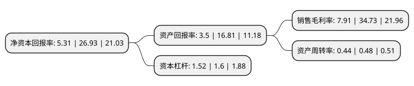

> 本页面由自动化程序生成于 2022年5月20日 01:32
> 内容可能存在错误，如有bug请提交issue至：https://github.com/Eroleice/doc-pi/issues
{.is-warning}

# 上市公司基本情况

## 基本资料

招商局南京油运股份有限公司（以下简称“招商南油”）成立于1993年09月08日，南京市。于2019年01月08日在上交所主板上市。

招商南油注册资本485,278.385万元，主营业务:海上原油，成品油，化工品，乙烯和液化气运输。以下是详细信息：

- 公司名称: 招商局南京油运股份有限公司
- 股票代码: 601975.SH
- 所在地: 江苏 - 南京市
- 成立日期: 1993年09月08日
- 注册资本: 485,278.385万元
- 法定代表人: 张锐
- 主营业务: 主营业务:海上原油，成品油，化工品，乙烯和液化气运输
- 公司官网: www.njtc.com.cn
- 公司介绍: 公司是招商局集团旗下从事油轮运输的专业平台，市场定位为“全球石化产品的运输服务商”，立足于液货运输主业，专注于国内外中小型油轮和化工气体等具有相对优势的市场领域。目前，公司拥有的各类运输船舶，包括：油轮、化学品船、乙烯船和液化气船。公司主要经营海上原油、成品油、化工品、乙烯和液化气运输。原油运输方面，公司主要从事国内沿海原油运输并辅以少量外贸运输。其中，内贸原油运输主要包括渤海湾地区、海进江以及长江口宁波舟山地区等三大区域；外贸原油运输主要包括东南亚、东北亚和澳洲航线。成品油运输方面，公司主要从事外贸运输，主要营运区域包括东北亚、新加坡和澳洲以及中东和东非等；此外公司外贸成品油业务还有少量涉足美国、地中海和波罗的海等区域。化工品及气体运输经营区域为国内沿海、远东和东南亚航线。公司高度关注船员综合素质的提升，通过专项培养计划，提高船员技术、管理水平，打造了一支高素质的船员队伍。此外，公司积极抓住国内炼化市场发展的机遇，与中石油、中石化等国内客户积极合作，提高国内油品运输市场的占有率。

## 股东及高管情况

上市公司第一大股东为中国长江航运集团有限公司，持股1,357,425,761股，占比27.97%，**疑似为**上市公司实际控制人。

截至2022年05月16日，上市公司的前十大股东中，共有10名机构股东，其中5%以上大股东共有4名。上市公司前十大股东明细如下：

> 未能通过持股比例判定出上市公司实际控制人（持股30%以上）
> 可能存在通过间接持股、联合持股、协议控制等方式拥有实际控制权的主体，具体请参考上市公司定期公告！
{.is-warning}

> 截至2022年05月16日，上市公司前十大股东信息如下：

| 股东名称 | 持股数量（股） | 持股比例 |
| --- | --- | --- |
| 中国长江航运集团有限公司 | 1,357,425,761 | 27.97% |
| 中国长江航运集团有限公司 | 1,357,425,761 | 27.97% |
| 中国建设银行股份有限公司江苏省分行 | 339,406,915 | 6.99% |
| 中国建设银行股份有限公司江苏省分行 | 316,406,915 | 6.5201% |
| 中国工商银行股份有限公司南京下关支行 | 188,426,770 | 3.88% |
| 中国长城资产管理股份有限公司 | 138,781,438 | 2.86% |
| 中信银行股份有限公司南京分行 | 125,996,031 | 2.6% |
| 交通银行股份有限公司 | 75,000,000 | 1.55% |
| 民生金融租赁股份有限公司 | 50,128,800 | 1.03% |
| 平安银行股份有限公司 | 29,260,000 | 0.6% |

## 利润表分析

上市公司2021年总收入为38.62亿元，净利润为3.05亿元，实现盈利。

## 杜邦分析

> 数据列示周期：2021年 | 2020年 | 2019年
{.is-info}

上市公司的净资产收益率在近一年有所下降，下降幅度为-80.28%，其变化情况分解如下：
- 上市公司的销售毛利率在近一年下降了-77.22%，可能是生产效率的下降、商品原材料价格上涨或商品价格的下跌所致。
- 上市公司的资产周转率在近一年下降了-8.33%，可能是源自于更慢的销售回款或库存管理效果下降。
- 上市公司的财务杠杆比率在近一年下降了-5%，可能是减少负债降低财务费用。

