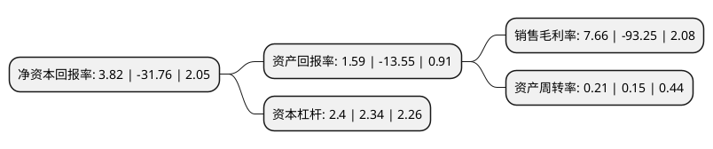

> 本页面由自动化程序生成于 2022年5月20日 01:02
> 内容可能存在错误，如有bug请提交issue至：https://github.com/Eroleice/doc-pi/issues
{.is-warning}

# 上市公司基本情况

## 基本资料

海马汽车股份有限公司（以下简称“海马汽车”）成立于1993年01月26日，海口市。于1994年08月08日在深交所主板上市。

海马汽车注册资本164,463.643万元，主要产品:S5，F7，F5，S7等系列产品。主要业务:汽车制造及服务。以下是详细信息：

- 公司名称: 海马汽车股份有限公司
- 股票代码: 000572.SZ
- 所在地: 海南 - 海口市
- 成立日期: 1993年01月26日
- 注册资本: 164,463.643万元
- 法定代表人: 孙忠春
- 主营业务: 主要产品:S5，F7，F5，S7等系列产品汽车制造及服务
- 公司官网: www.haima.com
- 公司介绍: 公司是一家拥有汽车及汽车发动机研发、制造、销售、物流配送及相关业务的完整业务链布局的公司。公司主营业务为汽车制造及服务，主要产品：S5、F7、F5、S7等系列产品。提供的主要劳务：金融服务、物业服务、物流配送服务等。公司秉承“开放合作、学习创新、自主多赢”的发展理念，坚持“先做精、后做强、再做稳、不争大”的经营理念。目前，公司已布局海口生产基地、郑州生产基地及上海研发基地，并实现在埃及、智利、菲律宾、越南等多个国家和地区的整车出口，展示了“中国制造”新形象。公司曾获得“最受赞赏的中国公司”、“中国民营企业500强”、“中国民营企业制造业500强”、“中国制造企业500强”等荣誉称号。

## 股东及高管情况

上市公司第一大股东为海马(上海)投资有限公司，持股473,600,000股，占比28.8%，**疑似为**上市公司实际控制人。

截至2022年03月31日，上市公司的前十大股东中，共有4名自然人股东，3名机构股东，3个产品账户，其中5%以上大股东共有2名。上市公司前十大股东明细如下：

> 未能通过持股比例判定出上市公司实际控制人（持股30%以上）
> 可能存在通过间接持股、联合持股、协议控制等方式拥有实际控制权的主体，具体请参考上市公司定期公告！
{.is-warning}

> 截至2022年03月31日，上市公司前十大股东信息如下：

| 股东名称 | 持股数量（股） | 持股比例 |
| --- | --- | --- |
| 海马(上海)投资有限公司 | 473,600,000 | 28.8% |
| 海马投资集团有限公司 | 93,022,951 | 5.66% |
| 何雪萍 | 59,150,000 | 3.6% |
| 工银瑞信基金-农业银行-工银瑞信中证金融资产管理计划 | 16,314,160 | 0.99% |
| 海南家美太阳能有限公司 | 15,493,884 | 0.94% |
| 博时资本-何雪萍-博时资本博创66号单一资产管理计划 | 15,000,000 | 0.91% |
| 吴鸣霄 | 14,387,913 | 0.87% |
| 嘉实基金-农业银行-嘉实中证金融资产管理计划 | 13,070,700 | 0.79% |
| 赵吉 | 10,000,000 | 0.61% |
| 赵建平 | 9,000,000 | 0.55% |

## 利润表分析

上市公司2021年总收入为18.11亿元，净利润为1.34亿元，实现盈利。

## 杜邦分析

> 数据列示周期：2021年 | 2020年 | 2019年
{.is-info}

上市公司的净资产收益率在近一年有所下降，下降幅度为-112.03%，其变化情况分解如下：
- 上市公司的销售毛利率在近一年下降了-108.21%，可能是生产效率的下降、商品原材料价格上涨或商品价格的下跌所致。
- 上市公司的资产周转率在近一年上升了40%，可能是源自于更快的销售回款或库存管理效果提升。
- 上市公司的财务杠杆比率在近一年上升了2.56%，可能是增加负债扩大生产规模。

