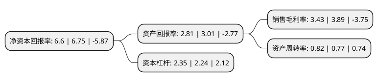

> 本页面由自动化程序生成于 2022年5月20日 01:02
> 内容可能存在错误，如有bug请提交issue至：https://github.com/Eroleice/doc-pi/issues
{.is-warning}

# 上市公司基本情况

## 基本资料

重庆长安汽车股份有限公司（以下简称“长安汽车”）成立于1996年10月31日，重庆市。于1997年06月10日在深交所主板上市。

长安汽车注册资本763,215.34万元，主要产品:微型客车，微型货车，轿车。主营业务:整车研发，制造和销售以及发动机的研发，生产。以下是详细信息：

- 公司名称: 重庆长安汽车股份有限公司
- 股票代码: 000625.SZ
- 所在地: 重庆 - 重庆市
- 成立日期: 1996年10月31日
- 注册资本: 763,215.34万元
- 法定代表人: 朱华荣
- 主营业务: 主要产品:微型客车，微型货车，轿车主营业务:整车研发，制造和销售以及发动机的研发，生产
- 公司官网: www.changan.com.cn
- 公司介绍: 公司是中国汽车四大集团阵营企业、中国品牌领先汽车企业，两度入选央视“国家品牌计划”，成为中国品牌汽车行业领跑者。公司的主要业务涵盖整车研发、制造和销售以及发动机的研发、生产，并整合优势资源积极发展出行服务、新零售、金融投资等领域，进行多维度的产业布局。公司始终坚持以“引领汽车文明造福人类生活”为使命，秉承“节能环保、科技智能”的理念，大力发展新能源和智能汽车，致力于用科技创新引领汽车文明，努力为客户提供高品质的产品和服务。经过多年发展，现已形成轿车、SUV、MPV、交叉型乘用车、客车、货车等多档次、宽系列、多品种的产品谱系，覆盖传统燃油和新能源车型，拥有排量从1.0L到2.0L的发动机平台。公司旗下拥有长安乘用车、欧尚汽车、凯程汽车、长安福特、长安马自达、长安铃木、长安PSA等众多知名品牌。

## 股东及高管情况

上市公司第一大股东为中国长安汽车集团有限公司，持股1,371,607,803股，占比17.97%，**疑似为**上市公司实际控制人。

截至2022年03月31日，上市公司的前十大股东中，共有6名机构股东，1个产品账户，3个海外主体，其中5%以上大股东共有3名。上市公司前十大股东明细如下：

> 未能通过持股比例判定出上市公司实际控制人（持股30%以上）
> 可能存在通过间接持股、联合持股、协议控制等方式拥有实际控制权的主体，具体请参考上市公司定期公告！
{.is-warning}

> 截至2022年03月31日，上市公司前十大股东信息如下：

| 股东名称 | 持股数量（股） | 持股比例 |
| --- | --- | --- |
| 中国长安汽车集团有限公司 | 1,371,607,803 | 17.97% |
| 中国兵器装备集团有限公司 | 1,125,382,399 | 14.75% |
| 南方工业资产管理有限责任公司 | 389,417,890 | 5.1% |
| 中国证券金融股份有限公司 | 327,971,466 | 4.3% |
| 中汇富通投资有限公司 | 215,768,332 | 2.83% |
| 香港中央结算有限公司(陆股通) | 164,180,084 | 2.15% |
| 中国建设银行股份有限公司-华夏能源革新股票型证券投资基金 | 63,301,744 | 0.83% |
| 招商证券香港有限公司 | 44,436,436 | 0.58% |
| CAPE ANN GLOBAL DEVELOPING MARKETS FUND | 32,554,272 | 0.43% |
| GUOTAI JUNAN SECURITIES(HONGKONG) LIMITED | 31,878,078 | 0.42% |

## 利润表分析

上市公司2021年总收入为1,051.41亿元，净利润为36.04亿元，实现盈利。

## 杜邦分析

> 数据列示周期：2021年 | 2020年 | 2019年
{.is-info}

上市公司的净资产收益率在近一年有所下降，下降幅度为-2.22%，其变化情况分解如下：
- 上市公司的销售毛利率在近一年下降了-11.83%，可能是生产效率的下降、商品原材料价格上涨或商品价格的下跌所致。
- 上市公司的资产周转率在近一年上升了6.49%，可能是源自于更快的销售回款或库存管理效果提升。
- 上市公司的财务杠杆比率在近一年上升了4.91%，可能是增加负债扩大生产规模。

