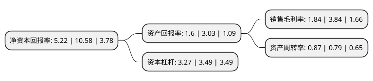

> 本页面由自动化程序生成于 2022年5月20日 01:10
> 内容可能存在错误，如有bug请提交issue至：https://github.com/Eroleice/doc-pi/issues
{.is-warning}

# 上市公司基本情况

## 基本资料

比亚迪股份有限公司（以下简称“比亚迪”）成立于1995年02月10日，深圳市。于2011年06月30日在深交所中小板上市。

比亚迪注册资本291,114.286万元，包含传统燃油汽车及新能源汽车在内的汽车业务，手机部件及组装业务，以及二次充电电池及新能源业务以下是详细信息：

- 公司名称: 比亚迪股份有限公司
- 股票代码: 002594.SZ
- 所在地: 广东 - 深圳市
- 成立日期: 1995年02月10日
- 注册资本: 291,114.286万元
- 法定代表人: 王传福
- 主营业务: 包含传统燃油汽车及新能源汽车在内的汽车业务，手机部件及组装业务，以及二次充电电池及新能源业务
- 公司官网: www.byd.com
- 公司介绍: 比亚迪是一家致力于“用技术创新，满足人们对美好生活的向往”的高新技术企业。比亚迪成立于1995年2月，经过20多年的高速发展，已在全球设立30多个工业园，实现全球六大洲的战略布局。比亚迪业务布局涵盖电子、汽车、新能源和轨道交通等领域，并在这些领域发挥着举足轻重的作用，从能源的获取、存储，再到应用，全方位构建零排放的新能源整体解决方案。比亚迪是香港和深圳上市公司，营业额和总市值均超过千亿元。

## 股东及高管情况

上市公司第一大股东为HKSCC NOMINEES LIMITED，持股872,399,247股，占比29.97%，**疑似为**上市公司实际控制人。

截至2022年04月22日，上市公司的前十大股东中，共有5名自然人股东，2名机构股东，3个海外主体，其中5%以上大股东共有5名。上市公司前十大股东明细如下：

> 未能通过持股比例判定出上市公司实际控制人（持股30%以上）
> 可能存在通过间接持股、联合持股、协议控制等方式拥有实际控制权的主体，具体请参考上市公司定期公告！
{.is-warning}

> 截至2022年04月22日，上市公司前十大股东信息如下：

| 股东名称 | 持股数量（股） | 持股比例 |
| --- | --- | --- |
| HKSCC NOMINEES LIMITED | 872,399,247 | 29.97% |
| 王传福 | 513,623,850 | 17.64% |
| 吕向阳 | 239,228,620 | 8.22% |
| WESTERN CAPITAL GROUP LLC | 225,000,000 | 7.73% |
| 融捷投资控股集团有限公司 | 154,986,202 | 5.32% |
| 夏佐全 | 82,635,607 | 2.84% |
| 香港中央结算有限公司(陆股通) | 63,085,663 | 2.17% |
| 王念强 | 18,299,740 | 0.63% |
| 中央汇金资产管理有限责任公司 | 11,976,633 | 0.41% |
| 李柯 | 10,921,400 | 0.38% |

## 利润表分析

上市公司2021年总收入为2,161.42亿元，净利润为39.67亿元，实现盈利。

## 杜邦分析

> 数据列示周期：2021年 | 2020年 | 2019年
{.is-info}

上市公司的净资产收益率在近一年有所下降，下降幅度为-50.66%，其变化情况分解如下：
- 上市公司的销售毛利率在近一年下降了-52.08%，可能是生产效率的下降、商品原材料价格上涨或商品价格的下跌所致。
- 上市公司的资产周转率在近一年上升了10.13%，可能是源自于更快的销售回款或库存管理效果提升。
- 上市公司的财务杠杆比率在近一年下降了-6.3%，可能是减少负债降低财务费用。

