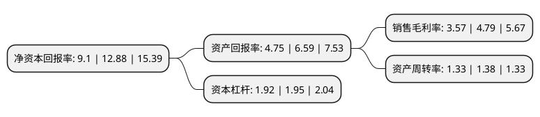

> 本页面由自动化程序生成于 2022年5月20日 01:22
> 内容可能存在错误，如有bug请提交issue至：https://github.com/Eroleice/doc-pi/issues
{.is-warning}

# 上市公司基本情况

## 基本资料

中集车辆(集团)股份有限公司（以下简称“中集车辆”）成立于1996年08月29日，深圳市。于2021年07月08日在深交所创业板上市。

中集车辆注册资本201,760万元，公司是全球销量排名第一的半挂车生产企业，在全球主要市场开展七大类半挂车的生产，销售和售后市场服务;在中国市场，公司是具有竞争能力和创新精神的专用车上装生产企业，同时也是知名的冷藏厢式车厢体的制造企业。以下是详细信息：

- 公司名称: 中集车辆(集团)股份有限公司
- 股票代码: 301039.SZ
- 所在地: 广东 - 深圳市
- 成立日期: 1996年08月29日
- 注册资本: 201,760万元
- 法定代表人: 李贵平
- 主营业务: 公司是全球销量排名第一的半挂车生产企业，在全球主要市场开展七大类半挂车的生产，销售和售后市场服务;在中国市场，公司是具有竞争能力和创新精神的专用车上装生产企业，同时也是知名的冷藏厢式车厢体的制造企业
- 公司官网: www.cimcvehiclesgroup.com
- 公司介绍: 公司是全球销量排名第一的半挂车生产企业，在全球主要市场开展七大类半挂车的生产、销售和售后市场服务；在中国市场，公司是具有竞争能力和创新精神的专用车上装生产企业，同时也是知名的冷藏厢式车厢体的制造企业。公司从2014年起开始探索建设“高端制造体系”，目前在境内外已建成12家半挂车灯塔工厂、5家专用车上装生产灯塔工厂，2家冷藏厢式车厢体生产灯塔工厂，并搭建了多个系列半挂车产品的“产品模块”，公司将继续致力于全面搭建和完善“高端制造体系”，保持公司的持续竞争优势。

## 股东及高管情况

上市公司第一大股东为中国国际海运集装箱(集团)股份有限公司，持股728,443,475股，占比36.1%，为上市公司实际控制人。

截至2022年03月31日，上市公司的前十大股东中，共有5名机构股东，4个产品账户，1个海外主体，其中5%以上大股东共有5名。上市公司前十大股东明细如下：

> 截至2022年03月31日，上市公司前十大股东信息如下：

| 股东名称 | 持股数量（股） | 持股比例 |
| --- | --- | --- |
| 中国国际海运集装箱(集团)股份有限公司 | 728,443,475 | 36.1% |
| 中国国际海运集装箱(香港)有限公司 | 391,280,500 | 19.39% |
| 香港中央结算(代理人)有限公司 | 172,597,032 | 8.55% |
| 平安资本有限责任公司-上海太富祥中股权投资基金合伙企业(有限合伙) | 167,836,525 | 8.32% |
| 平安资本有限责任公司-台州太富祥云股权投资合伙企业(有限合伙) | 161,602,500 | 8.01% |
| 象山华金实业投资合伙企业(有限合伙) | 96,877,500 | 4.8% |
| 中央企业乡村产业投资基金股份有限公司 | 28,235,632 | 1.4% |
| 中保投资有限责任公司-中国保险投资基金(有限合伙) | 25,862,068 | 1.28% |
| 深圳南山大成基金管理有限公司-深圳南山大成新材料投资合伙企业(有限合伙) | 23,160,000 | 1.15% |
| 深圳市龙源港城企业管理中心(有限合伙) | 23,160,000 | 1.15% |

## 利润表分析

上市公司2021年总收入为276.47亿元，净利润为9.87亿元，实现盈利。

## 杜邦分析

> 数据列示周期：2021年 | 2020年 | 2019年
{.is-info}

上市公司的净资产收益率在近一年有所下降，下降幅度为-29.35%，其变化情况分解如下：
- 上市公司的销售毛利率在近一年下降了-25.47%，可能是生产效率的下降、商品原材料价格上涨或商品价格的下跌所致。
- 上市公司的资产周转率在近一年下降了-3.62%，可能是源自于更慢的销售回款或库存管理效果下降。
- 上市公司的财务杠杆比率在近一年下降了-1.54%，可能是减少负债降低财务费用。

