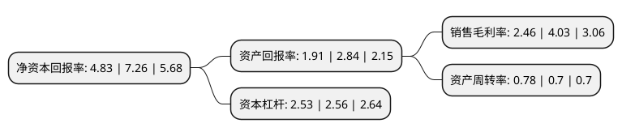

> 本页面由自动化程序生成于 2022年5月20日 01:23
> 内容可能存在错误，如有bug请提交issue至：https://github.com/Eroleice/doc-pi/issues
{.is-warning}

# 上市公司基本情况

## 基本资料

东风汽车股份有限公司（以下简称“东风汽车”）成立于1999年07月21日，襄阳市。于1999年07月27日在上交所主板上市。

东风汽车注册资本200,000万元，主要产品:东风系列轻型商用车，东风康明斯B，C系列柴油发动机和东风梅花铸件。主营业务:全系列轻型商用车整车和动力总成的设计，制造和销售。以下是详细信息：

- 公司名称: 东风汽车股份有限公司
- 股票代码: 600006.SH
- 所在地: 湖北 - 襄阳市
- 成立日期: 1999年07月21日
- 注册资本: 200,000万元
- 法定代表人: 赵书良
- 主营业务: 主要产品:东风系列轻型商用车，东风康明斯B，C系列柴油发动机和东风梅花铸件主营业务:全系列轻型商用车整车和动力总成的设计，制造和销售
- 公司官网: www.dfac.com
- 公司介绍: 公司作为东风汽车集团有限公司轻型商用车事业的承担者，主营业务为全系列轻型商用车整车和动力总成的设计、制造和销售。事业单元涉及轻卡事业、工程车事业、客车事业、新能源事业和发动机事业。公司涵盖全系列汽车品种从轻卡、工程车、特种车、皮卡到SUV、MPV、客车、轻型客车及底盘等，从传统汽车到新能源汽车，多方位满足全国客户的不同货物运输类型需要和行业集团客户的差异化需求。公司立足客户和市场的需求进行商品规划，以客户为中心研发和投放市场，打造工特事业的黄金车型，在市场上奠定了坚实的基础。

## 股东及高管情况

上市公司第一大股东为东风汽车有限公司，持股1,202,000,000股，占比60.1%，为上市公司实际控制人。

截至2022年03月31日，上市公司的前十大股东中，共有7名自然人股东，1名机构股东，2个产品账户，其中5%以上大股东共有1名。上市公司前十大股东明细如下：

> 截至2022年03月31日，上市公司前十大股东信息如下：

| 股东名称 | 持股数量（股） | 持股比例 |
| --- | --- | --- |
| 东风汽车有限公司 | 1,202,000,000 | 60.1% |
| 黄迎节 | 9,067,110 | 0.45% |
| 董云贤 | 4,643,578 | 0.23% |
| 中国农业银行股份有限公司-中证500交易型开放式指数证券投资基金 | 4,165,162 | 0.21% |
| 蔡恒刚 | 2,345,000 | 0.12% |
| 樊世彬 | 2,120,000 | 0.11% |
| 陈铭 | 2,020,000 | 0.1% |
| 张锦福 | 1,987,400 | 0.1% |
| 领航投资澳洲有限公司-领航新兴市场股指基金(交易所) | 1,936,312 | 0.1% |
| 周双波 | 1,820,160 | 0.09% |

## 利润表分析

上市公司2021年总收入为155.5亿元，净利润为3.82亿元，实现盈利。

## 杜邦分析

> 数据列示周期：2021年 | 2020年 | 2019年
{.is-info}

上市公司的净资产收益率在近一年有所下降，下降幅度为-33.47%，其变化情况分解如下：
- 上市公司的销售毛利率在近一年下降了-38.96%，可能是生产效率的下降、商品原材料价格上涨或商品价格的下跌所致。
- 上市公司的资产周转率在近一年上升了11.43%，可能是源自于更快的销售回款或库存管理效果提升。
- 上市公司的财务杠杆比率在近一年下降了-1.17%，可能是减少负债降低财务费用。

