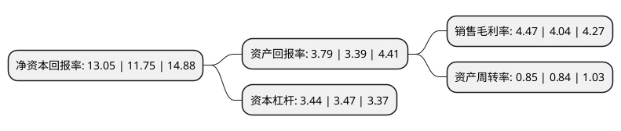

> 本页面由自动化程序生成于 2022年5月20日 01:24
> 内容可能存在错误，如有bug请提交issue至：https://github.com/Eroleice/doc-pi/issues
{.is-warning}

# 上市公司基本情况

## 基本资料

上海汽车集团股份有限公司（以下简称“上汽集团”）成立于1984年04月16日，上海市。于1997年11月25日在上交所主板上市。

上汽集团注册资本1,168,346.137万元，主要产品:轻型客车以及轿车，重型车，拖拉机变速器，汽车悬架弹簧，汽车散热器，粉末冶金制品，汽车底盘总成，车灯，转向机，ABS制动系统，轴瓦，安全带，传动轴，空调压缩机等汽车零部件。主营业务:整车(含乘用车，商用车)的研发，生产和销售，零部件(含动力驱动系统，底盘系统，内外饰系统，以及电池，电驱，电力电子等新能源汽车核心零部件和智能产品系统)的研发，生产，销售;物流，汽车电商，出行服务，节能和充电服务等汽车服务贸易业务;汽车相关金融，保险和投资业务;海外经营和国际商贸业务;并在产业大数据和人工智能领域积极布局。以下是详细信息：

- 公司名称: 上海汽车集团股份有限公司
- 股票代码: 600104.SH
- 所在地: 上海 - 上海市
- 成立日期: 1984年04月16日
- 注册资本: 1,168,346.137万元
- 法定代表人: 陈虹
- 主营业务: 主要产品:轻型客车以及轿车，重型车，拖拉机变速器，汽车悬架弹簧，汽车散热器，粉末冶金制品，汽车底盘总成，车灯，转向机，ABS制动系统，轴瓦，安全带，传动轴，空调压缩机等汽车零部件主营业务:整车(含乘用车，商用车)的研发，生产和销售，零部件(含动力驱动系统，底盘系统，内外饰系统，以及电池，电驱，电力电子等新能源汽车核心零部件和智能产品系统)的研发，生产，销售;物流，汽车电商，出行服务，节能和充电服务等汽车服务贸易业务;汽车相关金融，保险和投资业务;海外经营和国际商贸业务;并在产业大数据和人工智能领域积极布局
- 公司官网: www.saicmotor.com
- 公司介绍: 公司属于汽车制造行业，目前正努力把握产业发展趋势，加快创新转型，从传统的制造型企业，向为消费者提供移动出行服务与产品的综合供应商发展。公司主要业务包括整车(含乘用车、商用车)的研发、生产和销售，正积极推进新能源汽车、互联网汽车的商业化，并开展智能驾驶等技术研究和产业化探索；零部件(含动力驱动系统、底盘系统、内外饰系统，以及电池、电驱、电力电子等新能源汽车核心零部件和智能产品系统)的研发、生产、销售；物流、汽车电商、出行服务、节能和充电服务等汽车服务贸易业务；汽车相关金融、保险和投资业务；海外经营和国际商贸业务；并在产业大数据和人工智能领域积极布局。

## 股东及高管情况

上市公司第一大股东为上海汽车工业(集团)有限公司，持股7,923,795,943股，占比67.8206%，为上市公司实际控制人。

截至2022年05月05日，上市公司的前十大股东中，共有10名机构股东，其中5%以上大股东共有2名。上市公司前十大股东明细如下：

> 截至2022年05月05日，上市公司前十大股东信息如下：

| 股东名称 | 持股数量（股） | 持股比例 |
| --- | --- | --- |
| 上海汽车工业(集团)有限公司 | 7,923,795,943 | 67.8206% |
| 上海汽车工业(集团)有限公司 | 7,904,760,961 | 67.66% |
| 跃进汽车集团有限公司 | 413,919,141 | 3.54% |
| 上海国际集团有限公司 | 403,301,600 | 3.45% |
| 中国证券金融股份有限公司 | 349,768,454 | 2.99% |
| 中央汇金资产管理有限责任公司 | 98,585,000 | 0.84% |
| 河北港口集团有限公司 | 87,719,298 | 0.75% |
| 华融汇通资产管理有限公司 | 71,688,948 | 0.61% |
| 中信证券股份有限公司 | 51,249,545 | 0.44% |
| 广东恒健投资控股有限公司 | 40,704,757 | 0.35% |

## 利润表分析

上市公司2021年总收入为7,798.45亿元，净利润为339.41亿元，实现盈利。

## 杜邦分析

> 数据列示周期：2021年 | 2020年 | 2019年
{.is-info}

上市公司的净资产收益率在近一年有所上升，上升幅度为11.06%，其变化情况分解如下：
- 上市公司的销售毛利率在近一年上升了10.64%，可能是生产效率的提升、商品原材料价格下跌或商品价格的上涨所致。
- 上市公司的资产周转率在近一年上升了1.19%，可能是源自于更快的销售回款或库存管理效果提升。
- 上市公司的财务杠杆比率在近一年下降了-0.86%，可能是减少负债降低财务费用。

