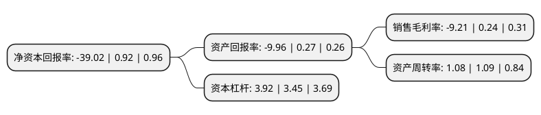

> 本页面由自动化程序生成于 2022年5月20日 01:24
> 内容可能存在错误，如有bug请提交issue至：https://github.com/Eroleice/doc-pi/issues
{.is-warning}

# 上市公司基本情况

## 基本资料

北汽福田汽车股份有限公司（以下简称“福田汽车”）成立于1996年08月28日，北京市。于1998年06月02日在上交所主板上市。

福田汽车注册资本657,519.205万元，主要产品:汽车。以下是详细信息：

- 公司名称: 北汽福田汽车股份有限公司
- 股票代码: 600166.SH
- 所在地: 北京 - 北京市
- 成立日期: 1996年08月28日
- 注册资本: 657,519.205万元
- 法定代表人: 常瑞
- 主营业务: 主要产品:汽车
- 公司官网: www.foton.com.cn
- 公司介绍: 公司是一家跨地区、跨行业、跨所有制的国有控股上市公司，目前拥有欧曼、欧辉、欧马可、奥铃、时代、萨瓦纳、拓陆者、萨普、图雅诺、风景、蒙派克、伽途、瑞沃等业务品牌，生产车型涵盖轻型卡车、中型卡车、重型卡车、轻型客车、大中型客车、乘用车以及核心零部件发动机。公司通过与世界知名企业戴姆勒、康明斯、采埃孚的横向一体化战略合作，完成了商用车全系列发动机、变速箱等核心零部件的布局，产品性能得到提升的同时创造了新的利润增长点，形成福田汽车核心竞争优势。

## 股东及高管情况

上市公司第一大股东为北京汽车集团有限公司，持股1,805,288,934股，占比27.46%，**疑似为**上市公司实际控制人。

截至2022年03月31日，上市公司的前十大股东中，共有1名自然人股东，7名机构股东，2个产品账户，其中5%以上大股东共有1名。上市公司前十大股东明细如下：

> 未能通过持股比例判定出上市公司实际控制人（持股30%以上）
> 可能存在通过间接持股、联合持股、协议控制等方式拥有实际控制权的主体，具体请参考上市公司定期公告！
{.is-warning}

> 截至2022年03月31日，上市公司前十大股东信息如下：

| 股东名称 | 持股数量（股） | 持股比例 |
| --- | --- | --- |
| 北京汽车集团有限公司 | 1,805,288,934 | 27.46% |
| 北京国有资本运营管理有限公司 | 296,626,400 | 4.51% |
| 常柴股份有限公司 | 144,220,000 | 2.19% |
| 许加元 | 130,200,000 | 1.98% |
| 潍柴动力股份有限公司 | 80,000,000 | 1.22% |
| 诸城市义和车桥有限公司 | 60,120,000 | 0.91% |
| 中国工商银行股份有限公司-中欧价值智选回报混合型证券投资基金 | 59,436,724 | 0.9% |
| 工银安盛人寿保险有限公司-传统2 | 49,999,965 | 0.76% |
| 山东莱动内燃机有限公司 | 49,666,600 | 0.76% |
| 上海浦东发展银行股份有限公司-中欧价值成长混合型证券投资基金 | 41,624,564 | 0.63% |

## 利润表分析

上市公司2021年总收入为549.73亿元，净利润为-50.61亿元，**未实现盈利**。

## 杜邦分析

> 数据列示周期：2021年 | 2020年 | 2019年
{.is-info}

上市公司的净资产收益率在近一年有所下降，下降幅度为-4341.3%，其变化情况分解如下：
- 上市公司的销售毛利率在近一年下降了-3937.5%，可能是生产效率的下降、商品原材料价格上涨或商品价格的下跌所致。
- 上市公司的资产周转率在近一年下降了-0.92%，可能是源自于更慢的销售回款或库存管理效果下降。
- 上市公司的财务杠杆比率在近一年上升了13.62%，可能是增加负债扩大生产规模。

