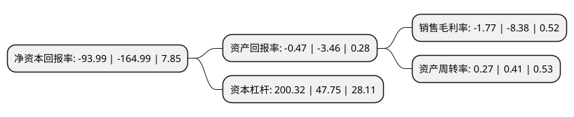

> 本页面由自动化程序生成于 2022年5月20日 01:25
> 内容可能存在错误，如有bug请提交issue至：https://github.com/Eroleice/doc-pi/issues
{.is-warning}

# 上市公司基本情况

## 基本资料

扬州亚星客车股份有限公司（以下简称“亚星客车”）成立于1998年09月28日，扬州市。于1999年08月31日在上交所主板上市。

亚星客车注册资本28,600万元，主要产品:大型客车，中型客车，轻型客车，特种车。以下是详细信息：

- 公司名称: 扬州亚星客车股份有限公司
- 股票代码: 600213.SH
- 所在地: 江苏 - 扬州市
- 成立日期: 1998年09月28日
- 注册资本: 28,600万元
- 法定代表人: 董长江
- 主营业务: 主要产品:大型客车，中型客车，轻型客车，特种车
- 公司官网: www.asiastarbus.com
- 公司介绍: 公司是生产客车和特种车的国家高新技术企业，目前拥有“亚星”、“扬子”两个品牌20多个系列百余个品种，产品覆盖大、中、轻型，高、中、普档客车。公司建立了同行业一流的技术开发中心，拥有近十项客车整车专利和结构专利，并成为全国率先通过“CCC”的客车企业之一。公司曾为北京亚运会、北京奥运会、世界运河名城博览会、亚乒赛、国际马拉松比赛等重大国际盛会提供优质车辆和服务，受到了国内外嘉宾的盛赞。

## 股东及高管情况

上市公司第一大股东为潍柴(扬州)亚星汽车有限公司，持股178,200,000股，占比62.31%，为上市公司实际控制人。

截至2022年03月31日，上市公司的前十大股东中，共有9名自然人股东，1名机构股东，其中5%以上大股东共有1名。上市公司前十大股东明细如下：

> 截至2022年03月31日，上市公司前十大股东信息如下：

| 股东名称 | 持股数量（股） | 持股比例 |
| --- | --- | --- |
| 潍柴(扬州)亚星汽车有限公司 | 178,200,000 | 62.31% |
| 胡祖平 | 5,090,900 | 1.78% |
| 周岭松 | 1,805,073 | 0.63% |
| 吴春燕 | 1,607,000 | 0.56% |
| 孙浩喃 | 862,500 | 0.3% |
| 赵爽 | 841,084 | 0.29% |
| 孙丽 | 653,300 | 0.23% |
| 许春凤 | 650,000 | 0.23% |
| 揭凯 | 650,000 | 0.23% |
| 琚泽平 | 636,600 | 0.22% |

## 利润表分析

上市公司2021年总收入为9.78亿元，净利润为-0.18亿元，**未实现盈利**。

## 杜邦分析

> 数据列示周期：2021年 | 2020年 | 2019年
{.is-info}

上市公司的净资产收益率在近一年有所下降，下降幅度为-43.03%，其变化情况分解如下：
- 上市公司的销售毛利率在近一年下降了-78.88%，可能是生产效率的下降、商品原材料价格上涨或商品价格的下跌所致。
- 上市公司的资产周转率在近一年下降了-34.15%，可能是源自于更慢的销售回款或库存管理效果下降。
- 上市公司的财务杠杆比率在近一年上升了319.52%，可能是增加负债扩大生产规模。

