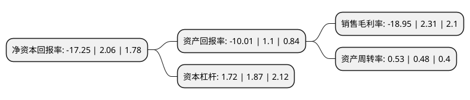

> 本页面由自动化程序生成于 2022年5月20日 01:25
> 内容可能存在错误，如有bug请提交issue至：https://github.com/Eroleice/doc-pi/issues
{.is-warning}

# 上市公司基本情况

## 基本资料

辽宁曙光汽车集团股份有限公司（以下简称“ST曙光”）成立于1995年12月11日，丹东市。于2000年12月26日在上交所主板上市。

ST曙光注册资本67,560.421万元，主要业务:车桥，黄海客车，曙光专用车，汽车零部件，差速器壳，经销其他汽车。以下是详细信息：

- 公司名称: 辽宁曙光汽车集团股份有限公司
- 股票代码: 600303.SH
- 所在地: 辽宁 - 丹东市
- 成立日期: 1995年12月11日
- 注册资本: 67,560.421万元
- 法定代表人: 宫大
- 主营业务: 车桥，黄海客车，曙光专用车，汽车零部件，差速器壳，经销其他汽车
- 公司官网: www.sgautomotive.com
- 公司介绍: 公司是以整车、车桥及零部件为主营业务的跨地区的企业集团，是“国家汽车整车出口基地企业”，拥有国家级技术中心。公司拥有的“黄海”汽车和“曙光”车桥两大产品是“中国名牌产品”，2007年国家工商行政管理总局商标评审委员会认定“黄海”商标为“中国驰名商标”。黄海客车作为中国城市客车的旗舰品牌在北京奥运招标中脱颖而出，作为标志性产品行驶在中国第一街——长安街上，连续荣获了世界客车博览亚洲展览会评选的“最佳巴士制造商”奖；“曙光车桥”连续二十多年位居国内轻型驱动桥行业销售榜首，被誉为中国“轻型车桥王”；黄海乘用车作为中国登山协会的唯一指定用车，助力国家登山队一起成功完成了2008年奥运火炬传送这一光荣而艰巨的任务，黄海N系列皮卡已成为中国新型城镇文化建设的领导者；黄海特种车可以满足机场、码头、民用市场的需求；“曙光零部件”大量出口国际OEM市场，并连续获得世界500强企业评定的“全球最佳供应商奖”。

## 股东及高管情况

上市公司第一大股东为华泰汽车集团有限公司，持股133,566,953股，占比19.77%，**疑似为**上市公司实际控制人。

截至2022年03月31日，上市公司的前十大股东中，共有5名自然人股东，4名机构股东，1个海外主体，其中5%以上大股东共有2名。上市公司前十大股东明细如下：

> 未能通过持股比例判定出上市公司实际控制人（持股30%以上）
> 可能存在通过间接持股、联合持股、协议控制等方式拥有实际控制权的主体，具体请参考上市公司定期公告！
{.is-warning}

> 截至2022年03月31日，上市公司前十大股东信息如下：

| 股东名称 | 持股数量（股） | 持股比例 |
| --- | --- | --- |
| 华泰汽车集团有限公司 | 133,566,953 | 19.77% |
| 深圳市中能绿色启航壹号投资企业(有限合伙) | 48,640,915 | 7.2% |
| 于晶 | 29,410,000 | 4.35% |
| 贾木云 | 9,864,801 | 1.46% |
| 姜鹏飞 | 9,651,198 | 1.43% |
| 辽宁曙光集团有限责任公司 | 6,700,000 | 0.99% |
| JPMORGAN CHASE BANK,NATIONAL   ASSOCIATION | 4,994,198 | 0.74% |
| 杨远超 | 4,036,894 | 0.6% |
| 吴映霞 | 3,057,900 | 0.45% |
| 华泰证券股份有限公司 | 2,664,154 | 0.39% |

## 杜邦分析

> 数据列示周期：2021年 | 2020年 | 2019年
{.is-info}

上市公司的净资产收益率在近一年有所下降，下降幅度为-937.38%，其变化情况分解如下：
- 上市公司的销售毛利率在近一年下降了-920.35%，可能是生产效率的下降、商品原材料价格上涨或商品价格的下跌所致。
- 上市公司的资产周转率在近一年上升了10.42%，可能是源自于更快的销售回款或库存管理效果提升。
- 上市公司的财务杠杆比率在近一年下降了-8.02%，可能是减少负债降低财务费用。

