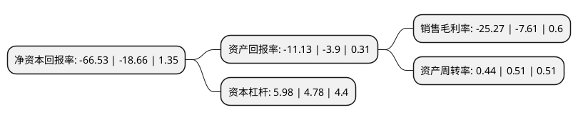

> 本页面由自动化程序生成于 2022年5月20日 01:26
> 内容可能存在错误，如有bug请提交issue至：https://github.com/Eroleice/doc-pi/issues
{.is-warning}

# 上市公司基本情况

## 基本资料

汉马科技集团股份有限公司（以下简称“汉马科技”）成立于1999年12月12日，马鞍山市。于2003年04月01日在上交所主板上市。

汉马科技注册资本65,431.484万元，主要产品:混凝土搅拌车，散装水泥车，混凝土泵车。主营业务:重卡，专用汽车及汽车零部件的生产，研发与销售。以下是详细信息：

- 公司名称: 汉马科技集团股份有限公司
- 股票代码: 600375.SH
- 所在地: 安徽 - 马鞍山市
- 成立日期: 1999年12月12日
- 注册资本: 65,431.484万元
- 法定代表人: 范现军
- 主营业务: 主要产品:混凝土搅拌车，散装水泥车，混凝土泵车主营业务:重卡，专用汽车及汽车零部件的生产，研发与销售
- 公司官网: www.camc.cc
- 公司介绍: 公司是全国重要的重型卡车、重型专用车及零部件生产研发基地，国家重点支持企业，首批“国家汽车整车出口基地企业”，第四批国家科技部科技创新型试点企业，国家倡导发展自主品牌、坚持自主创新的典范。公司拥有国家级企业技术中心和博士后科研工作站，与国际一流研发机构有密切的技术合作关系，与清华大学、上海交通大学、湖南大学、合肥工业大学等国内知名高校建立了长期的产学研合作关系，具有很强的产品开发能力。主导产品为重型汽车底盘及整车、发动机、重型专用车、客车、汽车零部件等系列产品，其中华菱重型卡车是替代进口的主流品牌，并出口到东欧、北非、东南亚、南美等地的六十多个国家和地区；星马专用车是享誉市场的知名品牌，长期占据国内市场的龙头地位。公司先后荣获全国精神文明建设先进单位、全国五一劳动奖状、全国文明单位等称号，产品连续多年荣获中国质量协会“全国用户满意产品”称号，得到党和国家领导人的高度重视和支持。

## 股东及高管情况

上市公司第一大股东为浙江吉利新能源商用车集团有限公司，持股183,255,152股，占比28.01%，**疑似为**上市公司实际控制人。

截至2022年03月31日，上市公司的前十大股东中，共有4名自然人股东，6名机构股东，其中5%以上大股东共有1名。上市公司前十大股东明细如下：

> 未能通过持股比例判定出上市公司实际控制人（持股30%以上）
> 可能存在通过间接持股、联合持股、协议控制等方式拥有实际控制权的主体，具体请参考上市公司定期公告！
{.is-warning}

> 截至2022年03月31日，上市公司前十大股东信息如下：

| 股东名称 | 持股数量（股） | 持股比例 |
| --- | --- | --- |
| 浙江吉利新能源商用车集团有限公司 | 183,255,152 | 28.01% |
| 吴吉林 | 19,844,240 | 3.03% |
| 马鞍山富华投资管理有限公司 | 15,828,500 | 2.42% |
| 上海图木新能源汽车科技有限公司 | 12,472,818 | 1.91% |
| 王忠伟 | 9,534,344 | 1.46% |
| 特百佳动力科技有限公司 | 4,744,256 | 0.73% |
| 中国国际金融股份有限公司 | 4,704,206 | 0.72% |
| 曹光明 | 4,621,400 | 0.71% |
| 上海融和必达融资租赁有限公司 | 3,886,600 | 0.59% |
| 张鹏 | 3,330,100 | 0.51% |

## 利润表分析

上市公司2021年总收入为53.19亿元，净利润为-13.45亿元，**未实现盈利**。

## 杜邦分析

> 数据列示周期：2021年 | 2020年 | 2019年
{.is-info}

上市公司的净资产收益率在近一年有所上升，上升幅度为256.54%，其变化情况分解如下：
- 上市公司的销售毛利率在近一年上升了232.06%，可能是生产效率的提升、商品原材料价格下跌或商品价格的上涨所致。
- 上市公司的资产周转率在近一年下降了-13.73%，可能是源自于更慢的销售回款或库存管理效果下降。
- 上市公司的财务杠杆比率在近一年上升了25.1%，可能是增加负债扩大生产规模。

