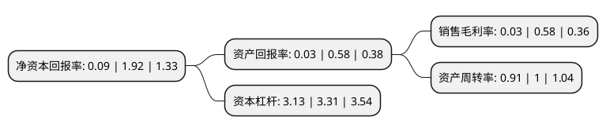

> 本页面由自动化程序生成于 2022年5月20日 01:26
> 内容可能存在错误，如有bug请提交issue至：https://github.com/Eroleice/doc-pi/issues
{.is-warning}

# 上市公司基本情况

## 基本资料

安徽江淮汽车集团股份有限公司（以下简称“江淮汽车”）成立于1999年09月30日，合肥市。于2001年08月24日在上交所主板上市。

江淮汽车注册资本218,400.979万元，主要产品:商用车，乘用车及汽车底盘等。以下是详细信息：

- 公司名称: 安徽江淮汽车集团股份有限公司
- 股票代码: 600418.SH
- 所在地: 安徽 - 合肥市
- 成立日期: 1999年09月30日
- 注册资本: 218,400.979万元
- 法定代表人: 项兴初
- 主营业务: 主要产品:商用车，乘用车及汽车底盘等
- 公司官网: www.jac.com.cn
- 公司介绍: 公司是一家集全系列商用车、乘用车及动力总成等研产销和服务于一体,“先进节能汽车、新能源汽车、智能网联汽车”并举的综合型汽车企业集团。公司现有主导产品包括：重、中、轻、微型卡车、多功能商用车、MPV、SUV、轿车、客车、专用底盘及变速箱、发动机、车桥等核心零部件。现拥有瑞风、江淮iEV、帅铃、骏铃、康铃、格尔发、和悦、星锐、锐捷特等知名品牌。公司坚持“安全、节能、环保、智能、舒适”的关键技术研发路线，已形成整车、核心动力总成、自动变速箱及软件系统等关键零部件研发、试验验证和标定开发等完整的正向研发体系。在节能减排技术、智能安全技术、噪音技术、轻量化技术、新能源技术、制造工艺技术等方面取得了全面突破，持续打造企业的核心竞争力。公司与德国大众汽车、康明斯发动机、西班牙桑坦德银行等知名企业分别建有合资公司。已经与南美、欧洲、非洲、中东、东南亚等全球130多个国家和地区建立合作关系，拥有JAC日本、JAC意大利两家海外研发中心；在俄罗斯、越南、肯尼亚建有子公司。

## 股东及高管情况

上市公司第一大股东为安徽江淮汽车集团控股有限公司，持股615,400,702股，占比28.18%，**疑似为**上市公司实际控制人。

截至2022年03月31日，上市公司的前十大股东中，共有1名自然人股东，5名机构股东，3个产品账户，1名其他股东，其中5%以上大股东共有1名。上市公司前十大股东明细如下：

> 未能通过持股比例判定出上市公司实际控制人（持股30%以上）
> 可能存在通过间接持股、联合持股、协议控制等方式拥有实际控制权的主体，具体请参考上市公司定期公告！
{.is-warning}

> 截至2022年03月31日，上市公司前十大股东信息如下：

| 股东名称 | 持股数量（股） | 持股比例 |
| --- | --- | --- |
| 安徽江淮汽车集团控股有限公司 | 615,400,702 | 28.18% |
| 建投投资有限责任公司 | 97,387,701 | 4.46% |
| 安徽省国有资本运营控股集团有限公司 | 93,988,550 | 4.3% |
| 合肥市国有资产控股有限公司 | 73,726,895 | 3.38% |
| 安徽省财政厅 | 36,540,923 | 1.67% |
| 安徽省铁路发展基金股份有限公司 | 32,815,463 | 1.5% |
| 上海浦东发展银行股份有限公司-景顺长城新能源产业股票型证券投资基金 | 24,056,110 | 1.1% |
| 宁波银行股份有限公司-景顺长城成长龙头一年持有期混合型证券投资基金 | 14,740,639 | 0.67% |
| 中信证券股份有限公司 | 11,115,762 | 0.51% |
| 陈维恩 | 10,214,297 | 0.47% |

## 利润表分析

上市公司2021年总收入为403.1亿元，净利润为0.13亿元，实现盈利。

## 杜邦分析

> 数据列示周期：2021年 | 2020年 | 2019年
{.is-info}

上市公司的净资产收益率在近一年有所下降，下降幅度为-95.31%，其变化情况分解如下：
- 上市公司的销售毛利率在近一年下降了-94.83%，可能是生产效率的下降、商品原材料价格上涨或商品价格的下跌所致。
- 上市公司的资产周转率在近一年下降了-9%，可能是源自于更慢的销售回款或库存管理效果下降。
- 上市公司的财务杠杆比率在近一年下降了-5.44%，可能是减少负债降低财务费用。

