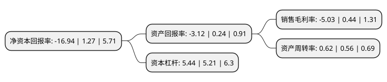

> 本页面由自动化程序生成于 2022年5月20日 01:28
> 内容可能存在错误，如有bug请提交issue至：https://github.com/Eroleice/doc-pi/issues
{.is-warning}

# 上市公司基本情况

## 基本资料

厦门金龙汽车集团股份有限公司（以下简称“金龙汽车”）成立于1996年10月18日，厦门市。于1993年11月08日在上交所主板上市。

金龙汽车注册资本71,704.742万元，客车产品。以下是详细信息：

- 公司名称: 厦门金龙汽车集团股份有限公司
- 股票代码: 600686.SH
- 所在地: 福建 - 厦门市
- 成立日期: 1996年10月18日
- 注册资本: 71,704.742万元
- 法定代表人: 谢思瑜
- 主营业务: 客车产品
- 公司官网: www.xmklm.com.cn
- 公司介绍: 公司创立于1988年，以大、中、轻型客车的制造与销售为主导产业，系目前全球领先的客车制造集团。公司在中国厦门、苏州、绍兴、西安、上海等地布局有厦门金龙联合汽车工业有限公司——金龙客车、厦门金龙旅行车有限公司——金旅客车、金龙联合汽车工业(苏州)有限公司——海格客车、厦门金龙礼宾车有限公司——金龙礼宾车、金龙汽车(西安)有限公司等客车整车制造企业以及金龙汽车车身、车架、空调、座椅、电器、互联网、充电站(桩)等汽车零部件生产企业，形成集整车与零部件制造为一体的客车产业集群。公司整车产品涵盖4.3米至18米各型客车，销往全球五大洲140多个国家和地区，广泛应用于客运、旅游、公交、团体和特种车等市场，并获得客户的一致认可。

## 股东及高管情况

上市公司第一大股东为福建省汽车工业集团有限公司，持股231,227,846股，占比32.25%，为上市公司实际控制人。

截至2022年03月31日，上市公司的前十大股东中，共有1名自然人股东，8名机构股东，1个产品账户，其中5%以上大股东共有2名。上市公司前十大股东明细如下：

> 截至2022年03月31日，上市公司前十大股东信息如下：

| 股东名称 | 持股数量（股） | 持股比例 |
| --- | --- | --- |
| 福建省汽车工业集团有限公司 | 231,227,846 | 32.25% |
| 福建省投资开发集团有限责任公司 | 75,757,575 | 10.57% |
| 福建省交通运输集团有限责任公司 | 34,022,525 | 4.74% |
| 洪泽君 | 33,700,000 | 4.7% |
| 福建建工集团有限责任公司 | 11,185,000 | 1.56% |
| 福建省能源集团有限责任公司 | 10,126,262 | 1.41% |
| 华润深国投信托有限公司-泽熙1期单一资金信托 | 10,009,609 | 1.4% |
| 福建省电子信息(集团)有限责任公司 | 9,900,010 | 1.38% |
| 福建省国有资产管理有限公司 | 8,436,016 | 1.18% |
| 保宁资本有限公司-保宁新兴市场基金(美国) | 7,519,800 | 1.05% |

## 利润表分析

上市公司2021年总收入为154.18亿元，净利润为-7.77亿元，**未实现盈利**。

## 杜邦分析

> 数据列示周期：2021年 | 2020年 | 2019年
{.is-info}

上市公司的净资产收益率在近一年有所下降，下降幅度为-1433.86%，其变化情况分解如下：
- 上市公司的销售毛利率在近一年下降了-1243.18%，可能是生产效率的下降、商品原材料价格上涨或商品价格的下跌所致。
- 上市公司的资产周转率在近一年上升了10.71%，可能是源自于更快的销售回款或库存管理效果提升。
- 上市公司的财务杠杆比率在近一年上升了4.41%，可能是增加负债扩大生产规模。

