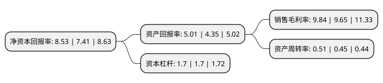

> 本页面由自动化程序生成于 2022年5月20日 01:30
> 内容可能存在错误，如有bug请提交issue至：https://github.com/Eroleice/doc-pi/issues
{.is-warning}

# 上市公司基本情况

## 基本资料

广州汽车集团股份有限公司（以下简称“广汽集团”）成立于1997年06月06日，广州市。于2012年03月29日在上交所主板上市。

广汽集团注册资本1,046,395.766万元，主营业务:汽车及配套产品的研发，制造，销售和相关服务，主要产品及服务包括乘用车，商用车，发动机及其他汽车零部件和汽车相关服务。以下是详细信息：

- 公司名称: 广州汽车集团股份有限公司
- 股票代码: 601238.SH
- 所在地: 广东 - 广州市
- 成立日期: 1997年06月06日
- 注册资本: 1,046,395.766万元
- 法定代表人: 曾庆洪
- 主营业务: 主营业务:汽车及配套产品的研发，制造，销售和相关服务，主要产品及服务包括乘用车，商用车，发动机及其他汽车零部件和汽车相关服务
- 公司官网: www.gac.com.cn
- 公司介绍: 公司是由广州汽车工业集团有限公司、万向集团公司、中国机械工业集团公司、广州钢铁企业集团有限公司、广州市长隆酒店有限公司作为共同发起人，以发起方式设立的大型国有控股股份制企业集团。主要业务包括乘用车、商用车、摩托车、汽车零部件的研发、制造、销售及售后服务，以及汽车相关产品进出口贸易，汽车租赁、二手车、物流、拆解、资源再生，汽车信贷、融资租赁、商业保理、保险和保险经纪，股权投资等。经过多年的资源整合及产业重组，公司已经形成了立足华南，辐射华北、华中、华东和环渤海地区的产业布局和以整车制造为中心，覆盖上游汽车与零部件的研发和下游的汽车服务与金融投资的产业链闭环，是国内产业链最为完整、产业布局最为优化的汽车集团。通过引进、消化、吸收和再创新，积累了国际先进的制造和管理技术，形成了世界级水平的生产体系；整合全球优势资源，形成跨平台、模块化架构的正向开发体系，具备集成创新优势。

## 股东及高管情况

上市公司第一大股东为广州汽车工业集团有限公司，持股5,502,360,069股，占比52.58%，为上市公司实际控制人。

截至2022年05月06日，上市公司的前十大股东中，共有1名自然人股东，4名机构股东，2个产品账户，3个海外主体，其中5%以上大股东共有4名。上市公司前十大股东明细如下：

> 截至2022年05月06日，上市公司前十大股东信息如下：

| 股东名称 | 持股数量（股） | 持股比例 |
| --- | --- | --- |
| 广州汽车工业集团有限公司 | 5,502,360,069 | 52.58% |
| 广州汽车工业集团有限公司 | 5,499,940,069 | 52.56% |
| 香港中央结算(代理人)有限公司 | 3,095,234,318 | 29.58% |
| 香港中央结算(代理人)有限公司 | 3,095,234,318 | 29.58% |
| 广州产业投资控股集团有限公司 | 152,075,600 | 1.45% |
| 广州金控资产管理有限公司-广金资产财富管理优选3号私募投资基金 | 140,738,735 | 1.34% |
| 普星聚能股份公司 | 103,635,174 | 0.99% |
| 香港中央结算有限公司(陆股通) | 50,871,263 | 0.49% |
| 袁河 | 24,956,641 | 0.24% |
| 全国社保基金六零一组合 | 19,642,272 | 0.19% |

## 利润表分析

上市公司2021年总收入为756.75亿元，净利润为73.9亿元，实现盈利。

## 杜邦分析

> 数据列示周期：2021年 | 2020年 | 2019年
{.is-info}

上市公司的净资产收益率在近一年有所上升，上升幅度为15.11%，其变化情况分解如下：
- 上市公司的销售毛利率在近一年上升了1.97%，可能是生产效率的提升、商品原材料价格下跌或商品价格的上涨所致。
- 上市公司的资产周转率在近一年上升了13.33%，可能是源自于更快的销售回款或库存管理效果提升。
- 上市公司的财务杠杆比率在近一年下降了0%，可能是减少负债降低财务费用。

