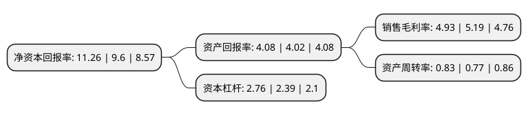

> 本页面由自动化程序生成于 2022年5月20日 01:31
> 内容可能存在错误，如有bug请提交issue至：https://github.com/Eroleice/doc-pi/issues
{.is-warning}

# 上市公司基本情况

## 基本资料

长城汽车股份有限公司（以下简称“长城汽车”）成立于2001年06月12日，保定市。于2011年09月28日在上交所主板上市。

长城汽车注册资本923,585.683万元，主营业务为汽车整车及汽车零部件的研发，生产及销售。主要产品为SUV，轿车，皮卡。以下是详细信息：

- 公司名称: 长城汽车股份有限公司
- 股票代码: 601633.SH
- 所在地: 河北 - 保定市
- 成立日期: 2001年06月12日
- 注册资本: 923,585.683万元
- 法定代表人: 魏建军
- 主营业务: 主营业务为汽车整车及汽车零部件的研发，生产及销售主要产品为SUV，轿车，皮卡
- 公司官网: www.gwm.com.cn
- 公司介绍: 公司是全球知名的SUV制造企业，秉承“每天进步一点点”的企业理念，拥有先进的企业文化和管理团队，创建了独具特色的经营和管理模式，经营质量在国内汽车行业首屈一指。公司多次入选“中国企业500强”、“中国机械500强”、“中国制造500强”，连续多年上榜“福布斯亚太最佳上市公司”、“福布斯2000强”、“《财富》中国500强”、“BrandZ最具价值中国品牌100强”等，并被评为中国机电进出口商会的“推荐出口品牌”，也是商务部、发改委授予的“国家汽车整车出口基地企业”，首家成为国际氢能委员会成员的中国汽车企业。近年来，长城汽车的技术实力得到了社会的广泛肯定，被国家发改委、科技部等五部委联合认定为“国家认定企业技术中心”、“博士后科研工作站设站单位”、“国家创新型企业”。

## 股东及高管情况

上市公司第一大股东为保定创新长城资产管理有限公司，持股5,115,000,000股，占比55.38%，为上市公司实际控制人。

截至2022年03月31日，上市公司的前十大股东中，共有2名机构股东，6个产品账户，2个海外主体，其中5%以上大股东共有2名。上市公司前十大股东明细如下：

> 截至2022年03月31日，上市公司前十大股东信息如下：

| 股东名称 | 持股数量（股） | 持股比例 |
| --- | --- | --- |
| 保定创新长城资产管理有限公司 | 5,115,000,000 | 55.38% |
| 香港中央结算(代理人)有限公司 | 3,085,385,251 | 33.41% |
| 中国证券金融股份有限公司 | 196,889,089 | 2.13% |
| 香港中央结算有限公司(陆股通) | 73,469,769 | 0.8% |
| 全国社保基金一零三组合 | 43,619,300 | 0.47% |
| 中国民生银行股份有限公司-广发行业严选三年持有期混合型证券投资基金 | 22,518,126 | 0.24% |
| 中国农业银行股份有限公司-易方达消费行业股票型证券投资基金 | 20,146,092 | 0.22% |
| 中国建设银行股份有限公司-华夏能源革新股票型证券投资基金 | 16,533,892 | 0.18% |
| 中国工商银行股份有限公司-广发双擎升级混合型证券投资基金 | 13,236,051 | 0.14% |
| 中国建设银行股份有限公司-广发科技先锋混合型证券投资基金 | 10,107,613 | 0.11% |

## 利润表分析

上市公司2021年总收入为1,364.04亿元，净利润为67.25亿元，实现盈利。

## 杜邦分析

> 数据列示周期：2021年 | 2020年 | 2019年
{.is-info}

上市公司的净资产收益率在近一年有所上升，上升幅度为17.29%，其变化情况分解如下：
- 上市公司的销售毛利率在近一年下降了-5.01%，可能是生产效率的下降、商品原材料价格上涨或商品价格的下跌所致。
- 上市公司的资产周转率在近一年上升了7.79%，可能是源自于更快的销售回款或库存管理效果提升。
- 上市公司的财务杠杆比率在近一年上升了15.48%，可能是增加负债扩大生产规模。

