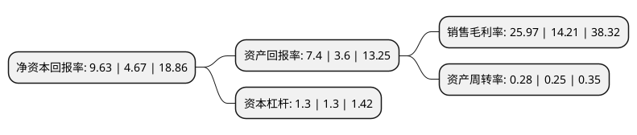

> 本页面由自动化程序生成于 2022年5月20日 01:01
> 内容可能存在错误，如有bug请提交issue至：https://github.com/Eroleice/doc-pi/issues
{.is-warning}

# 上市公司基本情况

## 基本资料

深圳市特力(集团)股份有限公司（以下简称“特力A”）成立于1986年11月10日，深圳市。于1993年06月21日在深交所主板上市。

特力A注册资本43,105.832万元，主营业务;汽车销售，汽车检测维修及配件销售，物业租赁及服务等。以下是详细信息：

- 公司名称: 深圳市特力(集团)股份有限公司
- 股票代码: 000025.SZ
- 所在地: 广东 - 深圳市
- 成立日期: 1986年11月10日
- 注册资本: 43,105.832万元
- 法定代表人: 富春龙
- 主营业务: 主营业务;汽车销售，汽车检测维修及配件销售，物业租赁及服务等
- 公司官网: www.tellus.cn
- 公司介绍: 公司是一家以汽车后市场服务和房地产物业经营管理为主营业务的大型集团。近年来，公司通过重组、资产整合、投资新项目，逐步形成了适应市场的经营模式，成为深圳市汽车行业的知名企业。拥有7家控股企业和多家参股企业，是深圳市汽车行业的知名企业。在汽车市场服务上，公司有一套完整的产业链，产品畅销全国各地、东南亚及非洲。物业经营管理方面，公司重点致力于产业园区建设，重点围绕特力吉盟黄金首饰产业园和布心汽车配件产业园建设，对产业园的部分项目进行投资开发、物业经营管理。

## 股东及高管情况

上市公司第一大股东为深圳市特发集团有限公司，持股211,591,621股，占比49.09%，为上市公司实际控制人。

截至2022年04月29日，上市公司的前十大股东中，共有4名自然人股东，4名机构股东，1个产品账户，1个海外主体，其中5%以上大股东共有4名。上市公司前十大股东明细如下：

> 截至2022年04月29日，上市公司前十大股东信息如下：

| 股东名称 | 持股数量（股） | 持股比例 |
| --- | --- | --- |
| 深圳市特发集团有限公司 | 211,591,621 | 49.09% |
| 深圳市特发集团有限公司 | 211,591,621 | 49.09% |
| 深圳远致富海珠宝产业投资企业(有限合伙) | 51,233,952 | 11.89% |
| 深圳远致富海珠宝产业投资企业(有限合伙) | 50,070,387 | 11.6157% |
| GUOTAIJUNANSECURITIES(HONGKONG)LIMITED | 1,761,891 | 0.41% |
| 中国建设银行股份有限公司-广发中证全指汽车指数型发起式证券投资基金 | 976,018 | 0.23% |
| 石秀民 | 860,635 | 0.2% |
| 徐菲蓉 | 576,578 | 0.13% |
| 杨建锋 | 573,735 | 0.13% |
| 肖桥月 | 572,848 | 0.13% |

## 利润表分析

上市公司2021年总收入为5.08亿元，净利润为1.32亿元，实现盈利。

## 杜邦分析

> 数据列示周期：2021年 | 2020年 | 2019年
{.is-info}

上市公司的净资产收益率在近一年有所上升，上升幅度为106.21%，其变化情况分解如下：
- 上市公司的销售毛利率在近一年上升了82.76%，可能是生产效率的提升、商品原材料价格下跌或商品价格的上涨所致。
- 上市公司的资产周转率在近一年上升了12%，可能是源自于更快的销售回款或库存管理效果提升。
- 上市公司的财务杠杆比率在近一年下降了0%，可能是减少负债降低财务费用。

