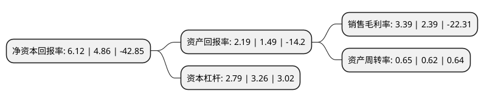

> 本页面由自动化程序生成于 2022年5月20日 01:14
> 内容可能存在错误，如有bug请提交issue至：https://github.com/Eroleice/doc-pi/issues
{.is-warning}

# 上市公司基本情况

## 基本资料

宁波双林汽车部件股份有限公司（以下简称“双林股份”）成立于2000年11月23日，宁波市。于2010年08月06日在深交所创业板上市。

双林股份注册资本40,214.979万元，主要产品:汽车座椅系统零部件，汽车内外饰系统零部件，汽车发动机周边件，汽车空调塑料件和汽车模具等。主营业务:以自主创新，产品研发，模具开发为基础实现汽车零部件模块化，平台化供应的国家级高新技术企业，主营汽车零部件的生产和销售。以下是详细信息：

- 公司名称: 宁波双林汽车部件股份有限公司
- 股票代码: 300100.SZ
- 所在地: 浙江 - 宁波市
- 成立日期: 2000年11月23日
- 注册资本: 40,214.979万元
- 法定代表人: 邬建斌
- 主营业务: 主要产品:汽车座椅系统零部件，汽车内外饰系统零部件，汽车发动机周边件，汽车空调塑料件和汽车模具等主营业务:以自主创新，产品研发，模具开发为基础实现汽车零部件模块化，平台化供应的国家级高新技术企业，主营汽车零部件的生产和销售
- 公司官网: www.shuanglin.com
- 公司介绍: 公司是一家专业从事汽车零部件及配件、模具设计、开发及制造的现代化企业,具有一流的汽车零部件及模具的生产制造能力和完善的营销网络。公司为世界上为数不多的开发汽车座椅驱动器(HDM)、位置记忆电位器产品的企业之一，是国内少数具有此类产品自主开发能力的企业，在业内具有较高的知名度。公司现拥有多项专利和专有技术，优质的产品和良好的信誉赢得了客户的一致好评，产品远销欧美、日韩等国家和地区。公司通过重大资产收购双林投资100%股权，进一步丰富了上市公司汽车零部件产品线，形成新的利润增长点。

## 股东及高管情况

上市公司第一大股东为双林集团股份有限公司，持股181,519,262股，占比45.14%，为上市公司实际控制人。

截至2022年03月31日，上市公司的前十大股东中，共有7名自然人股东，2名机构股东，1个产品账户，其中5%以上大股东共有1名。上市公司前十大股东明细如下：

> 截至2022年03月31日，上市公司前十大股东信息如下：

| 股东名称 | 持股数量（股） | 持股比例 |
| --- | --- | --- |
| 双林集团股份有限公司 | 181,519,262 | 45.14% |
| 邬建斌 | 18,000,000 | 4.48% |
| 徐开东 | 3,165,700 | 0.79% |
| 陈鸣凤 | 1,515,900 | 0.38% |
| 鞍山东亚信合国际会展中心有限公司 | 1,423,200 | 0.35% |
| 宁海新金沙江投资管理合伙企业(有限合伙)-宁海金石股权投资基金合伙企业(有限合伙) | 1,380,547 | 0.34% |
| 林伟通 | 1,279,200 | 0.32% |
| 侯睿娴 | 1,139,900 | 0.28% |
| 沈昌明 | 1,131,900 | 0.28% |
| 王国峰 | 935,000 | 0.23% |

## 利润表分析

上市公司2021年总收入为36.82亿元，净利润为1.24亿元，实现盈利。

## 杜邦分析

> 数据列示周期：2021年 | 2020年 | 2019年
{.is-info}

上市公司的净资产收益率在近一年有所上升，上升幅度为25.93%，其变化情况分解如下：
- 上市公司的销售毛利率在近一年上升了41.84%，可能是生产效率的提升、商品原材料价格下跌或商品价格的上涨所致。
- 上市公司的资产周转率在近一年上升了4.84%，可能是源自于更快的销售回款或库存管理效果提升。
- 上市公司的财务杠杆比率在近一年下降了-14.42%，可能是减少负债降低财务费用。

