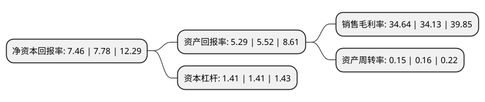

> 本页面由自动化程序生成于 2022年5月20日 01:23
> 内容可能存在错误，如有bug请提交issue至：https://github.com/Eroleice/doc-pi/issues
{.is-warning}

# 上市公司基本情况

## 基本资料

中汽研汽车试验场股份有限公司（以下简称“中汽股份”）成立于2011年03月30日，盐城市。于2022年03月08日在深交所创业板上市。

中汽股份注册资本132,240万元，主营业务为通过构建汽车场地试验环境和试验场景，为汽车整车生产企业，汽车检测机构，汽车底盘部件系统企业以及轮胎企业等客户提供场地试验技术服务。以下是详细信息：

- 公司名称: 中汽研汽车试验场股份有限公司
- 股票代码: 301215.SZ
- 所在地: 江苏 - 盐城市
- 成立日期: 2011年03月30日
- 注册资本: 132,240万元
- 法定代表人: 安铁成
- 主营业务: 主营业务为通过构建汽车场地试验环境和试验场景，为汽车整车生产企业，汽车检测机构，汽车底盘部件系统企业以及轮胎企业等客户提供场地试验技术服务
- 公司官网: www.capg.com.cn
- 公司介绍: 公司是我国主要的汽车试验场投资、运营、管理企业之一，公司主营业务为通过构建汽车场地试验环境和试验场景，为汽车整车生产企业、汽车检测机构、汽车底盘部件系统企业以及轮胎企业等客户提供场地试验技术服务。公司长期专注于汽车整车、汽车零部件以及轮胎检测领域的场地试验技术服务，始终坚持创新，并积极将各领域的领先技术运用于技术服务中。目前公司已建有高速环道、直线性能路、外部噪声路、直线制动路、动态广场、舒适性能路、强化耐久路、标准坡道、干操控路以及联络路等10条场地道路设施，试验道路总长超过60公里，试验条件均满足国家标准和ISO国际标准所要求的验证试验方法，并兼顾欧盟和美洲汽车测试标准，为国际通行使用，在部分道路的设计上前瞻性地考虑了试验技术的发展和产品开发的要求。目前，公司场地类型齐全、技术指标先进，法规类和研发类场地试验技术服务均能满足各类型客户的主要需求。

## 股东及高管情况

上市公司第一大股东为中国汽车技术研究中心有限公司，持股555,000,000股，占比41.97%，为上市公司实际控制人。

截至2022年03月31日，上市公司的前十大股东中，共有5名自然人股东，5名机构股东，其中5%以上大股东共有2名。上市公司前十大股东明细如下：

> 截至2022年03月31日，上市公司前十大股东信息如下：

| 股东名称 | 持股数量（股） | 持股比例 |
| --- | --- | --- |
| 中国汽车技术研究中心有限公司 | 555,000,000 | 41.97% |
| 江苏悦达集团有限公司 | 386,800,000 | 29.25% |
| 江苏大丰海港控股集团有限公司 | 50,000,000 | 3.78% |
| 中电科投资控股有限公司 | 28,947,368 | 2.19% |
| 重庆长安汽车股份有限公司 | 26,052,631 | 1.97% |
| 王新坤 | 2,931,021 | 0.22% |
| 王旭煌 | 2,600,206 | 0.2% |
| 霍晓谷 | 1,356,345 | 0.1% |
| 王颖娟 | 1,323,900 | 0.1% |
| 冀冰 | 789,500 | 0.06% |

## 利润表分析

上市公司2021年总收入为2.97亿元，净利润为1.03亿元，实现盈利。

## 杜邦分析

> 数据列示周期：2021年 | 2020年 | 2019年
{.is-info}

上市公司的净资产收益率在近一年有所下降，下降幅度为-4.11%，其变化情况分解如下：
- 上市公司的销售毛利率在近一年上升了1.49%，可能是生产效率的提升、商品原材料价格下跌或商品价格的上涨所致。
- 上市公司的资产周转率在近一年下降了-6.25%，可能是源自于更慢的销售回款或库存管理效果下降。
- 上市公司的财务杠杆比率在近一年下降了0%，可能是减少负债降低财务费用。

