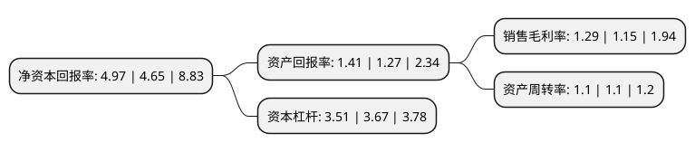

> 本页面由自动化程序生成于 2022年5月20日 01:25
> 内容可能存在错误，如有bug请提交issue至：https://github.com/Eroleice/doc-pi/issues
{.is-warning}

# 上市公司基本情况

## 基本资料

广汇汽车服务集团股份公司（以下简称“广汇汽车”）成立于1999年07月30日，大连市。于2000年11月16日在上交所主板上市。

广汇汽车注册资本811,103.715万元，乘用车经销与服务集团及乘用车融资租赁业务以下是详细信息：

- 公司名称: 广汇汽车服务集团股份公司
- 股票代码: 600297.SH
- 所在地: 辽宁 - 大连市
- 成立日期: 1999年07月30日
- 注册资本: 811,103.715万元
- 法定代表人: 陆伟
- 主营业务: 乘用车经销与服务集团及乘用车融资租赁业务
- 公司官网: www.chinagrandauto.com
- 公司介绍: 公司是中国领先的豪华乘用车经销与服务集团。依托广大的业务规模及广泛的销售网络，公司有实力为客户提供覆盖汽车服务生命周期的一站式综合服务，包括整车销售、汽车租赁及融资租赁、二手车、维修养护、佣金代理等在内的全方位服务。通过综合业务组合，公司的业务及经营业绩得到稳步增长，进一步加强了公司于中国乘用车经销及服务市场的领先地位，并赢得了业界的广泛认可。公司拥有中国规模广泛的乘用车品牌覆盖，与中国主要的汽车制造商建立了长期稳固的合作关系，并与部分汽车制造商签订了战略合作协议，为公司进一步扩大经营规模提供了保障。公司将继续巩固在中国领先的市场地位，把握商机，用心服务，以心联结，致力成为世界级的乘用车经销服务集团、领先的乘用车融资租赁提供商和二手车交易代理商。

## 股东及高管情况

上市公司第一大股东为新疆广汇实业投资(集团)有限责任公司，持股2,551,119,613股，占比31.45%，为上市公司实际控制人。

截至2022年03月31日，上市公司的前十大股东中，共有2名自然人股东，3名机构股东，3个产品账户，2个海外主体，其中5%以上大股东共有2名。上市公司前十大股东明细如下：

> 截至2022年03月31日，上市公司前十大股东信息如下：

| 股东名称 | 持股数量（股） | 持股比例 |
| --- | --- | --- |
| 新疆广汇实业投资(集团)有限责任公司 | 2,551,119,613 | 31.45% |
| CHINA GRAND AUTOMOTIVE (MAURITIUS) LIMITED | 1,621,932,099 | 20% |
| Blue Chariot Investment   Limited | 189,049,882 | 2.33% |
| 中国证券金融股份有限公司 | 120,982,010 | 1.49% |
| 新疆广汇实业投资(集团)有限责任公司-新疆广汇实业投资(集团)有限责任公司2021年非公开发行可交换债券(第一期)质押专户 | 120,000,000 | 1.48% |
| 深圳市银天使资产管理有限公司-银天使2号私募证券投资基金 | 117,346,940 | 1.45% |
| 许智强 | 117,307,950 | 1.45% |
| 诺德基金-招商银行-华宝信托-华宝-广汇1号单一资金信托 | 99,378,819 | 1.23% |
| 北信瑞丰基金-招商银行-陕国投-陕国投·金玉11号证券投资集合资金信托计划 | 69,565,207 | 0.86% |
| 杨俭 | 67,540,000 | 0.83% |

## 利润表分析

上市公司2021年总收入为1,584.36亿元，净利润为20.46亿元，实现盈利。

## 杜邦分析

> 数据列示周期：2021年 | 2020年 | 2019年
{.is-info}

上市公司的净资产收益率在近一年有所上升，上升幅度为6.88%，其变化情况分解如下：
- 上市公司的销售毛利率在近一年上升了12.17%，可能是生产效率的提升、商品原材料价格下跌或商品价格的上涨所致。
- 上市公司的资产周转率在近一年下降了0%，可能是源自于更慢的销售回款或库存管理效果下降。
- 上市公司的财务杠杆比率在近一年下降了-4.36%，可能是减少负债降低财务费用。

