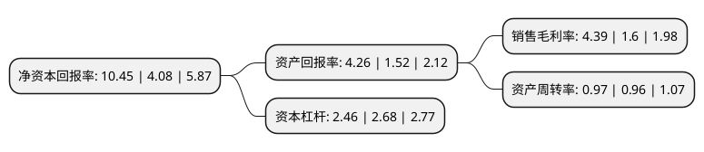

> 本页面由自动化程序生成于 2022年5月20日 01:26
> 内容可能存在错误，如有bug请提交issue至：https://github.com/Eroleice/doc-pi/issues
{.is-warning}

# 上市公司基本情况

## 基本资料

北京巴士传媒股份有限公司（以下简称“北巴传媒”）成立于1999年06月18日，北京市。于2001年02月16日在上交所主板上市。

北巴传媒注册资本80,640万元，主营业务为公交广告业务，汽车服务业务和投资业务。以下是详细信息：

- 公司名称: 北京巴士传媒股份有限公司
- 股票代码: 600386.SH
- 所在地: 北京 - 北京市
- 成立日期: 1999年06月18日
- 注册资本: 80,640万元
- 法定代表人: 阎广兴
- 主营业务: 主营业务为公交广告业务，汽车服务业务和投资业务
- 公司官网: www.bbcm.com.cn
- 公司介绍: 公司业务发展从最初的城市公交客运华丽转型为以广告传媒、汽车服务和投融资业务等为主营业务的综合性服务商。公司广告传媒业务板块主要经营北京公交集团所拥有的公交车身、车载移动电视、车内小媒体、候车亭灯箱和场站媒体等公交广告媒体及相关传媒业务。公司汽车业务服务板块主要包括车辆驾驶员培训、车辆销售和维修保养、汽车租赁、车辆报废回收拆解、新能源充电服务等子业务。公司始终坚持战略引领、依法治企，坚持精简高效、产融结合，以市场为导向，巩固现有业态发展，开拓创新经营模式，打造出全新、特色、新型的文化创意产业，为提升“北京软实力”做出贡献。

## 股东及高管情况

上市公司第一大股东为北京公共交通控股(集团)有限公司，持股443,520,000股，占比55%，为上市公司实际控制人。

截至2022年03月31日，上市公司的前十大股东中，共有8名自然人股东，1名机构股东，1个产品账户，其中5%以上大股东共有1名。上市公司前十大股东明细如下：

> 截至2022年03月31日，上市公司前十大股东信息如下：

| 股东名称 | 持股数量（股） | 持股比例 |
| --- | --- | --- |
| 北京公共交通控股(集团)有限公司 | 443,520,000 | 55% |
| 王燕亭 | 4,029,400 | 0.5% |
| 郭新民 | 3,028,148 | 0.38% |
| 潘卫华 | 3,003,141 | 0.37% |
| 张汉泉 | 2,971,000 | 0.37% |
| 潘剑林 | 2,805,500 | 0.35% |
| 中国建设银行股份有限公司-广发中证全指汽车指数型发起式证券投资基金 | 2,502,220 | 0.31% |
| 朱从杰 | 2,262,000 | 0.28% |
| 张论 | 1,901,761 | 0.24% |
| 张武高 | 1,890,500 | 0.23% |

## 利润表分析

上市公司2021年总收入为43.08亿元，净利润为1.89亿元，实现盈利。

## 杜邦分析

> 数据列示周期：2021年 | 2020年 | 2019年
{.is-info}

上市公司的净资产收益率在近一年有所上升，上升幅度为156.13%，其变化情况分解如下：
- 上市公司的销售毛利率在近一年上升了174.37%，可能是生产效率的提升、商品原材料价格下跌或商品价格的上涨所致。
- 上市公司的资产周转率在近一年上升了1.04%，可能是源自于更快的销售回款或库存管理效果提升。
- 上市公司的财务杠杆比率在近一年下降了-8.21%，可能是减少负债降低财务费用。

