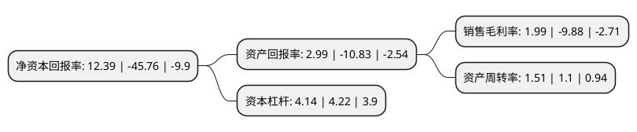

> 本页面由自动化程序生成于 2022年5月20日 01:28
> 内容可能存在错误，如有bug请提交issue至：https://github.com/Eroleice/doc-pi/issues
{.is-warning}

# 上市公司基本情况

## 基本资料

辽宁申华控股股份有限公司（以下简称“申华控股”）成立于1992年03月20日，沈阳市。于1990年12月19日在上交所主板上市。

申华控股注册资本194,638.032万元，主营业务以汽车消费相关产业为主导产业，以新能源产业，房地产等投资作为补充。以下是详细信息：

- 公司名称: 辽宁申华控股股份有限公司
- 股票代码: 600653.SH
- 所在地: 辽宁 - 沈阳市
- 成立日期: 1992年03月20日
- 注册资本: 194,638.032万元
- 法定代表人: 李景伟
- 主营业务: 主营业务以汽车消费相关产业为主导产业，以新能源产业，房地产等投资作为补充
- 公司官网: www.shkg.com.cn
- 公司介绍: 公司是一家综合类的上市公司，公司主营业务主要包括汽车销售及后市场服务、新能源、房地产、金融投资和产业管理等，控股子公司分布在全国各地，逐步建立起申华的品牌效应和价值。公司在历经了一系列的变革后，逐步走出了一条明晰合理的产业链条，确立了以汽车销售和汽车服务为主导产业，新能源为第二产业，同时依靠在资本市场的资产运作能力和房地产市场的丰富经验，支持企业多元化发展的道路。公司拥有一支经验丰富、锐意进取的管理团队以及高效精干、业务出众的员工队伍，是保障公司稳定发展的重要基础。

## 股东及高管情况

上市公司第一大股东为辽宁华晟汽车零部件有限公司，持股227,412,000股，占比11.68%，**疑似为**上市公司实际控制人。

截至2022年03月31日，上市公司的前十大股东中，共有3名自然人股东，5名机构股东，1个产品账户，1个海外主体，其中5%以上大股东共有2名。上市公司前十大股东明细如下：

> 未能通过持股比例判定出上市公司实际控制人（持股30%以上）
> 可能存在通过间接持股、联合持股、协议控制等方式拥有实际控制权的主体，具体请参考上市公司定期公告！
{.is-warning}

> 截至2022年03月31日，上市公司前十大股东信息如下：

| 股东名称 | 持股数量（股） | 持股比例 |
| --- | --- | --- |
| 辽宁华晟汽车零部件有限公司 | 227,412,000 | 11.68% |
| 辽宁正国投资发展有限公司 | 197,280,000 | 10.14% |
| 华晨汽车集团控股有限公司 | 21,673,266 | 1.11% |
| 中国建设银行股份有限公司-广发中证全指汽车指数型发起式证券投资基金 | 9,785,004 | 0.5% |
| 顾红 | 8,289,624 | 0.43% |
| 福建胜奇投资有限公司 | 7,500,000 | 0.39% |
| 张秀 | 5,333,400 | 0.27% |
| UBS AG | 5,326,228 | 0.27% |
| 李云 | 5,300,000 | 0.27% |
| 沈阳华益新汽车销售有限公司 | 4,973,052 | 0.26% |

## 利润表分析

上市公司2021年总收入为70.97亿元，净利润为1.4亿元，实现盈利。

## 杜邦分析

> 数据列示周期：2021年 | 2020年 | 2019年
{.is-info}

上市公司的净资产收益率在近一年有所下降，下降幅度为-127.08%，其变化情况分解如下：
- 上市公司的销售毛利率在近一年下降了-120.14%，可能是生产效率的下降、商品原材料价格上涨或商品价格的下跌所致。
- 上市公司的资产周转率在近一年上升了37.27%，可能是源自于更快的销售回款或库存管理效果提升。
- 上市公司的财务杠杆比率在近一年下降了-1.9%，可能是减少负债降低财务费用。

