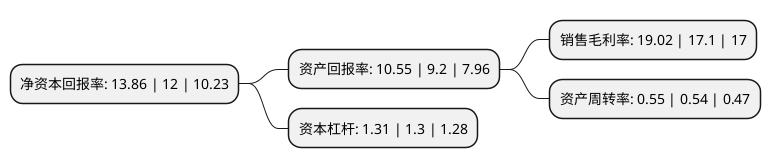

> 本页面由自动化程序生成于 2022年5月20日 01:31
> 内容可能存在错误，如有bug请提交issue至：https://github.com/Eroleice/doc-pi/issues
{.is-warning}

# 上市公司基本情况

## 基本资料

中国汽车工程研究院股份有限公司（以下简称“中国汽研”）成立于2001年01月11日，重庆市。于2012年06月11日在上交所主板上市。

中国汽研注册资本98,923.496万元，主要产品:包括技术服务业务和产业化制造业务两大部分，其中，技术服务业务包括汽车研发及咨询和汽车测试与评价两部分，产业化制造业务包括专用汽车，轨道交通关键零部件，汽车燃气系统及其关键零部件三部分。以下是详细信息：

- 公司名称: 中国汽车工程研究院股份有限公司
- 股票代码: 601965.SH
- 所在地: 重庆 - 重庆市
- 成立日期: 2001年01月11日
- 注册资本: 98,923.496万元
- 法定代表人: 李开国
- 主营业务: 主要产品:包括技术服务业务和产业化制造业务两大部分，其中，技术服务业务包括汽车研发及咨询和汽车测试与评价两部分，产业化制造业务包括专用汽车，轨道交通关键零部件，汽车燃气系统及其关键零部件三部分
- 公司官网: www.caeri.com.cn
- 公司介绍: 公司是我国汽车行业公共技术服务商之一，一直为汽车行业提供产品开发、测试评价等全方位的技术服务。主营业务为包括技术服务业务和产业化制造业务两大部分，其中，技术服务业务包括汽车研发及咨询和汽车测试与评价两部分，产业化制造业务包括专用汽车、轨道交通关键零部件、汽车燃气系统及其关键零部件三部分。公司拥有国家机动车质量监督检验中心(重庆)、国家燃气汽车工程技术研究中心、汽车噪声振动和安全技术国家重点实验室、替代燃料汽车国家地方联合工程实验室，并设有博士后科研工作站，是“国家高新技术企业”、“创新型企业”以及“国际科技合作基地”。

## 股东及高管情况

上市公司第一大股东为中国通用技术(集团)控股有限责任公司，持股512,160,872股，占比51.77%，为上市公司实际控制人。

截至2022年03月31日，上市公司的前十大股东中，共有1名自然人股东，4名机构股东，5个产品账户，其中5%以上大股东共有2名。上市公司前十大股东明细如下：

> 截至2022年03月31日，上市公司前十大股东信息如下：

| 股东名称 | 持股数量（股） | 持股比例 |
| --- | --- | --- |
| 中国通用技术(集团)控股有限责任公司 | 512,160,872 | 51.77% |
| 中国航天科工集团有限公司 | 100,000,000 | 10.11% |
| 朱晔 | 14,086,833 | 1.42% |
| 中国机械进出口(集团)有限公司 | 12,887,598 | 1.3% |
| 兴业银行股份有限公司-工银瑞信文体产业股票型证券投资基金 | 12,800,020 | 1.29% |
| 中国建设银行股份有限公司-中欧价值发现股票型证券投资基金 | 9,886,316 | 1% |
| 中国技术进出口集团有限公司 | 9,665,698 | 0.98% |
| 中国农业银行股份有限公司-工银瑞信创新成长混合型证券投资基金 | 7,384,148 | 0.75% |
| 交通银行股份有限公司-工银瑞信互联网加股票型证券投资基金 | 6,644,116 | 0.67% |
| 中国工商银行股份有限公司-中欧潜力价值灵活配置混合型证券投资基金 | 6,608,858 | 0.67% |

## 利润表分析

上市公司2021年总收入为38.35亿元，净利润为7.29亿元，实现盈利。

## 杜邦分析

> 数据列示周期：2021年 | 2020年 | 2019年
{.is-info}

上市公司的净资产收益率在近一年有所上升，上升幅度为15.5%，其变化情况分解如下：
- 上市公司的销售毛利率在近一年上升了11.23%，可能是生产效率的提升、商品原材料价格下跌或商品价格的上涨所致。
- 上市公司的资产周转率在近一年上升了1.85%，可能是源自于更快的销售回款或库存管理效果提升。
- 上市公司的财务杠杆比率在近一年上升了0.77%，可能是增加负债扩大生产规模。

