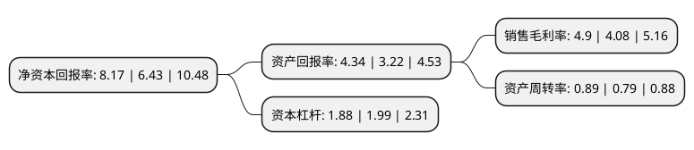

> 本页面由自动化程序生成于 2022年5月20日 01:02
> 内容可能存在错误，如有bug请提交issue至：https://github.com/Eroleice/doc-pi/issues
{.is-warning}

# 上市公司基本情况

## 基本资料

万向钱潮股份公司（以下简称“万向钱潮”）成立于1994年01月08日，杭州市。于1994年01月10日在深交所主板上市。

万向钱潮注册资本330,379.134万元，主要产品:万向节，轮毂单元，轴承，汽车底盘及悬架系统，制动系统，传动系统，排气系统，燃油箱，工程机械零部件等汽车系统零部件及总成。以下是详细信息：

- 公司名称: 万向钱潮股份公司
- 股票代码: 000559.SZ
- 所在地: 浙江 - 杭州市
- 成立日期: 1994年01月08日
- 注册资本: 330,379.134万元
- 法定代表人: 管大源
- 主营业务: 主要产品:万向节，轮毂单元，轴承，汽车底盘及悬架系统，制动系统，传动系统，排气系统，燃油箱，工程机械零部件等汽车系统零部件及总成
- 公司官网: www.wxqc.com.cn
- 公司介绍: 公司是目前国内主要的独立汽车零部件专业生产基地之一，专业生产底盘及悬架系统、汽车制动系统、汽车传动系统、汽车燃油排气系统、轮毂单元、轴承、精密件、工程机械零部件等汽车系统零部件及总成。公司围绕汽车零部件新能源化、模块化、轻量化、电子化、互联化、智能化等前沿技术加速发展，积极拓展业务及提高主导产品细分市场份额，不断提升公司活力、创新力和竞争力，实现市场的转型升级，使公司的核心竞争力不断得到提升。同时，公司不断完善公司体系治理，提高规范运作能力，加快人才引进、储备和培育，为公司发展奠定了坚实基础，确保公司的长期稳健快速发展。公司万向节、传动轴、制动器、燃油箱、排气系统等产品被认定为中国名牌产品，钱潮商标被认定为驰名商标，先后荣获中国世界名牌、中国工业大奖表彰奖、浙江省政府质量奖、首届中国质量奖提名奖、制造业单项冠军示范企业等。

## 股东及高管情况

上市公司第一大股东为万向集团公司，持股2,113,434,626股，占比63.97%，为上市公司实际控制人。

截至2022年03月31日，上市公司的前十大股东中，共有3名自然人股东，4名机构股东，2个产品账户，1个海外主体，其中5%以上大股东共有1名。上市公司前十大股东明细如下：

> 截至2022年03月31日，上市公司前十大股东信息如下：

| 股东名称 | 持股数量（股） | 持股比例 |
| --- | --- | --- |
| 万向集团公司 | 2,113,434,626 | 63.97% |
| 中国汽车工业投资开发有限公司 | 55,453,766 | 1.68% |
| 香港中央结算有限公司(陆股通) | 53,534,935 | 1.62% |
| 民生人寿保险股份有限公司-传统保险产品 | 36,766,800 | 1.11% |
| 祁堃 | 19,000,000 | 0.58% |
| 金华市穗丰农资有限公司 | 9,540,000 | 0.29% |
| 张阔 | 9,241,373 | 0.28% |
| 金华市农业生产资料有限公司 | 7,520,000 | 0.23% |
| 中国农业银行股份有限公司-中证500交易型开放式指数证券投资基金 | 6,802,710 | 0.21% |
| 龚娜娜 | 6,400,000 | 0.19% |

## 利润表分析

上市公司2021年总收入为143.22亿元，净利润为7.01亿元，实现盈利。

## 杜邦分析

> 数据列示周期：2021年 | 2020年 | 2019年
{.is-info}

上市公司的净资产收益率在近一年有所上升，上升幅度为27.06%，其变化情况分解如下：
- 上市公司的销售毛利率在近一年上升了20.1%，可能是生产效率的提升、商品原材料价格下跌或商品价格的上涨所致。
- 上市公司的资产周转率在近一年上升了12.66%，可能是源自于更快的销售回款或库存管理效果提升。
- 上市公司的财务杠杆比率在近一年下降了-5.53%，可能是减少负债降低财务费用。

