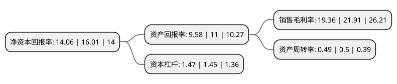

> 本页面由自动化程序生成于 2022年5月20日 01:02
> 内容可能存在错误，如有bug请提交issue至：https://github.com/Eroleice/doc-pi/issues
{.is-warning}

# 上市公司基本情况

## 基本资料

无锡威孚高科技集团股份有限公司（以下简称“威孚高科”）成立于1988年10月27日，无锡市。于1998年09月24日在深交所主板上市。

威孚高科注册资本100,865.957万元，主要产品:柴油燃油喷射系统产品，汽车尾气后处理系统产品和进气系统产品。以下是详细信息：

- 公司名称: 无锡威孚高科技集团股份有限公司
- 股票代码: 000581.SZ
- 所在地: 江苏 - 无锡市
- 成立日期: 1988年10月27日
- 注册资本: 100,865.957万元
- 法定代表人: 王晓东
- 主营业务: 主要产品:柴油燃油喷射系统产品，汽车尾气后处理系统产品和进气系统产品
- 公司官网: www.weifu.com.cn
- 公司介绍: 公司是国内汽车零部件的著名生产厂商之一，从事的主营业务产品为柴油燃油喷射系统产品、汽车尾气后处理系统产品和进气系统产品。公司从单一的燃油喷射系统产品扩展到燃油喷射系统、尾气后处理系统、汽车进气系统三大板块，形成了有竞争力的汽车核心零部件产业链，成功实现产品升级改造和业务战略转型。产品系列覆盖车用国V、非道路TierⅢ及更高排放法规，为国内大型汽车厂和柴油机厂配套，并远销美洲、中东、东南亚等地。公司是高新技术企业,拥有多项专利技术。多年来，依托“国家级企业技术中心”、“博士后科研工作站”、“江苏省工程技术研究中心”、“国家高技术研究发展计划成果产业化基地”等科研基础，围绕柴油燃油喷射系统、汽车尾气后处理系统、进气系统三大板块产品，积极开展技术升级及创新，并对新能源、新技术等前沿产业进行调研和积极布局,在行业中技术优势明显。

## 股东及高管情况

上市公司第一大股东为无锡产业发展集团有限公司，持股204,059,398股，占比20.23%，**疑似为**上市公司实际控制人。

截至2022年04月18日，上市公司的前十大股东中，共有1名自然人股东，2名机构股东，4个产品账户，3个海外主体，其中5%以上大股东共有2名。上市公司前十大股东明细如下：

> 未能通过持股比例判定出上市公司实际控制人（持股30%以上）
> 可能存在通过间接持股、联合持股、协议控制等方式拥有实际控制权的主体，具体请参考上市公司定期公告！
{.is-warning}

> 截至2022年04月18日，上市公司前十大股东信息如下：

| 股东名称 | 持股数量（股） | 持股比例 |
| --- | --- | --- |
| 无锡产业发展集团有限公司 | 204,059,398 | 20.23% |
| 罗伯特·博世有限公司 | 142,841,400 | 14.16% |
| 香港中央结算有限公司(陆股通) | 19,159,373 | 1.9% |
| BBH BOS S/A FIDELITY FD - CHINA FOCUS FD | 14,122,915 | 1.4% |
| FIDELITY INVMT TRT FIDELITY INTL SMALL CAP FUND | 7,043,386 | 0.7% |
| 全国社保基金四一三组合 | 6,450,000 | 0.64% |
| 中国民生银行股份有限公司-安信稳健增值灵活配置混合型证券投资基金 | 4,500,040 | 0.45% |
| 钱浩 | 4,373,400 | 0.43% |
| 基本养老保险基金一零零三组合 | 4,110,956 | 0.41% |
| 招商银行股份有限公司-安信稳健增利混合型证券投资基金 | 3,849,950 | 0.38% |

## 杜邦分析

> 数据列示周期：2021年 | 2020年 | 2019年
{.is-info}

上市公司的净资产收益率在近一年有所下降，下降幅度为-12.18%，其变化情况分解如下：
- 上市公司的销售毛利率在近一年下降了-11.64%，可能是生产效率的下降、商品原材料价格上涨或商品价格的下跌所致。
- 上市公司的资产周转率在近一年下降了-2%，可能是源自于更慢的销售回款或库存管理效果下降。
- 上市公司的财务杠杆比率在近一年上升了1.38%，可能是增加负债扩大生产规模。

