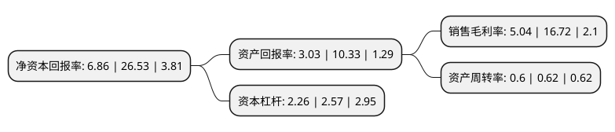

> 本页面由自动化程序生成于 2022年5月20日 01:02
> 内容可能存在错误，如有bug请提交issue至：https://github.com/Eroleice/doc-pi/issues
{.is-warning}

# 上市公司基本情况

## 基本资料

贵州轮胎股份有限公司（以下简称“贵州轮胎”）成立于1996年01月29日，贵阳市。于1996年03月08日在深交所主板上市。

贵州轮胎注册资本95,631.946万元，主要业务:“前进牌”轮胎的生产与销售。主要产品:斜交轮胎和子午线轮胎。以下是详细信息：

- 公司名称: 贵州轮胎股份有限公司
- 股票代码: 000589.SZ
- 所在地: 贵州 - 贵阳市
- 成立日期: 1996年01月29日
- 注册资本: 95,631.946万元
- 法定代表人: 黄舸舸
- 主营业务: “前进牌”轮胎的生产与销售主要产品:斜交轮胎和子午线轮胎
- 公司官网: www.gztyre.com
- 公司介绍: 公司是我国重点轮胎制造厂家和全国重点企业之一。公司主要从事轮胎研发、生产及销售，主要产品有“前进”、“大力士”、“多力通”、“劲虎”、“金刚”等品牌卡客车轮胎、工程机械轮胎、农业机械轮胎、林业机械轮胎、工业车辆轮胎、矿用轮胎、实心轮胎和特种轮胎，是国内规格品种较为齐全的轮胎制造企业之一。公司拥有雄厚的技术力量，建有国家级企业技术中心和博士后科研工作站，长期从美国、日本、韩国、澳大利亚等国家聘请资深技术专家进行现场指导和产品研发。产品通过了ISO9001质量体系认证、ISO/TS16949质量体系认证、国家强制性(3C)认证、美国交通部DOT安全标志认证、欧共体E-mark产品认证和军工产品质量体系认证等。

## 股东及高管情况

上市公司第一大股东为贵阳市工商产业投资集团有限公司，持股265,492,521股，占比27.76%，**疑似为**上市公司实际控制人。

截至2022年03月31日，上市公司的前十大股东中，共有3名自然人股东，4名机构股东，3个产品账户，其中5%以上大股东共有1名。上市公司前十大股东明细如下：

> 未能通过持股比例判定出上市公司实际控制人（持股30%以上）
> 可能存在通过间接持股、联合持股、协议控制等方式拥有实际控制权的主体，具体请参考上市公司定期公告！
{.is-warning}

> 截至2022年03月31日，上市公司前十大股东信息如下：

| 股东名称 | 持股数量（股） | 持股比例 |
| --- | --- | --- |
| 贵阳市工商产业投资集团有限公司 | 265,492,521 | 27.76% |
| 云南能投资本投资有限公司 | 23,709,523 | 2.48% |
| 北京丰汇投资管理有限公司-丰汇佳选私募证券投资基金 | 13,968,253 | 1.46% |
| 江苏兴达钢帘线股份有限公司 | 10,962,600 | 1.15% |
| 锦绣中和(天津)投资管理有限公司-中和资本耕耘9号私募证券投资基金 | 6,357,026 | 0.66% |
| 刘昌 | 5,168,229 | 0.54% |
| 苏州市天凯汇云实业投资合伙企业(有限合伙) | 5,079,365 | 0.53% |
| 袁建良 | 5,050,000 | 0.53% |
| 中国工商银行股份有限公司-国投瑞银远见成长混合型证券投资基金 | 4,810,400 | 0.5% |
| 李强 | 4,550,313 | 0.48% |

## 利润表分析

上市公司2021年总收入为73.39亿元，净利润为3.69亿元，实现盈利。

## 杜邦分析

> 数据列示周期：2021年 | 2020年 | 2019年
{.is-info}

上市公司的净资产收益率在近一年有所下降，下降幅度为-74.14%，其变化情况分解如下：
- 上市公司的销售毛利率在近一年下降了-69.86%，可能是生产效率的下降、商品原材料价格上涨或商品价格的下跌所致。
- 上市公司的资产周转率在近一年下降了-3.23%，可能是源自于更慢的销售回款或库存管理效果下降。
- 上市公司的财务杠杆比率在近一年下降了-12.06%，可能是减少负债降低财务费用。

