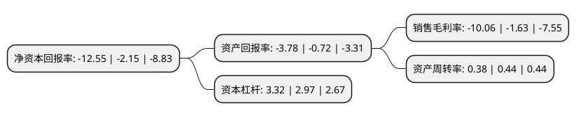

> 本页面由自动化程序生成于 2022年5月20日 01:02
> 内容可能存在错误，如有bug请提交issue至：https://github.com/Eroleice/doc-pi/issues
{.is-warning}

# 上市公司基本情况

## 基本资料

青岛双星股份有限公司（以下简称“青岛双星”）成立于1996年04月24日，青岛市。于1996年04月30日在深交所主板上市。

青岛双星注册资本81,679.249万元，主要产品:轮胎，运动鞋，铸造机械，橡塑机械，绣品。以下是详细信息：

- 公司名称: 青岛双星股份有限公司
- 股票代码: 000599.SZ
- 所在地: 山东 - 青岛市
- 成立日期: 1996年04月24日
- 注册资本: 81,679.249万元
- 法定代表人: 柴永森
- 主营业务: 主要产品:轮胎，运动鞋，铸造机械，橡塑机械，绣品
- 公司官网: www.doublestar.com.cn
- 公司介绍: 公司是一家具有多年历史的老国有企业，青岛双星是山东省轮胎行业目前唯一一家国有主板上市公司，目前已经形成了集轮胎、智能装备、工业智能物流(含机器人)等产业体系。公司主要从事轮胎业务、机械业务以及汽车后市场服务业务。公司国家工信部授予“品牌培育”、“技术创新”、“质量标杆”、“智能制造”、“绿色制造”、“服务转型”全产业链试点示范的企业，并被称为“中国轮胎智能制造的引领者”，也是中国轮胎历史上唯一一家被评为“全国先进生产力典范企业”的企业。双星品牌已连续三年荣登“亚洲品牌500强”中国轮胎第一名和“中国500最具价值品牌”轮胎行业榜首。

## 股东及高管情况

上市公司第一大股东为双星集团有限责任公司，持股264,644,199股，占比32.4%，为上市公司实际控制人。

截至2022年03月31日，上市公司的前十大股东中，共有3名自然人股东，4名机构股东，3个产品账户，其中5%以上大股东共有2名。上市公司前十大股东明细如下：

> 截至2022年03月31日，上市公司前十大股东信息如下：

| 股东名称 | 持股数量（股） | 持股比例 |
| --- | --- | --- |
| 双星集团有限责任公司 | 264,644,199 | 32.4% |
| 青岛国信金融控股有限公司 | 46,164,797 | 5.65% |
| 青岛国信资本投资有限公司 | 28,944,104 | 3.54% |
| 新余善思投资管理中心(有限合伙)-青岛鑫诚洪泰智造投资中心(有限合伙) | 18,180,000 | 2.23% |
| 济南国惠兴鲁股权投资基金合伙企业(有限合伙) | 12,638,231 | 1.55% |
| 戴文 | 8,960,839 | 1.1% |
| 徐国 | 5,000,000 | 0.61% |
| 崔军胜 | 4,259,300 | 0.52% |
| 汇丰投资管理(香港)有限公司-汇丰中国翔龙基金 | 3,514,776 | 0.43% |
| 汇丰中华证券投资信托有限公司-汇丰中国A股汇聚基金 | 2,763,100 | 0.34% |

## 利润表分析

上市公司2021年总收入为39.24亿元，净利润为-3.95亿元，**未实现盈利**。

## 杜邦分析

> 数据列示周期：2021年 | 2020年 | 2019年
{.is-info}

上市公司的净资产收益率在近一年有所上升，上升幅度为483.72%，其变化情况分解如下：
- 上市公司的销售毛利率在近一年上升了517.18%，可能是生产效率的提升、商品原材料价格下跌或商品价格的上涨所致。
- 上市公司的资产周转率在近一年下降了-13.64%，可能是源自于更慢的销售回款或库存管理效果下降。
- 上市公司的财务杠杆比率在近一年上升了11.78%，可能是增加负债扩大生产规模。

