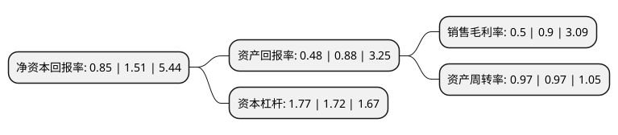

> 本页面由自动化程序生成于 2022年5月20日 01:02
> 内容可能存在错误，如有bug请提交issue至：https://github.com/Eroleice/doc-pi/issues
{.is-warning}

# 上市公司基本情况

## 基本资料

恒立实业发展集团股份有限公司（以下简称“恒立实业”）成立于1993年05月08日，岳阳市。于1996年11月07日在深交所主板上市。

恒立实业注册资本42,522.6万元，主要产品:汽车空调。以下是详细信息：

- 公司名称: 恒立实业发展集团股份有限公司
- 股票代码: 000622.SZ
- 所在地: 湖南 - 岳阳市
- 成立日期: 1993年05月08日
- 注册资本: 42,522.6万元
- 法定代表人: 马伟进
- 主营业务: 主要产品:汽车空调
- 公司官网: www.hlsyfzjt.com
- 公司介绍: 公司是国内最早进入汽车空调行业的企业之一。主要从事生产、销售制冷空调设备，销售汽车(含小轿车)；加工、销售机械设备；提供制冷空调设备安装、维修及本企业生产原料和产品的运输服务；公司完成了工商变更后，营业范围增加了凭资质证书从事房地产经营、物业管理；自有房屋租赁；实业投资等。公司经过多年的发展不断壮大，拥有多年的汽车空调生产历史。公司始终如一，秉承以“以人为本出精品，诚信服务赢客户，科学管理求绩效，持续改进再发展”的经营宗旨，服务于社会，回馈给广大的客户。站在历史性的新起点，面对新的机遇与挑战，公司加速战略转型，从过去单一的机械制造型，转变成为集汽车零部件、房地产经营、高新技术、投资管理、贸易等为一体的多元化发展的集团型公司。

## 股东及高管情况

上市公司第一大股东为中国华阳投资控股有限公司，持股76,496,653股，占比17.99%，**疑似为**上市公司实际控制人。

截至2022年03月31日，上市公司的前十大股东中，共有4名自然人股东，5名机构股东，1名其他股东，其中5%以上大股东共有2名。上市公司前十大股东明细如下：

> 未能通过持股比例判定出上市公司实际控制人（持股30%以上）
> 可能存在通过间接持股、联合持股、协议控制等方式拥有实际控制权的主体，具体请参考上市公司定期公告！
{.is-warning}

> 截至2022年03月31日，上市公司前十大股东信息如下：

| 股东名称 | 持股数量（股） | 持股比例 |
| --- | --- | --- |
| 中国华阳投资控股有限公司 | 76,496,653 | 17.99% |
| 揭阳市中萃房产开发有限公司 | 31,537,987 | 7.42% |
| 深圳市傲盛霞实业有限公司 | 17,695,500 | 4.16% |
| 中国长城资产管理股份有限公司 | 16,966,647 | 3.99% |
| 蔡长园 | 12,000,000 | 2.82% |
| 岳阳市人民政府国有资产监督管理委员会 | 4,260,000 | 1% |
| 叶仕麟 | 3,512,326 | 0.83% |
| 中信里昂资产管理有限公司-客户资金 | 2,871,200 | 0.68% |
| 张学斌 | 2,388,800 | 0.56% |
| 李珺 | 2,140,800 | 0.5% |

## 利润表分析

上市公司2021年总收入为3.53亿元，净利润为0.01亿元，实现盈利。

## 杜邦分析

> 数据列示周期：2021年 | 2020年 | 2019年
{.is-info}

上市公司的净资产收益率在近一年有所下降，下降幅度为-43.71%，其变化情况分解如下：
- 上市公司的销售毛利率在近一年下降了-44.44%，可能是生产效率的下降、商品原材料价格上涨或商品价格的下跌所致。
- 上市公司的资产周转率在近一年下降了0%，可能是源自于更慢的销售回款或库存管理效果下降。
- 上市公司的财务杠杆比率在近一年上升了2.91%，可能是增加负债扩大生产规模。

