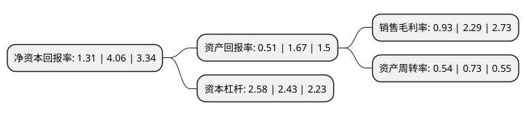

> 本页面由自动化程序生成于 2022年5月20日 01:04
> 内容可能存在错误，如有bug请提交issue至：https://github.com/Eroleice/doc-pi/issues
{.is-warning}

# 上市公司基本情况

## 基本资料

昆明云内动力股份有限公司（以下简称“云内动力”）成立于1999年03月08日，昆明市。于1999年04月15日在深交所主板上市。

云内动力注册资本197,080.086万元，主要产品:“100，102，90，95”系列柴油机，柴油机配件及其他轻卡，农用运输车。以下是详细信息：

- 公司名称: 昆明云内动力股份有限公司
- 股票代码: 000903.SZ
- 所在地: 云南 - 昆明市
- 成立日期: 1999年03月08日
- 注册资本: 197,080.086万元
- 法定代表人: 杨波
- 主营业务: 主要产品:“100，102，90，95”系列柴油机，柴油机配件及其他轻卡，农用运输车
- 公司官网: www.yunneidongli.com
- 公司介绍: 公司是由云南内燃机厂作为独家发起人，以社会募集方式设立的股份制上市公司，主要产品为发动机和配件，其中发动机可分为商用车柴油发动机、乘用车柴油发动机、非道路柴油发动机、天然气及双燃料动力发动机。公司是中国汽车零部件发动机行业龙头企业中国内燃机行业排头兵企业，国家第二批创新型试点企业及云南省首批创新型企业、高新技术企业，科技部认定的“国家乘用车柴油机高新技术产业化基地骨干企业”、“国家火炬计划重点高新技术企业”和“国际科技合作基地”，荣获全国“五一”劳动奖状和“全国先进基层党组织”称号。

## 股东及高管情况

上市公司第一大股东为云南云内动力集团有限公司，持股650,142,393股，占比32.99%，为上市公司实际控制人。

截至2022年03月31日，上市公司的前十大股东中，共有6名自然人股东，2名机构股东，1个产品账户，1个海外主体，其中5%以上大股东共有1名。上市公司前十大股东明细如下：

> 截至2022年03月31日，上市公司前十大股东信息如下：

| 股东名称 | 持股数量（股） | 持股比例 |
| --- | --- | --- |
| 云南云内动力集团有限公司 | 650,142,393 | 32.99% |
| 张杰明 | 22,471,141 | 1.14% |
| 贾跃峰 | 21,971,772 | 1.11% |
| 李娟 | 19,764,800 | 1% |
| 云南国际信托有限公司-云南信托·大西部丝绸之路2号集合资金信托计划 | 19,542,813 | 0.99% |
| 黄静 | 16,608,200 | 0.84% |
| 深圳市华科泰瑞电子合伙企业(有限合伙) | 8,995,408 | 0.46% |
| 卢云果 | 8,319,000 | 0.42% |
| 王世杰 | 6,652,800 | 0.34% |
| 香港中央结算有限公司(陆股通) | 6,452,355 | 0.33% |

## 利润表分析

上市公司2021年总收入为80.29亿元，净利润为0.74亿元，实现盈利。

## 杜邦分析

> 数据列示周期：2021年 | 2020年 | 2019年
{.is-info}

上市公司的净资产收益率在近一年有所下降，下降幅度为-67.73%，其变化情况分解如下：
- 上市公司的销售毛利率在近一年下降了-59.39%，可能是生产效率的下降、商品原材料价格上涨或商品价格的下跌所致。
- 上市公司的资产周转率在近一年下降了-26.03%，可能是源自于更慢的销售回款或库存管理效果下降。
- 上市公司的财务杠杆比率在近一年上升了6.17%，可能是增加负债扩大生产规模。

