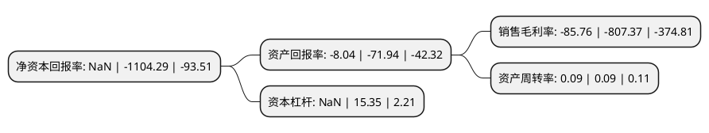

> 本页面由自动化程序生成于 2022年5月20日 01:04
> 内容可能存在错误，如有bug请提交issue至：https://github.com/Eroleice/doc-pi/issues
{.is-warning}

# 上市公司基本情况

## 基本资料

众泰汽车股份有限公司（以下简称“*ST众泰”）成立于1998年08月31日，金华市。于2000年06月16日在深交所主板上市。

*ST众泰注册资本506,917.822万元，主要业务:汽车整车及零部件，汽车配件，摩托车配件(不含发动机)，模具，电机产品，五金工具，家用电器，仪器仪表配件及电器件，电机系列产品，电子电器产品;货物和技术进出口业务(国家法律法规规定的除外);安全防撬门，装饰门，防盗窗及各种功能门窗生产，销售;企业自产产品及技术出口等业务。以下是详细信息：

- 公司名称: 众泰汽车股份有限公司
- 股票代码: 000980.SZ
- 所在地: 浙江 - 金华市
- 成立日期: 1998年08月31日
- 注册资本: 506,917.822万元
- 法定代表人: 黄继宏
- 主营业务: 汽车整车及零部件，汽车配件，摩托车配件(不含发动机)，模具，电机产品，五金工具，家用电器，仪器仪表配件及电器件，电机系列产品，电子电器产品;货物和技术进出口业务(国家法律法规规定的除外);安全防撬门，装饰门，防盗窗及各种功能门窗生产，销售;企业自产产品及技术出口等业务
- 公司官网: www.zotye.com
- 公司介绍: 公司是国内最大的车用仪表生产企业之一，国家火炬计划重点高新技术企业，设有省级技术中心，享有产品自营进出口权。公司是以汽车整车研发、制造及销售为核心业务的汽车整车制造企业，以市场为导向，不断丰富和完善业务范围，提升自主创新实力，逐渐成长为具有核心竞争优势的汽车产业民族自主品牌。公司拥有众泰、江南、君马等自主品牌，产品覆盖SUV、轿车、MPV和新能源汽车四个细分市场，SUV板块主要有T系列、君马系列和S系列三大系列产品，广受市场追捧和消费者的喜爱。通过多年研发积累，众泰汽车已形成了A、B、L三大技术平台，并在造型、模具、CAE、试验试制、NVH、检验检测等方面达到国际先进水平。公司主导产品均通过ISO9001、ISO/IS16949质量体系认证。

## 股东及高管情况

上市公司第一大股东为铁牛集团有限公司，持股786,250,375股，占比15.51%，**疑似为**上市公司实际控制人。

截至2022年03月31日，上市公司的前十大股东中，共有1名自然人股东，7名机构股东，2个产品账户，其中5%以上大股东共有4名。上市公司前十大股东明细如下：

> 未能通过持股比例判定出上市公司实际控制人（持股30%以上）
> 可能存在通过间接持股、联合持股、协议控制等方式拥有实际控制权的主体，具体请参考上市公司定期公告！
{.is-warning}

> 截至2022年03月31日，上市公司前十大股东信息如下：

| 股东名称 | 持股数量（股） | 持股比例 |
| --- | --- | --- |
| 铁牛集团有限公司 | 786,250,375 | 15.51% |
| 众泰汽车股份有限公司破产企业财产处置专用账户 | 775,722,083 | 15.3% |
| 江苏深商控股集团有限公司 | 747,000,000 | 14.74% |
| 深圳市国民数字信息技术有限公司 | 381,000,000 | 7.52% |
| 海南指明灯投资有限公司 | 200,000,000 | 3.95% |
| 长春市众合投资中心(有限合伙) | 200,000,000 | 3.95% |
| 长城(德阳)长富投资基金合伙企业(有限合伙) | 121,341,408 | 2.39% |
| 深圳市夏泰洛投资合伙企业(有限合伙) | 100,000,000 | 1.97% |
| 长春市硕成投资中心(有限合伙) | 100,000,000 | 1.97% |
| 竺伟 | 100,000,000 | 1.97% |

## 利润表分析

上市公司2021年总收入为8.25亿元，净利润为-7.08亿元，**未实现盈利**。

## 杜邦分析

> 数据列示周期：2021年 | 2020年 | 2019年
{.is-info}

上市公司的净资产收益率在近一年有所下降，下降幅度为NaN%，其变化情况分解如下：
- 上市公司的销售毛利率在近一年下降了-89.38%，可能是生产效率的下降、商品原材料价格上涨或商品价格的下跌所致。
- 上市公司的资产周转率在近一年下降了0%，可能是源自于更慢的销售回款或库存管理效果下降。
- 上市公司的财务杠杆比率在近一年下降了NaN%，可能是减少负债降低财务费用。

