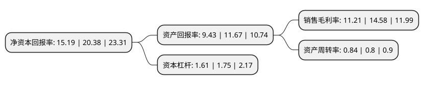

> 本页面由自动化程序生成于 2022年5月20日 01:05
> 内容可能存在错误，如有bug请提交issue至：https://github.com/Eroleice/doc-pi/issues
{.is-warning}

## 股东及高管情况

上市公司第一大股东为XIA LURONG，持股49,518,000股，占比35.02%，为上市公司实际控制人。

截至2022年05月12日，上市公司的前十大股东中，共有1名自然人股东，7名机构股东，1个产品账户，1个海外主体，其中5%以上大股东共有3名。上市公司前十大股东明细如下：

> 截至2022年05月12日，上市公司前十大股东信息如下：

| 股东名称 | 持股数量（股） | 持股比例 |
| --- | --- | --- |
| XIA LURONG | 49,518,000 | 35.02% |
| 杨国强 | 33,012,000 | 23.35% |
| 深圳市毅富和投资有限公司 | 7,470,000 | 5.28% |
| 盛荣(东莞)管理咨询合伙企业(有限合伙) | 6,156,000 | 4.35% |
| 聚麒(东莞)管理咨询合伙企业(有限合伙) | 3,414,000 | 2.41% |
| 重庆南方工业股权投资基金管理有限公司-重庆南方工业股权投资基金合伙企业(有限合伙) | 2,556,131 | 1.81% |
| 东莞市三正投资有限公司 | 1,732,211 | 1.23% |
| 东莞市科创资本创业投资有限公司 | 1,727,116 | 1.22% |
| 众坤(东莞)管理咨询合伙企业(有限合伙) | 430,000 | 0.3% |
| 华林证券股份有限公司 | 204,009 | 0.14% |

## 利润表分析

上市公司2021年总收入为8.55亿元，净利润为0.95亿元，实现盈利。

## 杜邦分析

> 数据列示周期：2021年 | 2020年 | 2019年
{.is-info}

上市公司的净资产收益率在近一年有所下降，下降幅度为-25.47%，其变化情况分解如下：
- 上市公司的销售毛利率在近一年下降了-23.11%，可能是生产效率的下降、商品原材料价格上涨或商品价格的下跌所致。
- 上市公司的资产周转率在近一年上升了5%，可能是源自于更快的销售回款或库存管理效果提升。
- 上市公司的财务杠杆比率在近一年下降了-8%，可能是减少负债降低财务费用。

