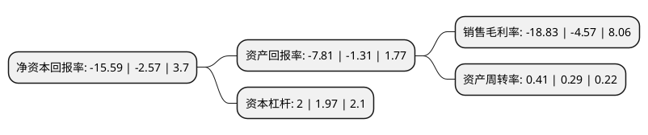

> 本页面由自动化程序生成于 2022年5月20日 01:05
> 内容可能存在错误，如有bug请提交issue至：https://github.com/Eroleice/doc-pi/issues
{.is-warning}

# 上市公司基本情况

## 基本资料

巨轮智能装备股份有限公司（以下简称“巨轮智能”）成立于2001年12月30日，揭阳市。于2004年08月16日在深交所中小板上市。

巨轮智能注册资本219,939.567万元，主要产品:子午线轮胎模具以下是详细信息：

- 公司名称: 巨轮智能装备股份有限公司
- 股票代码: 002031.SZ
- 所在地: 广东 - 揭阳市
- 成立日期: 2001年12月30日
- 注册资本: 219,939.567万元
- 法定代表人: 吴潮忠
- 主营业务: 主要产品:子午线轮胎模具
- 公司官网: www.greatoo.com
- 公司介绍: 公司是目前国内规模较大、技术领先和首家上市的轮胎模具开发制造企业。公司主要研制开发、生产子午线轮胎模具、液压式轮胎硫化机、精密机床和工业机器人，主导产品有子午线轮胎活络模具、轮胎二半模具、巨型工程车胎活络模具、多种型号的液压式轮胎硫化机、轻载和重载工业机器人、精密机床等。公司研发技术领先、产品质量可靠，品牌价值显著，产品畅销全国并远销美国、欧洲、东南亚、南美等国家和地区，被美国固特异、英国邓录普、法国米其林、日本普利司通、意大利皮列里等国际轮胎巨头列入全球采购供应体系，成为国内外高端客户的主流供应商。公司是国家火炬计划重点高新技术企业，国家创新技术创新示范企业、全国首批15家工业机器人行业规范企业、全国首批国家级绿色工厂，拥有国家级技术中心、院士工作站、博士后工作站、国家与地方联合工程中心等高端研发机构。

## 股东及高管情况

上市公司第一大股东为吴潮忠，持股259,210,587股，占比11.79%，**疑似为**上市公司实际控制人。

截至2022年03月31日，上市公司的前十大股东中，共有5名自然人股东，5个产品账户，其中5%以上大股东共有2名。上市公司前十大股东明细如下：

> 未能通过持股比例判定出上市公司实际控制人（持股30%以上）
> 可能存在通过间接持股、联合持股、协议控制等方式拥有实际控制权的主体，具体请参考上市公司定期公告！
{.is-warning}

> 截至2022年03月31日，上市公司前十大股东信息如下：

| 股东名称 | 持股数量（股） | 持股比例 |
| --- | --- | --- |
| 吴潮忠 | 259,210,587 | 11.79% |
| 洪惠平 | 155,723,000 | 7.08% |
| 浙江银万斯特投资管理有限公司-银万全盈23号私募证券投资基金 | 42,730,000 | 1.94% |
| 宁波宁聚资产管理中心(有限合伙)-宁聚量化稳增4号私募证券投资基金 | 33,000,000 | 1.5% |
| 深圳市前海建泓时代资产管理有限公司-建泓时代鸿运一号私募证券投资基金 | 17,000,000 | 0.77% |
| 刘文涛 | 15,480,442 | 0.7% |
| 深圳市前海建泓时代资产管理有限公司-建泓时代智汇2号投资基金 | 13,920,000 | 0.63% |
| 深圳市前海建泓时代资产管理有限公司-建泓时光精选1号私募证券投资基金 | 12,980,000 | 0.59% |
| 李丽璇 | 11,132,061 | 0.51% |
| 林瑞波 | 11,015,061 | 0.5% |

## 利润表分析

上市公司2021年总收入为22.08亿元，净利润为-4.16亿元，**未实现盈利**。

## 杜邦分析

> 数据列示周期：2021年 | 2020年 | 2019年
{.is-info}

上市公司的净资产收益率在近一年有所上升，上升幅度为506.61%，其变化情况分解如下：
- 上市公司的销售毛利率在近一年上升了312.04%，可能是生产效率的提升、商品原材料价格下跌或商品价格的上涨所致。
- 上市公司的资产周转率在近一年上升了41.38%，可能是源自于更快的销售回款或库存管理效果提升。
- 上市公司的财务杠杆比率在近一年上升了1.52%，可能是增加负债扩大生产规模。

