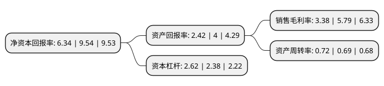

> 本页面由自动化程序生成于 2022年5月20日 01:06
> 内容可能存在错误，如有bug请提交issue至：https://github.com/Eroleice/doc-pi/issues
{.is-warning}

# 上市公司基本情况

## 基本资料

浙江银轮机械股份有限公司（以下简称“银轮股份”）成立于1999年03月10日，台州市。于2007年04月18日在深交所中小板上市。

银轮股份注册资本79,211.277万元，主要产品::新能源汽车热管理相关的高低温水箱，Chiller(电池深冷器)，电池冷却板，电机冷却器，电控冷却器，前端冷却模块，PTC加热器等。主要业务:研发，制造和销售各种热交换器及尾气后处理等产品。以下是详细信息：

- 公司名称: 浙江银轮机械股份有限公司
- 股票代码: 002126.SZ
- 所在地: 浙江 - 台州市
- 成立日期: 1999年03月10日
- 注册资本: 79,211.277万元
- 法定代表人: 徐小敏
- 主营业务: 主要产品::新能源汽车热管理相关的高低温水箱，Chiller(电池深冷器)，电池冷却板，电机冷却器，电控冷却器，前端冷却模块，PTC加热器等研发，制造和销售各种热交换器及尾气后处理等产品
- 公司官网: www.yinlun.cn
- 公司介绍: 公司是一家专业研发、制造和销售各种热交换器及尾气后处理等产品的国家级高新技术企业。目前公司是中国内燃机标准化技术委员会热交换器行业标准的牵头制订单位，建有国家级企业技术中心、省级重点企业研究院、省级工程实验室和国家级博士后科研工作站。公司在浙江、上海、湖北、山东等地建有生产基地和研发中心、并在北美、欧洲等地建有生产基地和研发分中心。公司主要产品有：新能源汽车热管理相关的高低温水箱、Chiller(电池深冷器)、电池冷却板、电机冷却器、电控冷却器、前端冷却模块、PTC加热器等，广泛应用于汽车、工程机械、农业机械、压缩机、风力发电、火车机车、轮船等热交换及尾气后处理领域。多年来，公司将自己的专业技术发展到新的应用领域，使其业务不断向农业机械、压缩机、船舶、风力发电、发电机组、火车机车及工业、民用等热交换领域市场拓展和延伸。公司已由简单的为客户提供产品发展到能以客户为中心提供换热解决方案，正被全球范围内越来越多的主机厂商肯定和认可，成为其在中国甚至全球热系统首选供应商。公司愿景是成为提供高效换热解决方案的世界级优秀企业。

## 股东及高管情况

上市公司第一大股东为天台银轮实业发展有限公司，持股80,444,000股，占比10.16%，**疑似为**上市公司实际控制人。

截至2022年03月31日，上市公司的前十大股东中，共有2名自然人股东，2名机构股东，6个产品账户，其中5%以上大股东共有2名。上市公司前十大股东明细如下：

> 未能通过持股比例判定出上市公司实际控制人（持股30%以上）
> 可能存在通过间接持股、联合持股、协议控制等方式拥有实际控制权的主体，具体请参考上市公司定期公告！
{.is-warning}

> 截至2022年03月31日，上市公司前十大股东信息如下：

| 股东名称 | 持股数量（股） | 持股比例 |
| --- | --- | --- |
| 天台银轮实业发展有限公司 | 80,444,000 | 10.16% |
| 徐小敏 | 55,615,820 | 7.02% |
| 基本养老保险基金一零零三组合 | 38,801,674 | 4.9% |
| 徐小敏 | 32,470,808 | 4.1% |
| 宁波正奇投资管理中心(有限合伙) | 32,000,000 | 4.04% |
| 上海浦东发展银行股份有限公司-景顺长城新能源产业股票型证券投资基金 | 22,584,766 | 2.85% |
| 中国建设银行股份有限公司-景顺长城环保优势股票型证券投资基金 | 13,706,445 | 1.73% |
| 浙江银轮机械股份有限公司-第二期员工持股计划 | 8,130,039 | 1.03% |
| 中国工商银行股份有限公司-景顺长城创新成长混合型证券投资基金 | 7,540,897 | 0.95% |
| 全国社保基金一零一组合 | 7,239,341 | 0.91% |

## 利润表分析

上市公司2021年总收入为78.16亿元，净利润为2.64亿元，实现盈利。

## 杜邦分析

> 数据列示周期：2021年 | 2020年 | 2019年
{.is-info}

上市公司的净资产收益率在近一年有所下降，下降幅度为-33.54%，其变化情况分解如下：
- 上市公司的销售毛利率在近一年下降了-41.62%，可能是生产效率的下降、商品原材料价格上涨或商品价格的下跌所致。
- 上市公司的资产周转率在近一年上升了4.35%，可能是源自于更快的销售回款或库存管理效果提升。
- 上市公司的财务杠杆比率在近一年上升了10.08%，可能是增加负债扩大生产规模。

