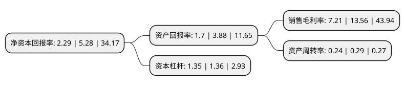

> 本页面由自动化程序生成于 2022年5月20日 01:06
> 内容可能存在错误，如有bug请提交issue至：https://github.com/Eroleice/doc-pi/issues
{.is-warning}

# 上市公司基本情况

## 基本资料

四川成飞集成科技股份有限公司（以下简称“成飞集成”）成立于2000年12月06日，成都市。于2007年12月03日在深交所中小板上市。

成飞集成注册资本35,872.934万元，主营业务:汽车覆盖件模具的设计，研究和制造以及对外数控加工业务。以下是详细信息：

- 公司名称: 四川成飞集成科技股份有限公司
- 股票代码: 002190.SZ
- 所在地: 四川 - 成都市
- 成立日期: 2000年12月06日
- 注册资本: 35,872.934万元
- 法定代表人: 石晓卿
- 主营业务: 主营业务:汽车覆盖件模具的设计，研究和制造以及对外数控加工业务
- 公司官网: www.cac-citc.com
- 公司介绍: 公司是由中国航空工业集团有限公司控股的高科技股份有限公司。公司以锂离子动力电池、电源系统研发及生产为主业，同时大力发展汽车工模具设计、研发和制造业务，主要产品是锂离子动力电池、电源PACK系统，中高档轿车侧围、顶盖、车门、翼子板等外覆盖件模具。子公司中航锂电(洛阳)有限公司先后参与并完成包括国家863计划和国家重点研发计划在内的多项国家级技术研发及产业化项目，是行业标准的重要起草单位；产品拥有广阔的市场前景和较高的美誉度。公司是国内汽车覆盖件模具重点骨干企业，拥有国内同行业中领先的技术实力和管理水平。

## 股东及高管情况

上市公司第一大股东为中国航空工业集团有限公司，持股179,959,663股，占比50.17%，为上市公司实际控制人。

截至2022年03月31日，上市公司的前十大股东中，共有8名自然人股东，2名机构股东，其中5%以上大股东共有1名。上市公司前十大股东明细如下：

> 截至2022年03月31日，上市公司前十大股东信息如下：

| 股东名称 | 持股数量（股） | 持股比例 |
| --- | --- | --- |
| 中国航空工业集团有限公司 | 179,959,663 | 50.17% |
| 成都凯天电子股份有限公司 | 3,290,080 | 0.92% |
| 牛桂兰 | 3,290,000 | 0.92% |
| 史生民 | 2,202,700 | 0.61% |
| 李云 | 1,373,569 | 0.38% |
| 张明峰 | 1,260,300 | 0.35% |
| 何怡 | 1,200,000 | 0.33% |
| 余峰 | 1,016,300 | 0.28% |
| 陈斌 | 993,700 | 0.28% |
| 郑潇潇 | 958,404 | 0.27% |

## 利润表分析

上市公司2021年总收入为12.68亿元，净利润为0.91亿元，实现盈利。

## 杜邦分析

> 数据列示周期：2021年 | 2020年 | 2019年
{.is-info}

上市公司的净资产收益率在近一年有所下降，下降幅度为-56.63%，其变化情况分解如下：
- 上市公司的销售毛利率在近一年下降了-46.83%，可能是生产效率的下降、商品原材料价格上涨或商品价格的下跌所致。
- 上市公司的资产周转率在近一年下降了-17.24%，可能是源自于更慢的销售回款或库存管理效果下降。
- 上市公司的财务杠杆比率在近一年下降了-0.74%，可能是减少负债降低财务费用。

