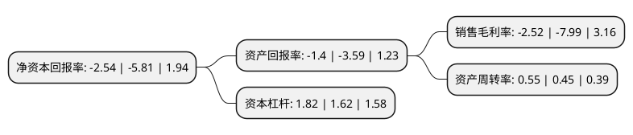

> 本页面由自动化程序生成于 2022年5月20日 01:07
> 内容可能存在错误，如有bug请提交issue至：https://github.com/Eroleice/doc-pi/issues
{.is-warning}

# 上市公司基本情况

## 基本资料

奥特佳新能源科技股份有限公司（以下简称“奥特佳”）成立于2002年06月13日，南通市。于2008年05月22日在深交所中小板上市。

奥特佳注册资本324,325.814万元，主要产品:汽车空调压缩机和汽车空调系统。主营业务:汽车空调压缩机和汽车空调系统的研发，生产和销售。以下是详细信息：

- 公司名称: 奥特佳新能源科技股份有限公司
- 股票代码: 002239.SZ
- 所在地: 江苏 - 南通市
- 成立日期: 2002年06月13日
- 注册资本: 324,325.814万元
- 法定代表人: 张永明
- 主营业务: 主要产品:汽车空调压缩机和汽车空调系统主营业务:汽车空调压缩机和汽车空调系统的研发，生产和销售
- 公司官网: www.aotecar.com
- 公司介绍: 公司主要从事各类汽车空调压缩机及汽车空调系统的研发、生产和销售，是国内最大的汽车空调压缩机生产企业，产品主要销往国内外知名整车制造厂。南京奥特佳和富通空调是国内汽车空调压缩机行业的领先企业。南京奥特佳是中国汽车工业协会认定的“中国汽车零部件(空调)行业龙头企业”，是全球最大的涡旋式汽车空调压缩机生产企业，并连续多年获得“全国百佳优秀汽车零部件供应商”称号，奥特佳商标被评定为“中国驰名商标”。

## 股东及高管情况

上市公司第一大股东为江苏天佑金淦投资有限公司，持股353,832,788股，占比10.91%，**疑似为**上市公司实际控制人。

截至2022年03月31日，上市公司的前十大股东中，共有4名自然人股东，5名机构股东，1个海外主体，其中5%以上大股东共有3名。上市公司前十大股东明细如下：

> 未能通过持股比例判定出上市公司实际控制人（持股30%以上）
> 可能存在通过间接持股、联合持股、协议控制等方式拥有实际控制权的主体，具体请参考上市公司定期公告！
{.is-warning}

> 截至2022年03月31日，上市公司前十大股东信息如下：

| 股东名称 | 持股数量（股） | 持股比例 |
| --- | --- | --- |
| 江苏天佑金淦投资有限公司 | 353,832,788 | 10.91% |
| 北京天佑投资有限公司 | 325,438,596 | 10.03% |
| 王进飞 | 273,544,949 | 8.43% |
| 李虹 | 90,000,000 | 2.77% |
| 江苏帝奥控股集团股份有限公司 | 82,496,915 | 2.54% |
| 西藏天佑投资有限公司 | 62,026,147 | 1.91% |
| 香港中央结算有限公司(陆股通) | 27,144,849 | 0.84% |
| 张宇 | 20,000,000 | 0.62% |
| 重庆三峡水利电力投资有限公司 | 17,721,518 | 0.55% |
| 元元 | 15,162,323 | 0.47% |

## 利润表分析

上市公司2021年总收入为51.37亿元，净利润为-1.3亿元，**未实现盈利**。

## 杜邦分析

> 数据列示周期：2021年 | 2020年 | 2019年
{.is-info}

上市公司的净资产收益率在近一年有所下降，下降幅度为-56.28%，其变化情况分解如下：
- 上市公司的销售毛利率在近一年下降了-68.46%，可能是生产效率的下降、商品原材料价格上涨或商品价格的下跌所致。
- 上市公司的资产周转率在近一年上升了22.22%，可能是源自于更快的销售回款或库存管理效果提升。
- 上市公司的财务杠杆比率在近一年上升了12.35%，可能是增加负债扩大生产规模。

