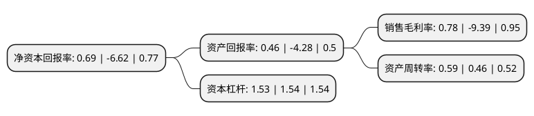

> 本页面由自动化程序生成于 2022年5月20日 01:07
> 内容可能存在错误，如有bug请提交issue至：https://github.com/Eroleice/doc-pi/issues
{.is-warning}

# 上市公司基本情况

## 基本资料

云南西仪工业股份有限公司（以下简称“西仪股份”）成立于1997年03月18日，昆明市。于2008年08月06日在深交所中小板上市。

西仪股份注册资本31,856.617万元，主要产品:轿车，微车和轻型车系列连杆，其他工业产品。主营业务:汽车发动机连杆，其他工业产品及其他产品的研发与生产。以下是详细信息：

- 公司名称: 云南西仪工业股份有限公司
- 股票代码: 002265.SZ
- 所在地: 云南 - 昆明市
- 成立日期: 1997年03月18日
- 注册资本: 31,856.617万元
- 法定代表人: 董绍杰
- 主营业务: 主要产品:轿车，微车和轻型车系列连杆，其他工业产品主营业务:汽车发动机连杆，其他工业产品及其他产品的研发与生产
- 公司官网: www.ynxygf.com
- 公司介绍: 公司以其他工业产品和汽车零部件作为主业，其中汽车发动机连杆业务迈进了合资品牌市场。公司建有国家级的校准实验室、部级理化检测机构和省级技术中心，拥有雄厚的机械加工、锻造、砂铸、精密铸造、表面处理、热处理和刀、夹、量等模具设计加工能力。2015年公司通过了ISO/TS16949:2009质量体系认证，2016年被云南省科技厅认定为“云南省高新技术企业”。公司与十多家主机厂建立长期稳定的定点配套服务和友好的战略合作关系,产品还出口美国、日本。凭借良好的产品质量和优质的售后服务，公司赢得了多家主机厂授予的“优秀配套厂”和“定点配套企业”荣誉称号。

## 股东及高管情况

上市公司第一大股东为南方工业资产管理有限责任公司，持股125,605,626股，占比39.43%，为上市公司实际控制人。

截至2022年03月31日，上市公司的前十大股东中，共有4名自然人股东，5名机构股东，1个产品账户，其中5%以上大股东共有2名。上市公司前十大股东明细如下：

> 截至2022年03月31日，上市公司前十大股东信息如下：

| 股东名称 | 持股数量（股） | 持股比例 |
| --- | --- | --- |
| 南方工业资产管理有限责任公司 | 125,605,626 | 39.43% |
| 中国兵器装备集团有限公司 | 50,756,653 | 15.93% |
| 江苏省农垦集团有限公司 | 10,994,886 | 3.45% |
| 贵州长征天成控股股份有限公司 | 2,241,953 | 0.7% |
| 刘鹰 | 1,163,900 | 0.37% |
| 唐伟雄 | 835,700 | 0.26% |
| 浙江嘉鸿资产管理有限公司-嘉鸿尊享1号私募证券投资基金 | 821,500 | 0.26% |
| 武汉长江光电有限公司 | 803,780 | 0.25% |
| 褚元杰 | 713,900 | 0.22% |
| 毛向阳 | 580,000 | 0.18% |

## 利润表分析

上市公司2021年总收入为7.84亿元，净利润为0.06亿元，实现盈利。

## 杜邦分析

> 数据列示周期：2021年 | 2020年 | 2019年
{.is-info}

上市公司的净资产收益率在近一年有所下降，下降幅度为-110.42%，其变化情况分解如下：
- 上市公司的销售毛利率在近一年下降了-108.31%，可能是生产效率的下降、商品原材料价格上涨或商品价格的下跌所致。
- 上市公司的资产周转率在近一年上升了28.26%，可能是源自于更快的销售回款或库存管理效果提升。
- 上市公司的财务杠杆比率在近一年下降了-0.65%，可能是减少负债降低财务费用。

