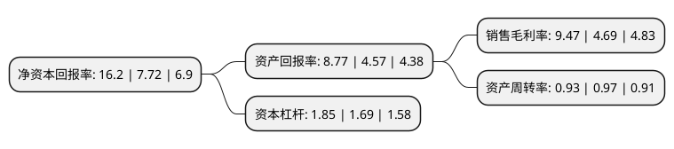

> 本页面由自动化程序生成于 2022年5月20日 01:08
> 内容可能存在错误，如有bug请提交issue至：https://github.com/Eroleice/doc-pi/issues
{.is-warning}

# 上市公司基本情况

## 基本资料

上海新朋实业股份有限公司（以下简称“新朋股份”）成立于1997年10月30日，上海市。于2009年12月30日在深交所中小板上市。

新朋股份注册资本77,177万元，主要产品:为乘用车专业提供汽车零部件开卷落料，大型覆盖件冲压，分总成焊接，小型金属零部件等。主营业务:汽车零部件，金属及通信部件的研发，生产及销售。以下是详细信息：

- 公司名称: 上海新朋实业股份有限公司
- 股票代码: 002328.SZ
- 所在地: 上海 - 上海市
- 成立日期: 1997年10月30日
- 注册资本: 77,177万元
- 法定代表人: 宋琳
- 主营业务: 主要产品:为乘用车专业提供汽车零部件开卷落料，大型覆盖件冲压，分总成焊接，小型金属零部件等主营业务:汽车零部件，金属及通信部件的研发，生产及销售
- 公司官网: www.xinpeng.com
- 公司介绍: 公司是专业的机电产品金属零部件设计和制造商，是多家全球著名跨国公司的主要供应商，专业为客户开发、生产各种规格和用途的专用的标准或非标准的金属机电零部件。公司拥有包括冲压、钣金类零件的精密冲压、连续冲压、数控冲裁及折弯、激光切割、机器人焊接，网板自动连续冲压，电泳处理、粉末喷涂处理等加工手段以及用于模具加工的四轴联动加工中心、精密慢走丝线切割加工以及常规车、铣、钻、磨、铆接和攻丝等各种金属加工成型能力，尤其擅长于各种模具的设计和制造以及用冲压、钣金工艺生产各种复杂的金属零部件。

## 股东及高管情况

上市公司第一大股东为宋琳，持股265,060,000股，占比34.34%，为上市公司实际控制人。

截至2022年03月31日，上市公司的前十大股东中，共有6名自然人股东，4个产品账户，其中5%以上大股东共有1名。上市公司前十大股东明细如下：

> 截至2022年03月31日，上市公司前十大股东信息如下：

| 股东名称 | 持股数量（股） | 持股比例 |
| --- | --- | --- |
| 宋琳 | 265,060,000 | 34.34% |
| 姜素青 | 9,850,810 | 1.28% |
| 中国建设银行股份有限公司-信达澳银新能源产业股票型证券投资基金 | 9,193,680 | 1.19% |
| 刘远军 | 7,881,750 | 1.02% |
| 单光林 | 4,330,600 | 0.56% |
| 郭捷 | 3,800,000 | 0.49% |
| 上海浦东发展银行股份有限公司-信达澳银领先智选混合型证券投资基金 | 2,513,644 | 0.33% |
| 中国建设银行股份有限公司-信达澳银匠心臻选两年持有期混合型证券投资基金 | 2,339,683 | 0.3% |
| 交通银行股份有限公司-信达澳银星奕混合型证券投资基金 | 2,324,612 | 0.3% |
| 李华 | 2,191,000 | 0.28% |

## 利润表分析

上市公司2021年总收入为47.21亿元，净利润为4.46亿元，实现盈利。

## 杜邦分析

> 数据列示周期：2021年 | 2020年 | 2019年
{.is-info}

上市公司的净资产收益率在近一年有所上升，上升幅度为109.84%，其变化情况分解如下：
- 上市公司的销售毛利率在近一年上升了101.92%，可能是生产效率的提升、商品原材料价格下跌或商品价格的上涨所致。
- 上市公司的资产周转率在近一年下降了-4.12%，可能是源自于更慢的销售回款或库存管理效果下降。
- 上市公司的财务杠杆比率在近一年上升了9.47%，可能是增加负债扩大生产规模。

