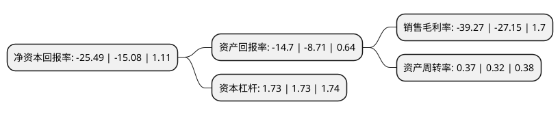

> 本页面由自动化程序生成于 2022年5月20日 01:08
> 内容可能存在错误，如有bug请提交issue至：https://github.com/Eroleice/doc-pi/issues
{.is-warning}

# 上市公司基本情况

## 基本资料

兴民智通(集团)股份有限公司（以下简称“兴民智通”）成立于1999年12月28日，烟台市。于2010年02月09日在深交所中小板上市。

兴民智通注册资本62,057.04万元，主要产品:乘用车钢制车轮，轻型卡车钢制车轮，重型卡车钢制车轮，拖车钢制车轮，农林机械钢制车轮，雪地轮六大系列;车联网硬件产品，车辆测试与数据采集系统及数据运营服务;车联网运营服务。主营业务:钢制车轮业务，智能网联汽车业务，车联网运营服务。以下是详细信息：

- 公司名称: 兴民智通(集团)股份有限公司
- 股票代码: 002355.SZ
- 所在地: 山东 - 烟台市
- 成立日期: 1999年12月28日
- 注册资本: 62,057.04万元
- 法定代表人: 赵丰
- 主营业务: 主要产品:乘用车钢制车轮，轻型卡车钢制车轮，重型卡车钢制车轮，拖车钢制车轮，农林机械钢制车轮，雪地轮六大系列;车联网硬件产品，车辆测试与数据采集系统及数据运营服务;车联网运营服务主营业务:钢制车轮业务，智能网联汽车业务，车联网运营服务
- 公司官网: www.xingmin.com
- 公司介绍: 公司在巩固钢制车轮业务的同时，紧抓时代脉搏，成功转型升级进入智能网联汽车领域，现已形成车轮研发生产销售、智能网联汽车数据采集运营双主业发展格局。公司主营业务为钢制车轮业务,智能网联汽车业务,车联网运营服务.公司专注从事汽车钢制车轮的研发、生产和销售，主要产品包括乘用车钢制车轮、轻型卡车钢制车轮、重型卡车钢制车轮、拖车钢制车轮、农林机械钢制车轮、雪地轮六大系列，主要为汽车制造商提供配套产品和为汽车维修售后市场供货。公司现拥有国家级汽车轮辋检测中心、山东省省级技术中心、山东省博士后创新实践基地、兴民—北航交通车轮先进技术研发中心、首钢—兴民钢圈联合实验室。公司致力于智能网联汽车领域发展，先后控股武汉英泰斯特电子技术有限公司、北京九五智驾信息技术股份有限公司，参股深圳广联赛讯有限公司、彩虹无线(北京)新技术有限公司。

## 股东及高管情况

上市公司第一大股东为四川盛邦创恒企业管理有限责任公司，持股115,848,000股，占比18.67%，**疑似为**上市公司实际控制人。

截至2022年03月31日，上市公司的前十大股东中，共有5名自然人股东，2名机构股东，3个产品账户，其中5%以上大股东共有2名。上市公司前十大股东明细如下：

> 未能通过持股比例判定出上市公司实际控制人（持股30%以上）
> 可能存在通过间接持股、联合持股、协议控制等方式拥有实际控制权的主体，具体请参考上市公司定期公告！
{.is-warning}

> 截至2022年03月31日，上市公司前十大股东信息如下：

| 股东名称 | 持股数量（股） | 持股比例 |
| --- | --- | --- |
| 四川盛邦创恒企业管理有限责任公司 | 115,848,000 | 18.67% |
| 青岛创疆环保新能源科技有限公司 | 40,000,000 | 6.45% |
| 万家基金-兴业银行-万家基金瀛海资产管理计划 | 15,213,276 | 2.45% |
| 崔积旺 | 12,579,900 | 2.03% |
| 邹志强 | 12,556,300 | 2.02% |
| 姜开学 | 12,095,600 | 1.95% |
| 杭州高鸿私募基金管理有限公司-高鸿睿远一号私募证券投资基金 | 8,620,657 | 1.39% |
| 顾斌 | 7,046,000 | 1.14% |
| 章翔 | 6,389,200 | 1.03% |
| 兴民智通(集团)股份有限公司-第一期员工持股计划 | 6,111,767 | 0.98% |

## 杜邦分析

> 数据列示周期：2021年 | 2020年 | 2019年
{.is-info}

上市公司的净资产收益率在近一年有所上升，上升幅度为69.03%，其变化情况分解如下：
- 上市公司的销售毛利率在近一年上升了44.64%，可能是生产效率的提升、商品原材料价格下跌或商品价格的上涨所致。
- 上市公司的资产周转率在近一年上升了15.63%，可能是源自于更快的销售回款或库存管理效果提升。
- 上市公司的财务杠杆比率在近一年下降了0%，可能是减少负债降低财务费用。

