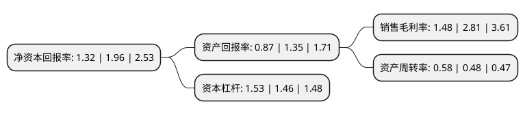

> 本页面由自动化程序生成于 2022年5月20日 01:08
> 内容可能存在错误，如有bug请提交issue至：https://github.com/Eroleice/doc-pi/issues
{.is-warning}

# 上市公司基本情况

## 基本资料

山东隆基机械股份有限公司（以下简称“隆基机械”）成立于1994年04月11日，烟台市。于2010年03月05日在深交所中小板上市。

隆基机械注册资本41,610.03万元，主要产品:汽车制动盘，普通制动毂，载重车制动毂，刹车片，轮毂，制动钳和其他铸件等。主营业务:汽车制动部件领域中制动盘，制动毂等产品的相关业务。以下是详细信息：

- 公司名称: 山东隆基机械股份有限公司
- 股票代码: 002363.SZ
- 所在地: 山东 - 烟台市
- 成立日期: 1994年04月11日
- 注册资本: 41,610.03万元
- 法定代表人: 张海燕
- 主营业务: 主要产品:汽车制动盘，普通制动毂，载重车制动毂，刹车片，轮毂，制动钳和其他铸件等主营业务:汽车制动部件领域中制动盘，制动毂等产品的相关业务
- 公司官网: www.sdljjx.com.cn
- 公司介绍: 公司主要从事汽车制动部件领域中制动盘、制动毂等产品的相关业务，主要产品包括汽车制动盘、普通制动毂、载重车制动毂、刹车片、轮毂、制动钳和其他铸件等，可以生产近万种型号的汽车制动部件产品，是国内规模最大、产品型号最多的汽车制动部件生产企业和出口企业之一。公司具有较高的行业影响力，是中国铸造协会的常务理事单位；公司先后被授予“中国汽车零部件百强企业”、“中国绿色铸造示范企业”、“中国铸造行业综合百强企业”、“中国铸造行业汽车铸件(黑色)分行业排头兵企业”、“中国制动盘产业十大著名品牌”、“中国民营500强企业”、“中国海关高级认证企业”、“国家工信部两化融合管理体系贯标试点企业”、“全国敬老爱老助老模范”、“山东省机械工业百强企业”、“山东省铸造行业综合实力50强企业”、“山东装备制造业十大品牌民营企业”、“山东省民营企业100强”、“山东省智能制造示范企业”和“烟台市智慧工厂”等荣誉称号。

## 股东及高管情况

上市公司第一大股东为隆基集团有限公司，持股175,771,440股，占比42.24%，为上市公司实际控制人。

截至2022年03月31日，上市公司的前十大股东中，共有8名自然人股东，2名机构股东，其中5%以上大股东共有1名。上市公司前十大股东明细如下：

> 截至2022年03月31日，上市公司前十大股东信息如下：

| 股东名称 | 持股数量（股） | 持股比例 |
| --- | --- | --- |
| 隆基集团有限公司 | 175,771,440 | 42.24% |
| 吴吉林 | 6,686,600 | 1.61% |
| 张业波 | 4,139,900 | 0.99% |
| 唐岩 | 4,096,590 | 0.98% |
| 李玉华 | 4,077,000 | 0.98% |
| 日照市海达尔能源装备科技股份有限公司 | 3,689,800 | 0.89% |
| 徐开东 | 3,425,600 | 0.82% |
| 曲来生 | 3,296,000 | 0.79% |
| 陈少龙 | 2,122,830 | 0.51% |
| 李玉祥 | 1,936,500 | 0.47% |

## 利润表分析

上市公司2021年总收入为19.59亿元，净利润为0.29亿元，实现盈利。

## 杜邦分析

> 数据列示周期：2021年 | 2020年 | 2019年
{.is-info}

上市公司的净资产收益率在近一年有所下降，下降幅度为-32.65%，其变化情况分解如下：
- 上市公司的销售毛利率在近一年下降了-47.33%，可能是生产效率的下降、商品原材料价格上涨或商品价格的下跌所致。
- 上市公司的资产周转率在近一年上升了20.83%，可能是源自于更快的销售回款或库存管理效果提升。
- 上市公司的财务杠杆比率在近一年上升了4.79%，可能是增加负债扩大生产规模。

