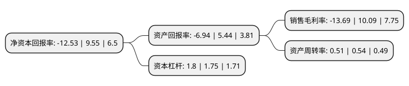

> 本页面由自动化程序生成于 2022年5月20日 01:09
> 内容可能存在错误，如有bug请提交issue至：https://github.com/Eroleice/doc-pi/issues
{.is-warning}

# 上市公司基本情况

## 基本资料

浙江万里扬股份有限公司（以下简称“万里扬”）成立于2003年10月22日，金华市。于2010年06月18日在深交所中小板上市。

万里扬注册资本134,000万元，主要产品:乘用车变速器和商用车变速器，汽车内饰仪表板，门板，中控台，立柱，护板，保险杠等，汽车零部件产品。主营业务:研发，生产，销售汽车变速器和汽车内饰件产品。以下是详细信息：

- 公司名称: 浙江万里扬股份有限公司
- 股票代码: 002434.SZ
- 所在地: 浙江 - 金华市
- 成立日期: 2003年10月22日
- 注册资本: 134,000万元
- 法定代表人: 黄河清
- 主营业务: 主要产品:乘用车变速器和商用车变速器，汽车内饰仪表板，门板，中控台，立柱，护板，保险杠等，汽车零部件产品主营业务:研发，生产，销售汽车变速器和汽车内饰件产品
- 公司官网: www.zjwly.com
- 公司介绍: 公司从事的主要业务为汽车零部件业务。汽车零部件业务主要为研发、生产、销售汽车变速器和汽车内饰件产品。汽车变速器产品包括乘用车变速器和商用车变速器，应用于轿车、SUV、MPV、微卡、轻卡、中卡、重卡、客车等不同车型。主要为奇瑞汽车、吉利汽车、重庆力帆、众泰汽车、北汽福田、东风汽车、中国重汽、一汽集团等大型汽车厂的各种车型提供配套。汽车内饰件产品涵盖汽车内饰仪表板、门板、中控台、立柱、护板、保险杠等，主要为奇瑞汽车、华晨宝马、北京奔驰、长安汽车、北汽股份、华晨汽车、一汽集团、汉腾汽车等大型汽车厂的各种车型提供配套。汽车零部件业务的主要经营模式为：通过产品设计开发、样品试制、工装样品、小批量供货，获得汽车整车厂的审核认证，与汽车整车厂确定配套供货关系，进行产品生产工艺设计、试验、定型，然后批量生产、销售，并提供售后服务。公司作为独立供应商，通过与汽车整车厂建立长期稳定的战略合作关系，实现业务的持续发展。

## 股东及高管情况

上市公司第一大股东为万里扬集团有限公司，持股384,075,744股，占比28.66%，**疑似为**上市公司实际控制人。

截至2022年03月31日，上市公司的前十大股东中，共有9名机构股东，1个海外主体，其中5%以上大股东共有5名。上市公司前十大股东明细如下：

> 未能通过持股比例判定出上市公司实际控制人（持股30%以上）
> 可能存在通过间接持股、联合持股、协议控制等方式拥有实际控制权的主体，具体请参考上市公司定期公告！
{.is-warning}

> 截至2022年03月31日，上市公司前十大股东信息如下：

| 股东名称 | 持股数量（股） | 持股比例 |
| --- | --- | --- |
| 万里扬集团有限公司 | 384,075,744 | 28.66% |
| 陕西省国际信托股份有限公司-陕国投·昌丰52号单一资金信托 | 79,000,000 | 5.9% |
| 陕西省国际信托股份有限公司-陕国投·昌盛1号单一资金信托 | 79,000,000 | 5.9% |
| 安徽国元信托有限责任公司-国元信托-安瑞1号单一资金信托 | 79,000,000 | 5.9% |
| 华润深国投信托有限公司-华润信托·华颖16号单一资金信托 | 73,760,000 | 5.5% |
| 金华市众成投资有限公司 | 52,785,000 | 3.94% |
| 浙大网新科技股份有限公司 | 45,580,000 | 3.4% |
| 香港利邦实业有限公司 | 29,795,000 | 2.22% |
| 香港中央结算有限公司(陆股通) | 25,486,578 | 1.9% |
| 奇瑞汽车股份有限公司 | 12,529,256 | 0.94% |

## 杜邦分析

> 数据列示周期：2021年 | 2020年 | 2019年
{.is-info}

上市公司的净资产收益率在近一年有所下降，下降幅度为-231.2%，其变化情况分解如下：
- 上市公司的销售毛利率在近一年下降了-235.68%，可能是生产效率的下降、商品原材料价格上涨或商品价格的下跌所致。
- 上市公司的资产周转率在近一年下降了-5.56%，可能是源自于更慢的销售回款或库存管理效果下降。
- 上市公司的财务杠杆比率在近一年上升了2.86%，可能是增加负债扩大生产规模。

