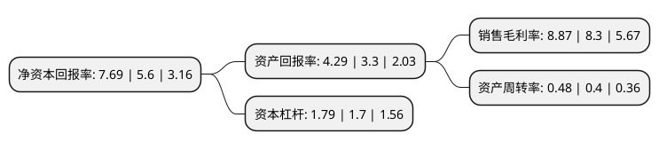

> 本页面由自动化程序生成于 2022年5月20日 01:09
> 内容可能存在错误，如有bug请提交issue至：https://github.com/Eroleice/doc-pi/issues
{.is-warning}

# 上市公司基本情况

## 基本资料

中原内配集团股份有限公司（以下简称“中原内配”）成立于1996年12月29日，焦作市。于2010年07月16日在深交所中小板上市。

中原内配注册资本60,314.411万元，主要产品:内燃机气缸套。主营业务:内燃机气缸套的研制，开发，制造，销售及技术服务。以下是详细信息：

- 公司名称: 中原内配集团股份有限公司
- 股票代码: 002448.SZ
- 所在地: 河南 - 焦作市
- 成立日期: 1996年12月29日
- 注册资本: 60,314.411万元
- 法定代表人: 薛德龙
- 主营业务: 主要产品:内燃机气缸套主营业务:内燃机气缸套的研制，开发，制造，销售及技术服务
- 公司官网: www.hnzynp.com
- 公司介绍: 公司主营业务是内燃机气缸套的研制、开发、制造、销售及技术服务，公司产品广泛应用于乘用车、商用车、工程机械、农业机械、园林机械、军工、船舶、发电机组等。作为内燃机的核心关键零部件，气缸套的材质、精度、网纹技术直接影响发动机的节能性、环保性、动力性、可靠性。作为世界级的汽车零部件供应商，公司具备行业内特有的科研优势、质量优势、装备优势、物流优势及市场优势，是国内唯一具备批量生产欧V、欧VI标准气缸套能力的企业。荣获国家“工业质量标杆企业”、“工业品牌培育示范企业”、“河南省省长质量奖”等诸多殊荣。

## 股东及高管情况

上市公司第一大股东为薛德龙，持股105,192,724股，占比17.44%，**疑似为**上市公司实际控制人。

截至2022年03月31日，上市公司的前十大股东中，共有10名自然人股东，其中5%以上大股东共有1名。上市公司前十大股东明细如下：

> 未能通过持股比例判定出上市公司实际控制人（持股30%以上）
> 可能存在通过间接持股、联合持股、协议控制等方式拥有实际控制权的主体，具体请参考上市公司定期公告！
{.is-warning}

> 截至2022年03月31日，上市公司前十大股东信息如下：

| 股东名称 | 持股数量（股） | 持股比例 |
| --- | --- | --- |
| 薛德龙 | 105,192,724 | 17.44% |
| 张冬梅 | 26,275,662 | 4.36% |
| 薛建军 | 6,851,875 | 1.14% |
| 党增军 | 6,386,500 | 1.06% |
| 赵学文 | 6,317,255 | 1.05% |
| 王琛 | 5,913,700 | 0.98% |
| 王国庆 | 3,187,400 | 0.53% |
| 王中营 | 3,153,500 | 0.52% |
| 闫帅 | 2,817,400 | 0.47% |
| 崔联委 | 2,715,000 | 0.45% |

## 利润表分析

上市公司2021年总收入为24.48亿元，净利润为2.17亿元，实现盈利。

## 杜邦分析

> 数据列示周期：2021年 | 2020年 | 2019年
{.is-info}

上市公司的净资产收益率在近一年有所上升，上升幅度为37.32%，其变化情况分解如下：
- 上市公司的销售毛利率在近一年上升了6.87%，可能是生产效率的提升、商品原材料价格下跌或商品价格的上涨所致。
- 上市公司的资产周转率在近一年上升了20%，可能是源自于更快的销售回款或库存管理效果提升。
- 上市公司的财务杠杆比率在近一年上升了5.29%，可能是增加负债扩大生产规模。

