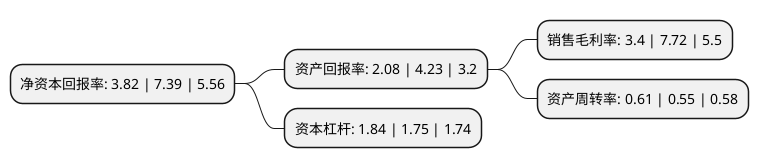

> 本页面由自动化程序生成于 2022年5月20日 01:09
> 内容可能存在错误，如有bug请提交issue至：https://github.com/Eroleice/doc-pi/issues
{.is-warning}

# 上市公司基本情况

## 基本资料

上海加冷松芝汽车空调股份有限公司（以下简称“松芝股份”）成立于2002年06月04日，上海市。于2010年07月20日在深交所中小板上市。

松芝股份注册资本62,858.16万元，主要产品:应用于大中型客车，乘用车，货车，轻型客车，轨道车辆，专用机械设备及冷冻冷藏车等各类车辆的移动式空调系统。主营业务:移动式空调系统的研发，生产，销售及服务业务。以下是详细信息：

- 公司名称: 上海加冷松芝汽车空调股份有限公司
- 股票代码: 002454.SZ
- 所在地: 上海 - 上海市
- 成立日期: 2002年06月04日
- 注册资本: 62,858.16万元
- 法定代表人: 陈焕雄
- 主营业务: 主要产品:应用于大中型客车，乘用车，货车，轻型客车，轨道车辆，专用机械设备及冷冻冷藏车等各类车辆的移动式空调系统主营业务:移动式空调系统的研发，生产，销售及服务业务
- 公司官网: www.shsongz.com.cn
- 公司介绍: 公司是一家专业的车辆空调制造商，主要产品为各系列大中型客车空调和乘用车空调，广泛应用于大中型客车、乘用车、货车、轻型客车和轨道车等各类车辆。公司以自有品牌运营为核心，以市场为导向，自主研发、设计、营销推广、销售各类车辆空调产品。公司有完备的技术标准体系，是国家客车空调标准的主要起草单位，并连续多年被中国建设部科技委城市车辆专家委员会和世界客车联盟授予“客车空调旗舰企业”、“年度最佳客车空调制造商”称号。

## 股东及高管情况

上市公司第一大股东为陈福成，持股275,470,809股，占比43.82%，为上市公司实际控制人。

截至2022年03月31日，上市公司的前十大股东中，共有6名自然人股东，3名机构股东，1个产品账户，其中5%以上大股东共有1名。上市公司前十大股东明细如下：

> 截至2022年03月31日，上市公司前十大股东信息如下：

| 股东名称 | 持股数量（股） | 持股比例 |
| --- | --- | --- |
| 陈福成 | 275,470,809 | 43.82% |
| 北京巴士传媒股份有限公司 | 13,689,000 | 2.18% |
| 刘伟文 | 12,367,500 | 1.97% |
| 苏乾坤 | 8,783,704 | 1.4% |
| 南京公用发展股份有限公司 | 5,402,955 | 0.86% |
| 蒋丽涛 | 5,044,700 | 0.8% |
| 深圳市佳威尔科技有限公司 | 4,400,000 | 0.7% |
| 李书彬 | 3,690,000 | 0.59% |
| 张国豪 | 2,550,000 | 0.41% |
| 东方证券股份有限公司-中庚价值先锋股票型证券投资基金 | 2,251,800 | 0.36% |

## 利润表分析

上市公司2021年总收入为41.23亿元，净利润为1.4亿元，实现盈利。

## 杜邦分析

> 数据列示周期：2021年 | 2020年 | 2019年
{.is-info}

上市公司的净资产收益率在近一年有所下降，下降幅度为-48.31%，其变化情况分解如下：
- 上市公司的销售毛利率在近一年下降了-55.96%，可能是生产效率的下降、商品原材料价格上涨或商品价格的下跌所致。
- 上市公司的资产周转率在近一年上升了10.91%，可能是源自于更快的销售回款或库存管理效果提升。
- 上市公司的财务杠杆比率在近一年上升了5.14%，可能是增加负债扩大生产规模。

