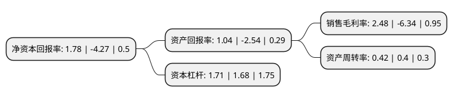

> 本页面由自动化程序生成于 2022年5月20日 01:09
> 内容可能存在错误，如有bug请提交issue至：https://github.com/Eroleice/doc-pi/issues
{.is-warning}

# 上市公司基本情况

## 基本资料

浙江金固股份有限公司（以下简称“金固股份”）成立于1996年06月24日，杭州市。于2010年10月21日在深交所中小板上市。

金固股份注册资本100,191.482万元，主要产品:轿车，微型车等乘用车和部分特种用途车辆的钢制滚型车轮，以及各型号卡车，挂车和客车等商用车的钢制滚型车轮。主营业务:钢制车轮的研发，生产和销售。以下是详细信息：

- 公司名称: 浙江金固股份有限公司
- 股票代码: 002488.SZ
- 所在地: 浙江 - 杭州市
- 成立日期: 1996年06月24日
- 注册资本: 100,191.482万元
- 法定代表人: 孙锋峰
- 主营业务: 主要产品:轿车，微型车等乘用车和部分特种用途车辆的钢制滚型车轮，以及各型号卡车，挂车和客车等商用车的钢制滚型车轮主营业务:钢制车轮的研发，生产和销售
- 公司官网: www.jgwheel.com
- 公司介绍: 公司专业从事钢制滚型车轮的研发、生产和销售，主要产品包括轿车、微型车等乘用车和部分特种用途车辆的钢制滚型车轮，以及各型号卡车、挂车和客车等商用车的钢制滚型车轮。公司的销售模式主要包括直接为整车制造商配套和通过经销商网络进行销售。公司汽车后市场业务以轮胎、保养维修、汽车美容等汽车配套服务为切入点，结合线下合作门店和直营门店布局，为广大车主提供线上销售与线下服务相结合的服务体验，建立标准化、透明化的服务标准，并积极拓展汽车金融、汽车保险、汽车救援、车务服务等后服务市场相关业务，建成汽车后服务一站式解决方案平台。

## 股东及高管情况

上市公司第一大股东为孙锋峰，持股100,473,422股，占比10.03%，**疑似为**上市公司实际控制人。

截至2022年03月31日，上市公司的前十大股东中，共有3名自然人股东，2名机构股东，5个产品账户，其中5%以上大股东共有2名。上市公司前十大股东明细如下：

> 未能通过持股比例判定出上市公司实际控制人（持股30%以上）
> 可能存在通过间接持股、联合持股、协议控制等方式拥有实际控制权的主体，具体请参考上市公司定期公告！
{.is-warning}

> 截至2022年03月31日，上市公司前十大股东信息如下：

| 股东名称 | 持股数量（股） | 持股比例 |
| --- | --- | --- |
| 孙锋峰 | 100,473,422 | 10.03% |
| 孙金国 | 56,428,461 | 5.63% |
| 合肥东鑫产投创业投资合伙企业(有限合伙) | 50,095,742 | 5% |
| 合肥产投兴巢低碳创业投资合伙企业(有限合伙) | 50,095,742 | 5% |
| 南宁产投新兴一号投资基金合伙企业(有限合伙) | 50,095,742 | 5% |
| 浙江金固股份有限公司-第一期员工持股计划 | 38,647,307 | 3.86% |
| 孙利群 | 20,567,555 | 2.05% |
| 金元顺安基金-宁波银行-杭州乾瞳投资管理合伙企业(有限合伙) | 19,248,275 | 1.92% |
| 杭州东方嘉富资产管理有限公司-东方嘉富-兴瑞1号专项私募基金 | 19,002,771 | 1.9% |
| 深圳市安鹏股权投资基金管理有限公司-深圳安鹏汽车后市场产业基金(有限合伙) | 18,127,355 | 1.81% |

## 利润表分析

上市公司2021年总收入为27.28亿元，净利润为0.67亿元，实现盈利。

## 杜邦分析

> 数据列示周期：2021年 | 2020年 | 2019年
{.is-info}

上市公司的净资产收益率在近一年有所下降，下降幅度为-141.69%，其变化情况分解如下：
- 上市公司的销售毛利率在近一年下降了-139.12%，可能是生产效率的下降、商品原材料价格上涨或商品价格的下跌所致。
- 上市公司的资产周转率在近一年上升了5%，可能是源自于更快的销售回款或库存管理效果提升。
- 上市公司的财务杠杆比率在近一年上升了1.79%，可能是增加负债扩大生产规模。

