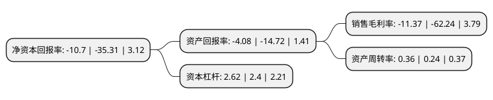

> 本页面由自动化程序生成于 2022年5月20日 01:09
> 内容可能存在错误，如有bug请提交issue至：https://github.com/Eroleice/doc-pi/issues
{.is-warning}

# 上市公司基本情况

## 基本资料

天津汽车模具股份有限公司（以下简称“天汽模”）成立于1996年12月03日，天津市。于2010年11月25日在深交所中小板上市。

天汽模注册资本94,161.662万元，主要产品:模具设计，制造;冲压件加工，铆焊加工;汽车车身及其工艺装备设计，制造;航空航天产品零部件，工装及地面保障设备设计与制造;技术咨询服务(不含中介);计算机应用服务;进出口服务。主营业务:汽车车身覆盖件模具及其配套产品的研发，设计，生产与销售等。以下是详细信息：

- 公司名称: 天津汽车模具股份有限公司
- 股票代码: 002510.SZ
- 所在地: 天津 - 天津市
- 成立日期: 1996年12月03日
- 注册资本: 94,161.662万元
- 法定代表人: 任伟
- 主营业务: 主要产品:模具设计，制造;冲压件加工，铆焊加工;汽车车身及其工艺装备设计，制造;航空航天产品零部件，工装及地面保障设备设计与制造;技术咨询服务(不含中介);计算机应用服务;进出口服务主营业务:汽车车身覆盖件模具及其配套产品的研发，设计，生产与销售等
- 公司官网: www.tqm.cn
- 公司介绍: 公司自设立以来一直从事汽车车身覆盖件模具及其配套产品的研发、设计、生产与销售等。主要产品包括汽车车身覆盖件模具、汽车车身冲压件、检具及装焊夹具，所属行业为汽车制造业中的汽车模具子行业。该行业集传统产业与高科技于一身，在整个汽车工业体系中占据重要地位，是汽车工业发展的基础和效益放大器。公司高度重视科技创新，核心技术全部自主研发，是国家高新技术企业，拥有博士后科研工作站。公司客户覆盖了国内绝大多数知名汽车厂商和众多国际知名汽车企业。

## 股东及高管情况

上市公司第一大股东为胡津生，持股45,144,546股，占比4.79%，**疑似为**上市公司实际控制人。

截至2022年03月31日，上市公司的前十大股东中，共有9名自然人股东，1名机构股东。上市公司前十大股东明细如下：

> 未能通过持股比例判定出上市公司实际控制人（持股30%以上）
> 可能存在通过间接持股、联合持股、协议控制等方式拥有实际控制权的主体，具体请参考上市公司定期公告！
{.is-warning}

> 上市公司第一大股东持股不超过10%，请检查是否存在公司控制权风险！
{.is-danger}

> 截至2022年03月31日，上市公司前十大股东信息如下：

| 股东名称 | 持股数量（股） | 持股比例 |
| --- | --- | --- |
| 胡津生 | 45,144,546 | 4.79% |
| 常世平 | 34,600,800 | 3.67% |
| 宁波益到投资管理中心(有限合伙) | 30,620,810 | 3.25% |
| 董书新 | 27,923,586 | 2.97% |
| 鲍建新 | 14,254,408 | 1.51% |
| 任伟 | 13,650,792 | 1.45% |
| 尹宝茹 | 13,227,608 | 1.4% |
| 王子玲 | 12,204,952 | 1.3% |
| 冯量 | 11,302,772 | 1.2% |
| 张义生 | 11,010,594 | 1.17% |

## 利润表分析

上市公司2021年总收入为18.79亿元，净利润为-2.14亿元，**未实现盈利**。

## 杜邦分析

> 数据列示周期：2021年 | 2020年 | 2019年
{.is-info}

上市公司的净资产收益率在近一年有所下降，下降幅度为-69.7%，其变化情况分解如下：
- 上市公司的销售毛利率在近一年下降了-81.73%，可能是生产效率的下降、商品原材料价格上涨或商品价格的下跌所致。
- 上市公司的资产周转率在近一年上升了50%，可能是源自于更快的销售回款或库存管理效果提升。
- 上市公司的财务杠杆比率在近一年上升了9.17%，可能是增加负债扩大生产规模。

