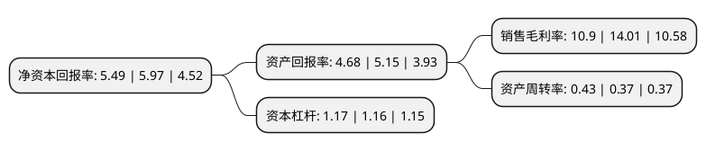

> 本页面由自动化程序生成于 2022年5月20日 01:09
> 内容可能存在错误，如有bug请提交issue至：https://github.com/Eroleice/doc-pi/issues
{.is-warning}

# 上市公司基本情况

## 基本资料

旷达科技集团股份有限公司（以下简称“旷达科技”）成立于2000年12月06日，常州市。于2010年12月07日在深交所中小板上市。

旷达科技注册资本147,083.868万元，主营业务为从事汽车及其他交通工具座椅面料以及其他内饰面料和车内饰面料用有色差别化涤纶丝的研发，生产和销售。主要产品据生产设备，工艺的不同，可分为机织面料，经编面料和纬编面料三类。以下是详细信息：

- 公司名称: 旷达科技集团股份有限公司
- 股票代码: 002516.SZ
- 所在地: 江苏 - 常州市
- 成立日期: 2000年12月06日
- 注册资本: 147,083.868万元
- 法定代表人: 沈介良
- 主营业务: 主营业务为从事汽车及其他交通工具座椅面料以及其他内饰面料和车内饰面料用有色差别化涤纶丝的研发，生产和销售主要产品据生产设备，工艺的不同，可分为机织面料，经编面料和纬编面料三类
- 公司官网: www.kuangdacn.com
- 公司介绍: 公司是一家专业从事汽车内饰面料、座套研发、生产和销售以及新能源开发与应用的多元化高新技术企业集团。是国家火炬计划重点高新技术企业、国家守合同重信用企业、江苏省高新技术企业、江苏省优秀民营企业、江苏省民营科技企业、江苏省信息化与工业化融合试点企业。公司建有省级工程技术中心、省级工业设计中心、国家级实验室和江苏省博士后科研工作站，承担多项国家级、省级科技研发、攻关项目，拥有一大批专利成果，曾参与起草、制订多项国家、行业标准，获得TS16949质量体系认证。司是国内最早进入汽车内饰面料行业的专业生产企业之一，国内行业龙头企业，拥有从有色差别化纤维生产到座套成品的完整产业链生产体系和先进的生产技术装备，具备强劲的汽车内饰面料自主研发能力和完善的质量控制系统，主导产品---汽车内饰面料主要应用于汽车的座椅、车顶、门板、扶手、行李架等内部装饰，部分已被高铁、动车所采用。在汽车领域，主要配套客户有一汽大众、上海大众、上海通用、上汽集团、广州本田等主机厂，同时获得大众、通用全球供应商资格，部分产品远销欧洲、美洲。

## 股东及高管情况

上市公司第一大股东为沈介良，持股685,821,524股，占比46.63%，为上市公司实际控制人。

截至2022年03月31日，上市公司的前十大股东中，共有5名自然人股东，3名机构股东，2个产品账户，其中5%以上大股东共有1名。上市公司前十大股东明细如下：

> 截至2022年03月31日，上市公司前十大股东信息如下：

| 股东名称 | 持股数量（股） | 持股比例 |
| --- | --- | --- |
| 沈介良 | 685,821,524 | 46.63% |
| 江苏旷达创业投资有限公司 | 45,433,890 | 3.09% |
| 旷达控股集团有限公司 | 36,669,370 | 2.49% |
| 常州产业投资集团有限公司 | 23,006,134 | 1.56% |
| 野村东方国际证券-上海纺织(集团)有限公司-野村东方国际日出东方1号单一资产管理计划 | 12,000,000 | 0.82% |
| 汇添富基金管理股份有限公司-社保基金1103组合 | 8,888,300 | 0.6% |
| 陈敏芳 | 7,374,300 | 0.5% |
| 马水花 | 7,273,800 | 0.49% |
| 邹洋 | 6,658,723 | 0.45% |
| 梁炳容 | 6,012,604 | 0.41% |

## 利润表分析

上市公司2021年总收入为17.23亿元，净利润为1.87亿元，实现盈利。

## 杜邦分析

> 数据列示周期：2021年 | 2020年 | 2019年
{.is-info}

上市公司的净资产收益率在近一年有所下降，下降幅度为-8.04%，其变化情况分解如下：
- 上市公司的销售毛利率在近一年下降了-22.2%，可能是生产效率的下降、商品原材料价格上涨或商品价格的下跌所致。
- 上市公司的资产周转率在近一年上升了16.22%，可能是源自于更快的销售回款或库存管理效果提升。
- 上市公司的财务杠杆比率在近一年上升了0.86%，可能是增加负债扩大生产规模。

