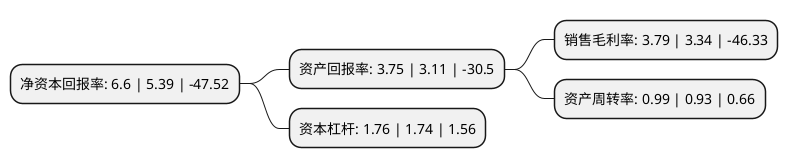

> 本页面由自动化程序生成于 2022年5月20日 01:10
> 内容可能存在错误，如有bug请提交issue至：https://github.com/Eroleice/doc-pi/issues
{.is-warning}

# 上市公司基本情况

## 基本资料

海联金汇科技股份有限公司（以下简称“海联金汇”）成立于2004年12月03日，青岛市。于2011年01月10日在深交所中小板上市。

海联金汇注册资本117,401.675万元，主营业务为第三方支付服务，大数据服务，移动信息服务，跨境电商服务及移动运营商计费结算服务业务;智能制造板块主要从事汽车及配件，家电配件等产品的生产与销售业务;汽车及配件业务，家电配件业务以下是详细信息：

- 公司名称: 海联金汇科技股份有限公司
- 股票代码: 002537.SZ
- 所在地: 山东 - 青岛市
- 成立日期: 2004年12月03日
- 注册资本: 117,401.675万元
- 法定代表人: 刘国平
- 主营业务: 主营业务为第三方支付服务，大数据服务，移动信息服务，跨境电商服务及移动运营商计费结算服务业务;智能制造板块主要从事汽车及配件，家电配件等产品的生产与销售业务;汽车及配件业务，家电配件业务
- 公司官网: www.haili.com.cn
- 公司介绍: 公司原是国内综合实力较强的家电零部件供应商。2016年7月，公司成功重组并购了互联网金融信息技术服务公司联动优势科技有限公司，通过并购加快了公司产业转型升级，公司产业结构由家电零部件产业向互联网金融技术服务产业和整车及汽车总成件企业转型，并迈入新能源行业，成功实现“工业制造＋互联网金融信息技术服务”双轮驱动发展模式。目前，公司主营业务含金融科技产业和智能制造产业，金融科技产业主要从事移动信息服务、第三方支付服务、大数据服务、运营商计费结算服务及跨境电商服务业务，智能制造产业主要从事汽车及配件、家电配件、电机及配件和模具业务。通过多年的积累，公司先后赢得省级守合同重信用企业、建行AAA企业、青岛工行战略合作伙伴，连续多年蝉联青岛市百强企业、青岛市最具成长型中小企业、青岛市优秀民营企业等荣誉称号，公司在互联网金融技术服务行业已获得中国人民银行《支付业务许可证》(全国范围的互联网支付、移动电话支付、银行卡收单)，中国证监会基金销售支付结算业务资格，以及国家外汇管理局北京外汇管理部跨境外汇支付试点和跨境人民币支付试点资质。

## 股东及高管情况

上市公司第一大股东为青岛海立控股有限公司，持股241,775,600股，占比20.59%，**疑似为**上市公司实际控制人。

截至2022年05月11日，上市公司的前十大股东中，共有9名机构股东，1个海外主体，其中5%以上大股东共有7名。上市公司前十大股东明细如下：

> 未能通过持股比例判定出上市公司实际控制人（持股30%以上）
> 可能存在通过间接持股、联合持股、协议控制等方式拥有实际控制权的主体，具体请参考上市公司定期公告！
{.is-warning}

> 截至2022年05月11日，上市公司前十大股东信息如下：

| 股东名称 | 持股数量（股） | 持股比例 |
| --- | --- | --- |
| 青岛海立控股有限公司 | 241,775,600 | 20.59% |
| 青岛海立控股有限公司 | 241,775,600 | 20.59% |
| 青岛海立控股有限公司 | 241,775,600 | 20.59% |
| 银联商务股份有限公司 | 82,290,000 | 7.0093% |
| 银联商务股份有限公司 | 82,290,000 | 7.0093% |
| 北京博升优势科技发展有限公司 | 64,227,220 | 5.47% |
| 北京博升优势科技发展有限公司 | 63,227,220 | 5.3855% |
| 青岛天晨投资有限公司 | 52,443,548 | 4.47% |
| 中国移动通信集团有限公司 | 25,769,351 | 2.19% |
| 高华-汇丰-GOLDMAN, SACHS & CO.LLC | 4,000,000 | 0.34% |

## 利润表分析

上市公司2021年总收入为72.49亿元，净利润为2.74亿元，实现盈利。

## 杜邦分析

> 数据列示周期：2021年 | 2020年 | 2019年
{.is-info}

上市公司的净资产收益率在近一年有所上升，上升幅度为22.45%，其变化情况分解如下：
- 上市公司的销售毛利率在近一年上升了13.47%，可能是生产效率的提升、商品原材料价格下跌或商品价格的上涨所致。
- 上市公司的资产周转率在近一年上升了6.45%，可能是源自于更快的销售回款或库存管理效果提升。
- 上市公司的财务杠杆比率在近一年上升了1.15%，可能是增加负债扩大生产规模。

